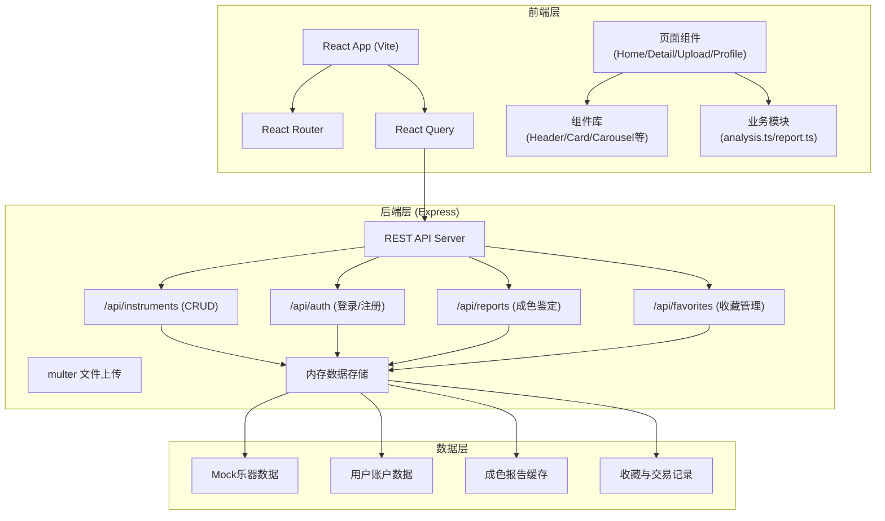
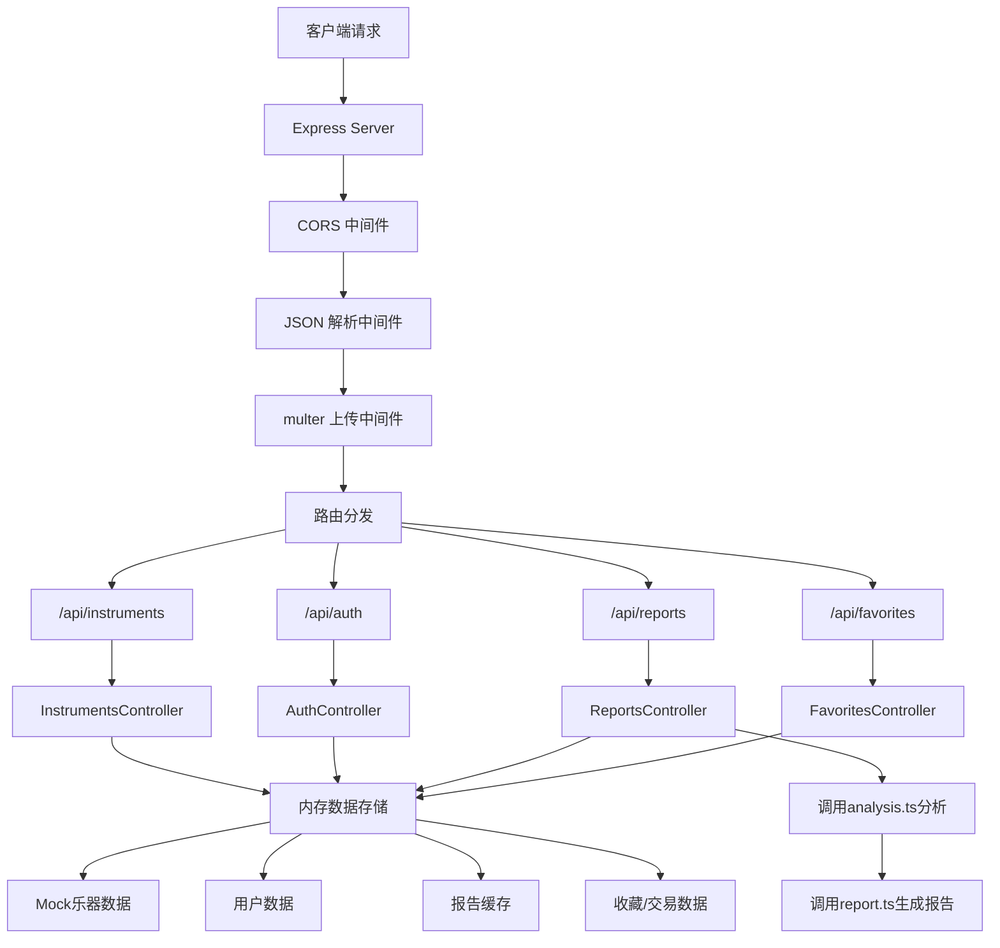

## 1. 架构设计



## 2. 技术描述

### 2.1 前端技术栈
- **框架**：React 18 + TypeScript
- **构建工具**：Vite 5
- **路由**：react-router-dom 6
- **数据管理**：@tanstack/react-query 5
- **文件上传**：react-dropzone 14
- **动画库**：canvas-confetti（庆祝效果）
- **样式**：原生CSS + CSS Modules（全局样式+组件级样式）

### 2.2 后端技术栈
- **框架**：Express 4
- **跨域**：cors 2
- **文件上传**：multer 1
- **唯一ID**：uuid 9
- **数据存储**：内存数据结构（Mock）

### 2.3 开发工具
- **类型检查**：TypeScript 5（严格模式）
- **并行启动**：concurrently 8
- **代码规范**：ESLint + Prettier（可选）

## 3. 目录结构

```
auto91/
├── package.json
├── index.html
├── vite.config.js
├── tsconfig.json
├── server.js                 # Express后端服务
├── src/
│   ├── main.tsx             # React入口
│   ├── App.tsx              # 主路由组件
│   ├── styles/
│   │   └── global.css       # 全局样式
│   ├── pages/
│   │   ├── Home.tsx         # 首页展示墙
│   │   ├── Detail.tsx       # 乐器详情页
│   │   ├── Upload.tsx       # 上传鉴定页
│   │   └── Profile.tsx      # 个人中心
│   ├── components/
│   │   └── Header.tsx       # 顶部导航栏
│   └── modules/
│       ├── analysis.ts      # 图像分析算法
│       └── report.ts        # 报告生成模块
└── .trae/
    └── documents/
        ├── PRD.md
        └── TECH_ARCH.md
```

## 4. 路由定义

| 路由 | 页面组件 | 用途 |
|------|----------|------|
| `/` | Home.tsx | 首页乐器展示墙 |
| `/instrument/:id` | Detail.tsx | 乐器详情页，含成色报告 |
| `/upload` | Upload.tsx | 上传鉴定页，生成报告 |
| `/profile` | Profile.tsx | 个人中心（收藏夹+交易记录） |
| `/login` | App.tsx内联 | 登录弹窗/页面 |
| `/register` | App.tsx内联 | 注册弹窗/页面 |

## 5. API 接口定义

### 5.1 乐器管理 API

```typescript
// 乐器数据类型
interface Instrument {
  id: string;
  name: string;
  brand: string;
  model: string;
  price: number;
  condition: 'new' | 'like-new' | 'used' | 'damaged';
  conditionScore: number;
  images: string[];
  description: string;
  sellerId: string;
  sellerName: string;
  createdAt: string;
  reportId?: string;
}

// GET /api/instruments
// 响应: Instrument[]

// GET /api/instruments/:id
// 响应: Instrument

// POST /api/instruments
// 请求: FormData (name, brand, model, price, description, images[])
// 响应: Instrument

// PUT /api/instruments/:id
// 请求: Partial<Instrument>
// 响应: Instrument

// DELETE /api/instruments/:id
// 响应: { success: boolean }
```

### 5.2 用户认证 API

```typescript
interface User {
  id: string;
  username: string;
  email: string;
  avatar?: string;
}

interface AuthResponse {
  user: User;
  token: string;
}

// POST /api/auth/register
// 请求: { username: string; email: string; password: string }
// 响应: AuthResponse

// POST /api/auth/login
// 请求: { email: string; password: string }
// 响应: AuthResponse
```

### 5.3 成色鉴定 API

```typescript
interface Flaw {
  x: number;      // 相对位置 0-1
  y: number;
  w: number;
  h: number;
  description: string;
  imageIndex: number;
}

interface AnalysisResult {
  score: number;        // 0-100
  flaws: Flaw[];
  brightness: number;
  noiseLevel: number;
  edgeCount: number;
}

interface PriceRange {
  min: number;
  max: number;
  unit: string;
}

interface ConditionReport {
  id: string;
  score: number;
  condition: 'new' | 'like-new' | 'used' | 'damaged';
  conditionLabel: string;
  flaws: Flaw[];
  priceRange: PriceRange;
  description: string;
  overallAssessment: string;
  createdAt: string;
}

// POST /api/reports
// 请求: multipart/form-data (images: File[])
// 响应: ConditionReport
// 模拟响应时间: ≤ 500ms
```

### 5.4 收藏管理 API

```typescript
interface Favorite {
  id: string;
  userId: string;
  instrumentId: string;
  instrument: Instrument;
  createdAt: string;
}

interface Transaction {
  id: string;
  instrumentId: string;
  instrumentName: string;
  buyerId: string;
  buyerName: string;
  sellerId: string;
  sellerName: string;
  price: number;
  createdAt: string;
}

// GET /api/favorites
// 请求头: Authorization: Bearer <token>
// 响应: Favorite[]

// POST /api/favorites
// 请求: { instrumentId: string }
// 响应: Favorite

// DELETE /api/favorites/:id
// 响应: { success: boolean }

// GET /api/transactions
// 响应: Transaction[]
```

## 6. 服务端架构图



## 7. 数据模型

### 7.1 ER图

```mermaid
erDiagram
    USER ||--o{ INSTRUMENT : "发布"
    USER ||--o{ FAVORITE : "收藏"
    USER ||--o{ TRANSACTION : "参与"
    INSTRUMENT ||--o| CONDITION_REPORT : "关联"
    INSTRUMENT ||--o{ FAVORITE : "被收藏"
    INSTRUMENT ||--o{ TRANSACTION : "被交易"

    USER {
        string id PK
        string username
        string email
        string password_hash
        string avatar
        datetime created_at
    }

    INSTRUMENT {
        string id PK
        string name
        string brand
        string model
        number price
        string condition
        number condition_score
        string[] images
        string description
        string seller_id FK
        string report_id FK
        datetime created_at
    }

    CONDITION_REPORT {
        string id PK
        number score
        string condition
        string flaws JSON
        number price_min
        number price_max
        string description
        string assessment
        datetime created_at
    }

    FAVORITE {
        string id PK
        string user_id FK
        string instrument_id FK
        datetime created_at
    }

    TRANSACTION {
        string id PK
        string instrument_id FK
        string instrument_name
        string buyer_id FK
        string buyer_name
        string seller_id FK
        string seller_name
        number price
        datetime created_at
    }
```

### 7.2 Mock数据结构

```javascript
// Mock乐器数据
const mockInstruments = [
  {
    id: '1',
    name: '马丁D-28原声吉他',
    brand: 'Martin',
    model: 'D-28',
    price: 12800,
    condition: 'like-new',
    conditionScore: 92,
    images: ['...'],
    description: '2020年购于香港通利琴行，保养极佳，仅在家使用',
    sellerId: 'u1',
    sellerName: '音乐爱好者小王',
    createdAt: '2026-06-01'
  },
  // 更多mock数据...
];

// Mock历史成交数据（用于价格估算）
const mockHistoryData = {
  'Martin': {
    'D-28': { avgPrice: 15000, salesCount: 156, priceTrend: -0.03 }
  }
};
```

## 8. 关键技术实现点

### 8.1 前端性能优化
- 图片懒加载：`IntersectionObserver API`
- React Query 缓存：减少重复请求
- 路由代码分割：`React.lazy` + `Suspense`
- 组件懒加载：按需加载页面组件

### 8.2 Canvas图像分析
- 平均亮度计算：像素RGB平均值
- 噪点检测：像素标准差分析
- 边缘检测：Sobel算子简化实现
- 瑕疵位置模拟：基于随机种子的可信区域

### 8.3 动画实现
- CSS `@keyframes` 实现波纹扩散
- CSS `transition` 实现悬停缩放、页面滑入
- SVG `stroke-dasharray` 实现环形进度条动画
- Canvas-confetti 实现上传成功庆祝效果

### 8.4 响应式布局
- CSS Grid `auto-fit` + `minmax` 实现自适应网格
- 媒体查询断点：768px、1024px
- CSS 变量统一管理颜色、圆角等设计token
