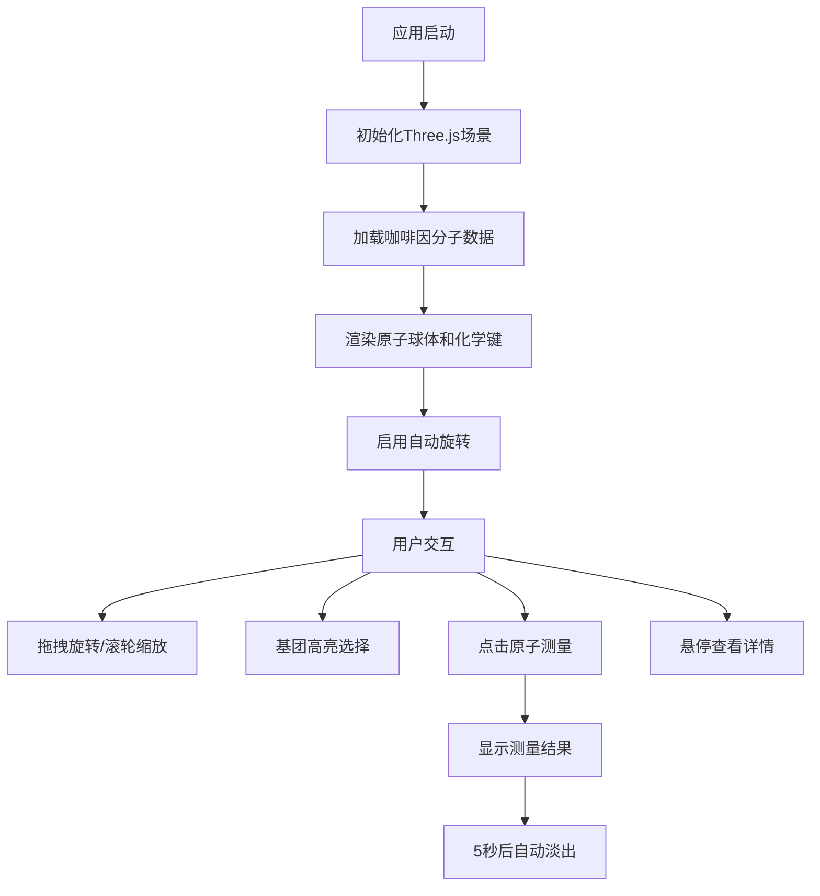

## 1. 产品概述

三维分子结构可视化与交互工具，用于观察有机分子的原子与键结构，支持交互式旋转、缩放、基团高亮、距离和键角测量。面向化学教育、科研人员和分子模型爱好者。

## 2. 核心功能

### 2.1 功能模块

1. **主视图区**：Three.js 3D分子模型渲染，交互式旋转/缩放，自动旋转
2. **控制面板**：dat.gui基团高亮选择、分子缩放控制、标签显示切换
3. **测量功能**：点击原子计算键长和键角，结果浮动显示
4. **悬停交互**：原子放大效果、光晕、跟随标签

### 2.3 页面详情

| 页面名称 | 模块名称 | 功能描述 |
|-----------|-------------|---------------------|
| 主页面 | 3D场景渲染 | 渲染咖啡因分子模型，支持鼠标拖拽旋转、滚轮缩放，0.5秒惯性阻尼 |
| 主页面 | 基团高亮系统 | 下拉菜单选择化学基团（苯环、羟基、氨基），选中后外发光效果，其余原子半透明 |
| 主页面 | 测量系统 | 点击两个原子计算距离，点击三个原子计算键角，结果显示5秒后淡出 |
| 主页面 | 悬停交互 | 鼠标悬停原子时放大1.3倍、显示光晕和元素标签 |
| 主页面 | 自动旋转 | 场景每10秒旋转一周，用户交互时暂停，停止3秒后恢复 |

## 3. 核心流程

### 3.1 主要用户流程

用户打开应用 → 自动加载咖啡因分子模型 → 场景自动缓慢旋转 → 用户可：
- 拖拽旋转视角/滚轮缩放
- 通过右侧面板选择高亮基团、调整缩放、切换标签
- 点击原子进行距离和键角测量
- 悬停原子查看详细信息

## 4. 用户界面设计

### 4.1 设计风格
- **主色调**：深空蓝渐变（顶部#0B0B2B到底部#1B1B4B）
- **原子颜色**：碳#808080、氢#FFFFFF、氧#FF0000、氮#0000FF
- **高亮色**：金色#FFD700
- **面板背景**：半透明深色#1A1A2E（透明度0.85）
- **文字颜色**：#E0E0E0

### 4.2 页面设计概述

| 页面名称 | 模块名称 | UI元素 |
|-----------|-------------|-------------|
| 主页面 | 3D场景 | 深空蓝渐变背景、网格辅助线（#333，透明度0.2）、半透明辅助球体 |
| 主页面 | 右侧控制面板 | 宽度260px、圆角8px、间距12px、字体14px无衬线 |
| 主页面 | 原子标签 | CSS2DRenderer渲染、12px字体、白色半透明、始终面向屏幕 |
| 主页面 | 测量结果框 | 左上角浮动、白色半透明文本框、淡出动画0.3秒 |

### 4.3 响应性
- 桌面端优先，主视图占满整个浏览器窗口
- 控制面板固定在右侧，不随窗口滚动
- 支持窗口大小变化时自动调整场景

### 4.4 3D场景指导
- **环境**：深空蓝渐变背景，营造科技感暗色调氛围
- **光照**：环境光 + 点光源组合，确保分子结构清晰可见
- **相机**：透视相机，初始距离适合观察完整分子
- **交互**：OrbitControls轨道控制器，0.5秒惯性阻尼
- **动画**：自动旋转（10秒/周），悬停放大过渡（0.2秒），测量结果淡出（0.3秒）
- **性能**：控制原子数≤200，键数≤250，帧率≥50FPS
