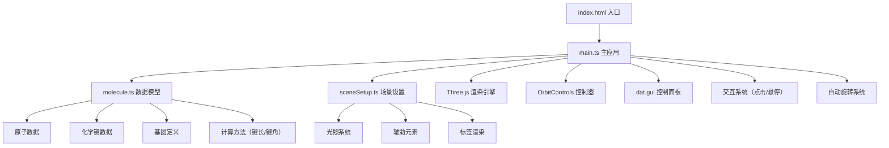
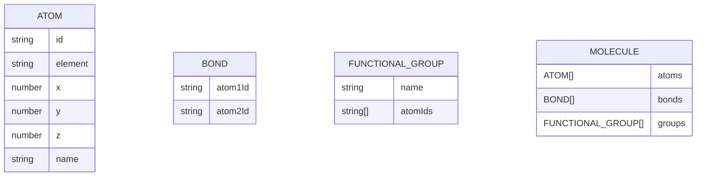

## 1. 架构设计

## 2. 技术描述

- **前端框架**：原生 TypeScript + Three.js
- **构建工具**：Vite
- **UI控制**：dat.gui
- **标签渲染**：CSS2DRenderer
- **开发语言**：TypeScript（严格模式）

## 3. 文件结构

| 文件路径 | 用途 |
|---------|------|
| `package.json` | 项目依赖配置（three, dat.gui, typescript, vite） |
| `index.html` | 入口页面，标题"分子结构查看器" |
| `vite.config.js` | Vite 基础构建配置 |
| `tsconfig.json` | TypeScript 配置（启用严格模式） |
| `src/main.ts` | 主应用入口：初始化场景、相机、控制器、加载分子、交互逻辑 |
| `src/molecule.ts` | 数据模型：原子、键、基团定义，计算键长和键角方法 |
| `src/sceneSetup.ts` | 场景设置：环境光、点光源、辅助球体、文字标签 |

## 6. 数据模型

### 6.1 数据模型定义

### 6.2 原子属性

| 元素 | 颜色 | 半径 |
|------|------|------|
| 碳（C） | #808080 | 0.4 |
| 氢（H） | #FFFFFF | 0.2 |
| 氧（O） | #FF0000 | 0.35 |
| 氮（N） | #0000FF | 0.35 |

### 6.3 咖啡因分子预定义数据

包含24个原子和25个化学键，预定义三个功能基团：苯环、羟基、氨基。
