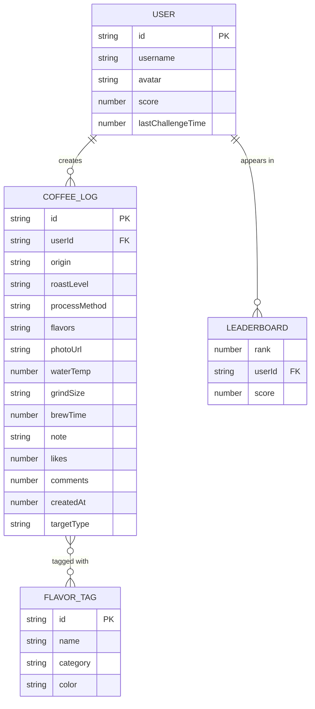

# 豆录 - 咖啡品鉴档案应用 技术架构文档

## 1. 架构设计

```mermaid
graph TD
    "浏览器客户端" --> "Vite Dev Server (前端)"
    "浏览器客户端" --> "Express API Server (后端)"
    "Vite Dev Server" --> "React 组件层"
    "React 组件层" --> "Context 状态管理"
    "React 组件层" --> "业务逻辑模块 (纯TS)"
    "Express API Server" --> "内存数据存储"
    "业务逻辑模块" --> "flavorMatcher (TF-IDF余弦相似度)"
    "业务逻辑模块" --> "leaderboardSort (排行榜排序)"
```

## 2. 技术选型说明
- **前端框架**：React 18 + TypeScript
- **构建工具**：Vite（含路径别名 @ -> src）
- **路由**：React Router DOM v6
- **图表库**：Recharts（雷达图）
- **状态管理**：React Context
- **后端框架**：Express 4 + TypeScript
- **跨域处理**：cors 中间件
- **唯一ID**：uuid
- **数据库**：内存数组模拟（无需持久化）

## 3. 路由定义
| 路由 | 用途 |
|------|------|
| / | 首页 - 品鉴日志瀑布流 |
| /challenge | 挑战页 - 风味盲猜与排行榜 |
| /profile | 个人中心 - 风味统计仪表盘 |

## 4. API 定义

### 4.1 TypeScript 类型定义

```typescript
interface User {
  id: string;
  username: string;
  avatar: string;
  score: number;
  lastChallengeTime: number;
}

interface FlavorTag {
  id: string;
  name: string;
  category: 'floral' | 'fruity' | 'nutty' | 'chocolate' | 'spicy';
  color: string;
}

interface CoffeeLog {
  id: string;
  userId: string;
  origin: string;
  roastLevel: 'light' | 'medium' | 'dark';
  processMethod: 'washed' | 'natural' | 'honey';
  flavors: string[];
  photoUrl?: string;
  waterTemp?: number;
  grindSize?: string;
  brewTime?: number;
  note?: string;
  likes: number;
  comments: number;
  createdAt: number;
  isChallengeTarget?: boolean;
  targetType?: 'gesha' | 'mandheling';
}

interface LeaderboardEntry {
  rank: number;
  userId: string;
  username: string;
  avatar: string;
  score: number;
}

interface ChallengeQuestion {
  optionA: CoffeeLog;
  optionB: CoffeeLog;
  correctAnswer: 'A' | 'B';
}
```

### 4.2 REST API 端点

| 方法 | 路径 | 说明 | 请求体 | 响应 |
|------|------|------|--------|------|
| GET | /api/logs | 获取所有品鉴日志 | - | CoffeeLog[] |
| POST | /api/logs | 创建品鉴日志 | Omit<CoffeeLog, 'id' \| 'createdAt' \| 'likes' \| 'comments'> | CoffeeLog |
| GET | /api/challenge/random | 获取随机挑战题目 | - | ChallengeQuestion |
| POST | /api/challenge/guess | 提交猜测答案 | { answer: 'A' \| 'B'; streak: number; userId: string } | { isCorrect: boolean; score: number; newStreak: number } |
| GET | /api/leaderboard | 获取排行榜前10 | - | LeaderboardEntry[] |
| POST | /api/auth/login | 用户登录 | { username: string; password: string } | User |
| POST | /api/auth/register | 用户注册 | { username: string; password: string } | User |

## 5. 后端服务架构

```mermaid
graph LR
    "Client" --> "Routes (Express Router)"
    "Routes" --> "Controllers"
    "Controllers" --> "In-Memory Store"
    "Controllers" --> "Business Logic"
    "Business Logic" --> "flavorMatcher.ts"
    "Business Logic" --> "leaderboardSort.ts"
```

## 6. 数据模型

### 6.1 ER 图



### 6.2 初始种子数据
- 预置 5-8 条模拟品鉴日志（包含浅烘水洗瑰夏和深烘日晒曼特宁）
- 预置 5 个模拟用户及其初始得分
- 预置完整风味轮数据（五大类共 20+ 风味标签）
