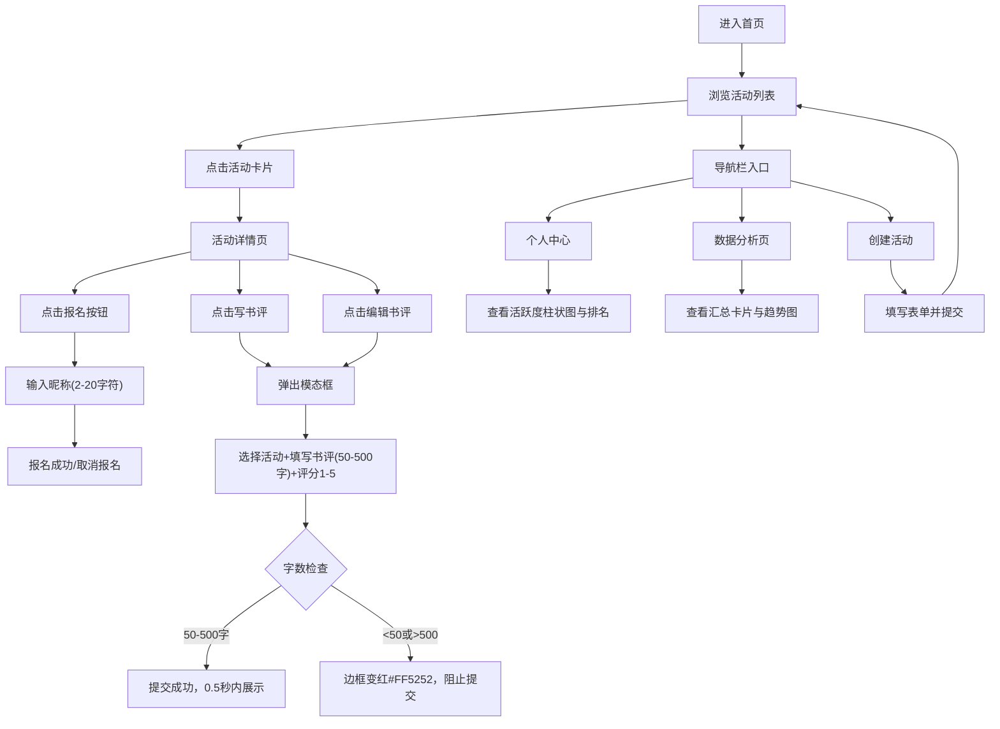

## 1. 产品概述

读书会活动管理与书评聚合平台，面向社区书店及其书友用户，提供线上读书会活动发起、报名参与、书评提交与活跃度统计的一站式解决方案。帮助书店提升社群运营效率，激发书友阅读热情与互动粘性。

## 2. 核心功能

### 2.1 用户角色

| 角色 | 注册方式 | 核心权限 |
|------|----------|----------|
| 书友用户 | 输入昵称即可参与 | 浏览活动、报名/取消报名、提交/编辑书评、查看个人活跃度 |
| 书店店主 | 预设账号进入管理页 | 创建发布活动、查看数据分析仪表盘、查看活跃度与书评统计 |

### 2.2 功能模块

1. **首页（活动列表页）**：活动卡片展示、按时间排序、分页浏览、导航栏入口
2. **活动详情页**：活动信息展示、报名/取消报名、书评列表、写书评模态框、书评编辑
3. **活动创建页**：活动表单（名称、日期、地点、说明）、提交发布
4. **个人中心页**：个人信息卡片、近7天活跃度柱状图、本月排名统计
5. **店主数据分析页**：汇总统计卡片、近30天活动新建趋势图、近30天书评提交趋势图

### 2.3 页面详情

| 页面名称 | 模块名称 | 功能描述 |
|----------|----------|----------|
| 首页 | 导航栏 | 品牌logo、首页/个人中心/数据分析/创建活动入口 |
| 首页 | 活动卡片列表 | 展示活动名称、时间、地点、报名人数；hover阴影加深+上移2px；点击进入详情；按开始时间降序；每页10条+分页 |
| 活动详情页 | 活动信息区 | 渐变背景(#F3E5F5→#E8F5E9)、圆角16px，显示名称、日期、地点、说明 |
| 活动详情页 | 报名区 | 已报名用户圆形头像列表(直径40px，首字母替代)、报名/取消报名按钮(文案动态切换)、昵称输入弹窗(2-20字符) |
| 活动详情页 | 书评区 | 书评列表(浅灰#E0E0E0分隔线)、写书评按钮、每条书评支持编辑 |
| 活动详情页 | 书评模态框 | 白色背景圆角12px、活动下拉选择、书评正文(50-500字，实时字数统计)、1-5分评分、400字提示、超字数红色边框(#FF5252)阻止提交 |
| 活动创建页 | 创建表单 | 活动名称、日期选择、地点(≤200字符)、活动说明(支持换行textarea)、提交按钮 |
| 个人中心页 | 个人信息卡 | 头像、昵称、注册日期展示 |
| 个人中心页 | 活跃度仪表盘 | 近7天每日书评字数柱状图(#64B5F6→#1E88E5渐变，hover显示数值)、本月排名展示(例：排名第5，超过89%书友) |
| 店主数据分析页 | 汇总卡片 | 总活动数、总参与人次、平均书评评分三卡片并排 |
| 店主数据分析页 | 趋势图1 | 近30天每日新建活动数量折线图(#FF7043)，点击点跳转对应日期活动列表 |
| 店主数据分析页 | 趋势图2 | 近30天每日书评提交数量折线图(#42A5F5)，点击点跳转对应日期活动列表 |

## 3. 核心流程

书友用户浏览活动列表 → 点击卡片进入详情 → 点击报名输入昵称 → 报名成功显示头像 → 点击写书评弹出模态框 → 选择活动填写正文评分 → 提交后书评展示 → 进入个人中心查看活跃度与排名

店主进入数据分析页 → 查看总览卡片 → 浏览30天活动与书评趋势图 → 可创建新活动 → 填写表单发布

## 4. 用户界面设计

### 4.1 设计风格
- **主背景色**：米白色 #FAFAFA
- **主色调**：蓝色系 #1976D2（聚焦边框、主要按钮）
- **辅助色**：紫色 #F3E5F5、绿色 #E8F5E9（活动详情渐变）、橙色 #FF7043、天蓝 #42A5F5（折线图）
- **警告色**：红色 #FF5252（超字数边框）
- **中性色**：浅灰 #E0E0E0（分隔线）、中灰 #BDBDBD（默认边框）
- **字体**：系统默认无衬线字体（font-family: system-ui, -apple-system, sans-serif）
- **圆角**：所有组件统一 12px，活动详情信息区 16px
- **阴影**：活动卡片 box-shadow: 0 2px 8px rgba(0,0,0,0.1)；hover时 0 4px 16px rgba(0,0,0,0.2) 且 translateY(-2px)
- **按钮过渡**：0.2s 背景色过渡动画
- **输入框聚焦**：边框从 #BDBDBD 过渡到 #1976D2

### 4.2 页面设计概览

| 页面名称 | 模块名称 | UI元素 |
|----------|----------|--------|
| 首页 | 导航栏 | 横向布局，左侧品牌名"读书会"，右侧四个导航项（首页、个人中心、数据分析、创建活动） |
| 首页 | 活动卡片 | 白色卡片12px圆角，上方阴影，hover上移+加深阴影，活动名称加粗，日期地点灰色小字，报名人数蓝色徽章 |
| 首页 | 分页器 | 底部分页按钮组，当前页高亮蓝色背景 |
| 活动详情页 | 活动信息区 | 顶部渐变大卡片16px圆角，内部标题大字号，说明文本换行显示 |
| 活动详情页 | 报名区 | flex布局，头像圆形40px，边框2px白色，报名按钮蓝色背景白字 |
| 活动详情页 | 书评列表 | 每条书评之间1px #E0E0E0分隔线，评分用★表示，正文多段显示 |
| 活动详情页 | 书评模态框 | 全屏遮罩半透明黑色，居中白色面板12px圆角，底部实时字数计数器 |
| 个人中心页 | 布局 | 桌面左右两栏，左侧信息卡，右侧活跃度图表；768px以下上下堆叠 |
| 个人中心页 | 柱状图 | X轴日期，Y轴字数，柱子#64B5F6到#1E88E5垂直渐变，tooltip显示数值 |
| 数据分析页 | 汇总卡 | 三卡片并排，图标+数字+描述文案，浅色背景 |
| 数据分析页 | 折线图 | 两图表上下排列，图例、坐标轴、数据点可点击跳转 |

### 4.3 响应式
- 桌面优先设计，断点 768px
- ≤768px 时个人中心左右布局改为上下堆叠
- ≤768px 时柱状图宽度自适应缩小（容器宽度100%）
- ≤768px 时活动卡片列表单列显示
- 触控优化：按钮最小点击区域 44×44px

### 4.4 动效与交互细节
- 页面元素入场：轻微淡入 + 向上位移
- 活动卡片 hover：transition: all 0.2s ease，阴影加深+translateY(-2px)
- 按钮点击：背景色过渡 0.2s，轻微 scale(0.97) 按下效果
- 模态框：遮罩 fadeIn 0.2s，面板 scale(0.95)→scale(1) 0.25s 弹性动画
- 书评提交成功：底部出现新评论项时轻微滑入
- 400字提示：达到字数时一次性 fadeIn 提示文案"再写一些就可以提交了！"
