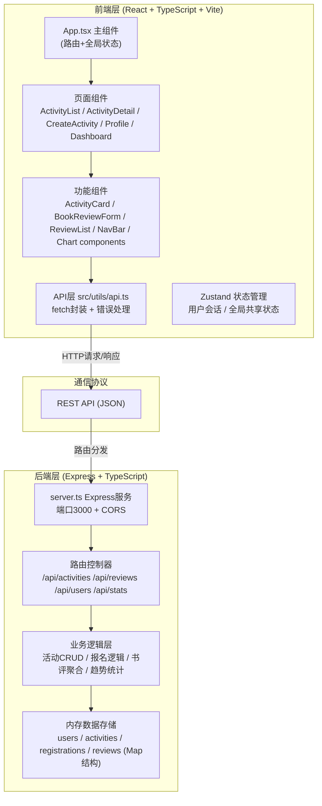
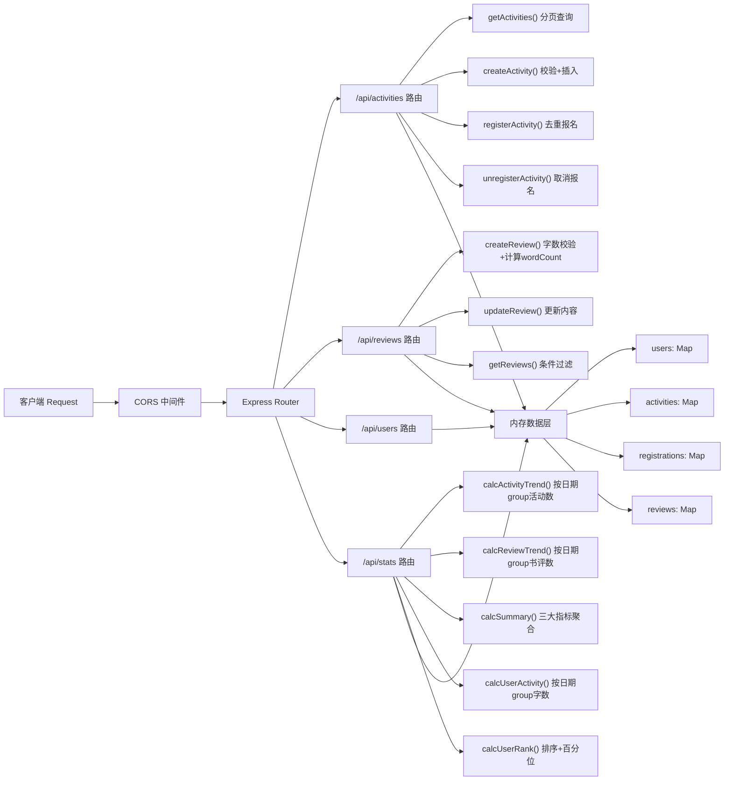
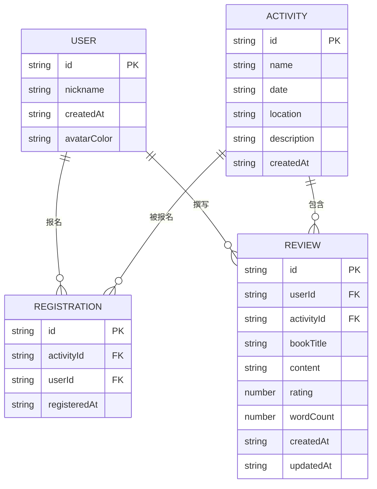

## 1. 架构设计



## 2. 技术描述

- **前端框架**：React 18 + TypeScript（严格模式）
- **构建工具**：Vite 5，@vitejs/plugin-react-swc
- **后端框架**：Express 4 + TypeScript，ts-node 运行
- **路由方案**：react-router-dom v6，HashRouter
- **状态管理**：zustand（轻量级 store）
- **数据可视化**：原生 SVG 实现柱状图/折线图（无第三方图表库，减少包体积）
- **数据存储**：Node.js 内存 Map + uuid 生成唯一ID（无需数据库，重启丢失，符合演示场景）
- **API通信**：原生 fetch + async/await，封装于 src/utils/api.ts
- **样式方案**：CSS Modules + 全局 CSS 变量，不使用 Tailwind（按需求精确匹配设计规格）
- **图标方案**：lucide-react 图标库
- **跨域处理**：后端启用 cors 中间件，允许 * 来源

### 运行脚本
| 命令 | 用途 | 端口 |
|------|------|------|
| `npm run dev:server` | 启动后端服务 | 3000 |
| `npm run dev` | 启动 Vite 前端开发服务器 | 5173（Vite默认） |
| `npm install` | 安装所有依赖 | - |

## 3. 路由定义

### 前端路由 (react-router-dom)
| 路由路径 | 页面组件 | 用途 |
|----------|----------|------|
| `/` | ActivityList | 首页：活动卡片列表，分页排序 |
| `/activity/:id` | ActivityDetail | 活动详情：信息展示、报名、书评 |
| `/create` | CreateActivity | 创建活动：表单提交 |
| `/profile` | Profile | 个人中心：信息卡+活跃度柱状图 |
| `/dashboard` | Dashboard | 店主数据分析：汇总卡+趋势图 |

### 后端 REST API 路由
| Method | 路径 | 用途 |
|--------|------|------|
| GET | `/api/activities?page=&size=` | 分页获取活动列表（按开始时间降序） |
| GET | `/api/activities/:id` | 获取单个活动详情（含报名人数、书评列表） |
| POST | `/api/activities` | 创建新活动（店主） |
| POST | `/api/activities/:id/register` | 用户报名活动（body: {nickname}） |
| DELETE | `/api/activities/:id/register` | 用户取消报名（body: {userId}） |
| GET | `/api/reviews?activityId=&userId=` | 获取书评列表（可按活动或用户过滤） |
| POST | `/api/reviews` | 提交新书评（body: {userId, activityId, bookTitle, content, rating}） |
| PUT | `/api/reviews/:id` | 编辑已有书评 |
| GET | `/api/users/:id` | 获取用户信息（含注册日期、昵称） |
| POST | `/api/users` | 登录/创建用户（body: {nickname}，若不存在则创建） |
| GET | `/api/stats/activity-trend?days=30` | 近N天每日新建活动数趋势数据 |
| GET | `/api/stats/review-trend?days=30` | 近N天每日书评提交数趋势数据 |
| GET | `/api/stats/summary` | 店主汇总数据：总活动数、总参与人次、平均评分 |
| GET | `/api/stats/user-activity/:userId?days=7` | 用户近N天每日书评字数 |
| GET | `/api/stats/user-rank/:userId` | 用户本月活跃度排名与百分比 |

## 4. API 定义（TypeScript 类型）

```typescript
// src/shared/types.ts - 前后端共享类型

interface User {
  id: string;
  nickname: string;
  createdAt: string; // ISO日期
  avatarColor?: string; // 首字母背景色
}

interface Activity {
  id: string;
  name: string;
  date: string; // ISO日期
  location: string; // ≤200字符
  description: string; // 支持换行
  createdAt: string;
}

interface Registration {
  id: string;
  activityId: string;
  userId: string;
  registeredAt: string;
}

interface Review {
  id: string;
  userId: string;
  activityId: string;
  bookTitle: string;
  content: string; // 50-500字
  rating: number; // 1-5
  wordCount: number;
  createdAt: string;
  updatedAt: string;
}

// 趋势图数据点
interface TrendPoint {
  date: string; // YYYY-MM-DD
  count: number;
}

// 用户活跃度柱状图数据点
interface ActivityWordPoint {
  date: string; // YYYY-MM-DD
  words: number;
}

// 用户排名
interface UserRank {
  rank: number;
  totalUsers: number;
  percent: number; // 超过的百分比，0-100
  totalWords: number;
}

// 店主汇总
interface SummaryStats {
  totalActivities: number;
  totalRegistrations: number;
  avgReviewRating: number; // 保留1位小数
}
```

### 请求/响应示例
- **POST /api/activities** 响应：`{ success: true, data: Activity }`
- **GET /api/activities** 响应：`{ success: true, data: { items: Activity[], total: number, page: number, size: number } }`
- **POST /api/reviews** 响应：`{ success: true, data: Review }`
- 错误响应：`{ success: false, error: string }`

## 5. 服务器架构图



## 6. 数据模型

### 6.1 数据模型关系 (ER图)



### 6.2 初始化数据（内存预置）

```typescript
// 首次启动时注入 mock 数据，便于演示
// 10+ 个活动、5+ 个用户、20+ 条书评、大量报名记录
// 活动日期分布在近30天内，书评日期分布在近7天和近30天
```

## 7. 文件结构与调用关系

```
项目根目录/
├── package.json              # 依赖+脚本
├── vite.config.js            # Vite配置（代理/api到3000端口）
├── tsconfig.json             # TypeScript严格模式
├── index.html                # 入口HTML，标题"读书会"
├── src/
│   ├── App.tsx               # 主组件：路由配置+全局状态提升
│   │   └── 调用→ pages/*、components/*、utils/api.ts
│   ├── main.tsx              # React入口，渲染App
│   ├── backend/
│   │   └── server.ts         # Express服务：所有路由+内存数据+mock初始化
│   │       └── 启动后→ 监听3000端口
│   ├── components/
│   │   ├── ActivityList.tsx  # 活动卡片列表组件（App传入数据）
│   │   │   └── 使用→ api.ts (GET /api/activities)
│   │   ├── BookReviewForm.tsx # 书评提交/编辑模态框
│   │   │   └── 使用→ api.ts (POST/PUT /api/reviews)
│   │   ├── NavBar.tsx        # 顶部导航栏
│   │   ├── ActivityCard.tsx  # 单个活动卡片
│   │   ├── ReviewList.tsx    # 书评列表+单项
│   │   ├── BarChart.tsx      # 活跃度柱状图(SVG)
│   │   └── LineChart.tsx     # 趋势折线图(SVG)
│   ├── pages/
│   │   ├── ActivityListPage.tsx   # 首页：活动列表+分页
│   │   ├── ActivityDetailPage.tsx # 活动详情页
│   │   ├── CreateActivityPage.tsx # 创建活动页
│   │   ├── ProfilePage.tsx        # 个人中心
│   │   └── DashboardPage.tsx      # 店主数据分析
│   ├── utils/
│   │   └── api.ts            # fetch封装：统一错误处理、超时、基地址
│   ├── store/
│   │   └── useUserStore.ts   # zustand：当前登录用户nickname/id持久化
│   └── styles/
│       └── globals.css       # 全局样式变量+基础重置
└── shared/
    └── types.ts              # 前后端共享类型定义
```

### 核心数据流

1. **活动列表加载**：App.tsx → pages/ActivityListPage → components/ActivityList → utils/api.ts → server.ts GET /api/activities → 返回分页数据 → 渲染卡片
2. **书评提交**：BookReviewForm 收集数据 → api.ts POST /api/reviews → server.ts 校验(50-500字、1-5分) → 存入reviews Map + 计算wordCount → 返回Review → App触发refresh → ReviewList 0.5秒内展示
3. **活跃度柱状图**：ProfilePage → api.ts GET /api/stats/user-activity/:userId → server.ts 聚合reviews按日期group by YYYY-MM-DD → 返回ActivityWordPoint[] → BarChart渲染SVG
4. **店主趋势图**：DashboardPage → api.ts GET /api/stats/activity-trend → server.ts group activities.createdAt 按日期统计 → 返回TrendPoint[] → LineChart渲染
