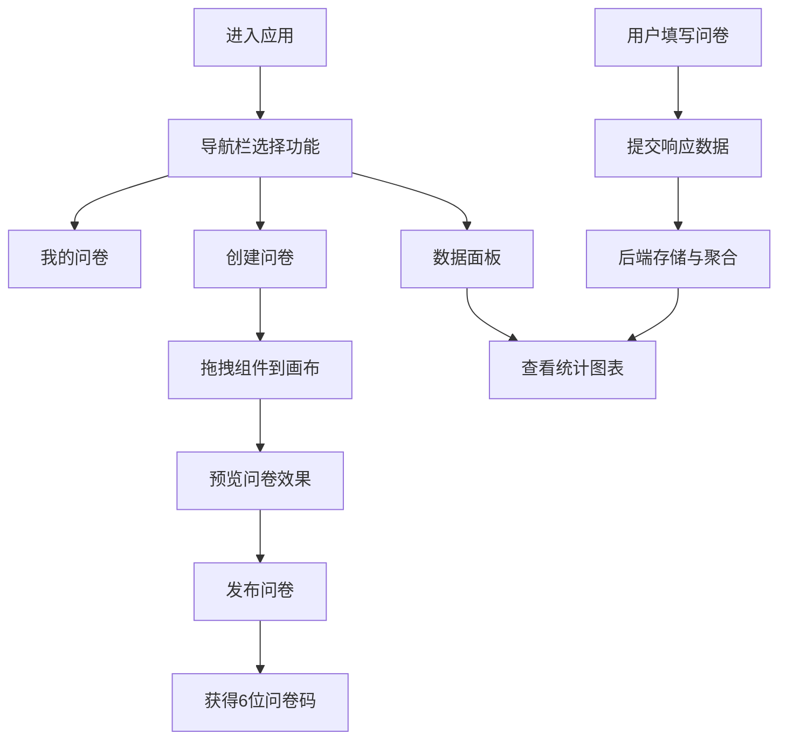

## 1. 产品概述

在线调查问卷创建与数据实时可视化面板应用，帮助用户通过拖拽组件快速设计问卷，发布后收集响应数据，并在管理后台以多种图表形式实时查看统计结果。

- 主要用途：快速创建、发布问卷并实时分析响应数据
- 目标用户：市场调研人员、企业管理者、教育工作者等需要收集反馈的用户群体
- 产品价值：零代码问卷设计，实时数据可视化，降低调研门槛，提升决策效率

## 2. 核心功能

### 2.1 用户角色

| 角色 | 注册方式 | 核心权限 |
|------|----------|----------|
| 普通用户 | 无需注册，直接使用 | 创建问卷、发布问卷、查看响应数据统计 |

### 2.2 功能模块

1. **问卷列表页**：展示所有已创建问卷，支持创建新问卷
2. **问卷编辑器**：拖拽式组件设计，支持5种题型组件
3. **问卷预览页**：完整预览问卷效果，支持交互测试
4. **数据可视化面板**：实时展示响应数据，3种图表类型统计分析

### 2.3 页面详情

| 页面名称 | 模块名称 | 功能描述 |
|----------|----------|----------|
| 问卷列表页 | 导航栏 | 提供"我的问卷"、"创建问卷"、"数据面板"入口 |
| 问卷列表页 | 问卷卡片列表 | 以卡片形式展示问卷，支持悬停动效 |
| 问卷编辑器 | 组件库面板 | 提供5种可拖拽组件（单选、多选、评分、文本、下拉） |
| 问卷编辑器 | 画布区域 | 8:5比例显示，支持组件拖拽放置、垂直间距16px |
| 问卷编辑器 | 分隔条 | 可拖动调整组件库与画布宽度比例 |
| 问卷预览页 | 问卷展示 | 完整展示所有组件，支持交互填写 |
| 问卷预览页 | 发布功能 | 生成6位唯一问卷码，提交到后端存储 |
| 数据面板 | 条形图 | 展示各题目选项分布情况 |
| 数据面板 | 折线图 | 展示响应数量随时间变化（按小时统计） |
| 数据面板 | 饼图 | 展示评分类题目各分数占比 |

## 3. 核心流程

用户进入应用后，在导航栏选择"创建问卷"，进入编辑器从左侧组件库拖拽组件到画布设计问卷；设计完成后点击预览查看效果，确认后发布问卷获得6位问卷码；用户填写问卷后，响应数据提交到后端；在导航栏选择"数据面板"查看实时统计图表。

## 4. 用户界面设计

### 4.1 设计风格

- 主色调：#4A90D9（柔和蓝色）
- 辅助色：#FFA500（金色评分）、#FF8C00（深金色悬停）
- 背景色：#F8FAFC（导航栏）、#FFFFFF（主内容区）
- 中性色：#CBD5E1（默认高亮）、#93C5FD（选中高亮）
- 按钮风格：圆角8px，内边距12px 24px，胶囊状设计，悬停变色，按下缩放0.95
- 字体：使用现代无衬线字体，标题20px加粗，正文字体清晰可读
- 布局风格：卡片式布局，左侧导航栏（宽240px，圆角8px），主内容区居右
- 图标风格：使用lucide-react图标库，线性简洁风格

### 4.2 页面设计概述

| 页面名称 | 模块名称 | UI元素 |
|----------|----------|--------|
| 问卷列表页 | 导航栏 | 背景#F8FAFC，宽240px，圆角8px，悬停0.3s高亮过渡 |
| 问卷列表页 | 问卷卡片 | 宽280px，高160px，圆角12px，阴影0 4px 6px rgba(0,0,0,0.1)，悬停加深阴影上移2px，过渡0.2s |
| 问卷编辑器 | 组件库 | 宽度300px，展示5种组件，支持拖拽 |
| 问卷编辑器 | 画布区域 | 8:5比例，组件垂直间距16px，拖拽半透明阴影跟随，放置后2秒显示组件标签 |
| 问卷编辑器 | 分隔条 | 可拖动，光标col-resize |
| 问卷预览页 | 评分组件 | 金色星标#FFA500，悬停深金色#FF8C00，点击填充，咔嗒音效 |
| 问卷预览页 | 单选/多选 | 圆角6px卡片，选中边框#4A90D9，背景#E6F0FA |
| 数据面板 | 图表区域 | 使用recharts，动画0.5秒，hover显示精确数值 |

### 4.3 响应式

- 采用桌面优先设计，主内容区最小宽度1024px
- 导航栏固定左侧，主内容区自适应剩余空间
- 画布区域保持8:5比例，可根据容器宽度自动缩放
- 触摸设备优化：增大点击区域，支持触摸拖拽

### 4.4 动效设计

- 页面切换：平滑淡入过渡，时长0.3s
- 组件拖拽：半透明阴影跟随，放置时轻微弹跳效果
- 按钮交互：悬停背景渐变，按下缩放0.95
- 卡片悬停：阴影加深，上移2px，过渡0.2s
- 导航高亮：背景色从#CBD5E1过渡到#93C5FD，时长0.3s
- 图表加载：动画时长0.5秒，数据变化时平滑过渡
