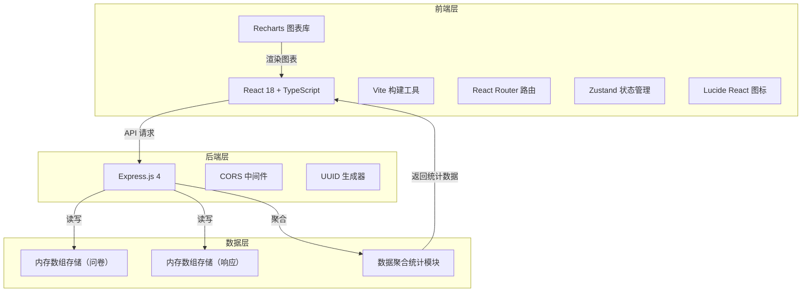
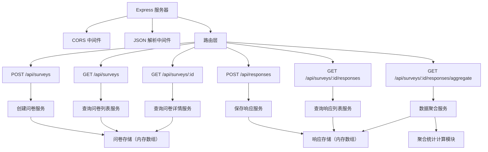
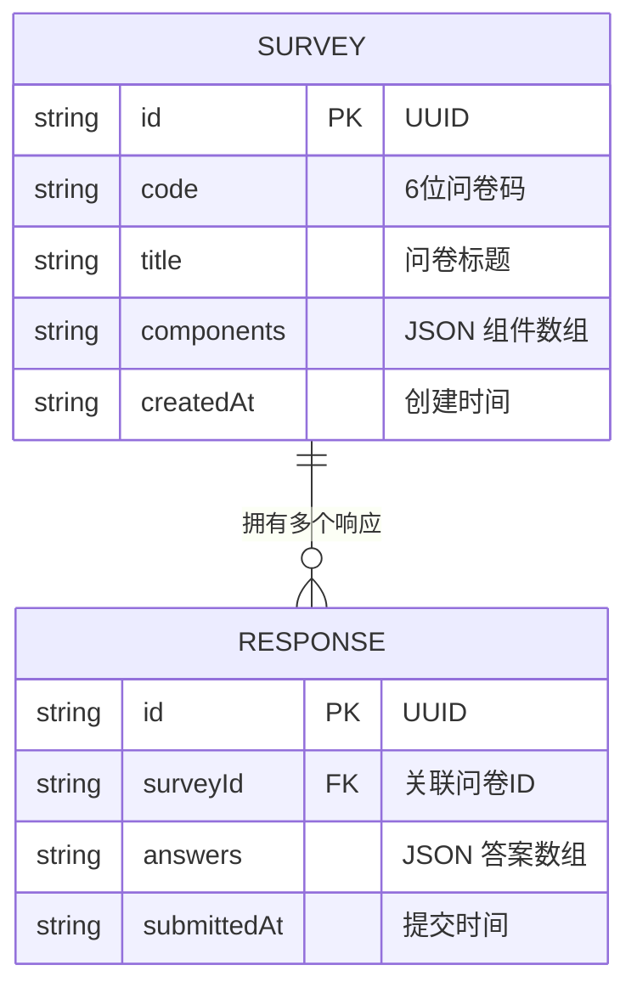

## 1. 架构设计



## 2. 技术描述

- **前端**：React@18 + TypeScript + Vite@5 + React Router DOM@6 + Zustand@4 + Recharts@2 + Lucide React@0.344
- **初始化工具**：vite-init，使用 react-express-ts 模板
- **后端**：Express@4 + TypeScript + ts-node + cors@2 + uuid@9
- **数据存储**：内存数组存储（开发环境），支持后续扩展为数据库
- **样式方案**：Tailwind CSS@3 + 自定义CSS变量

## 3. 路由定义

| 路由路径 | 页面组件 | 功能 |
|----------|----------|------|
| `/` | SurveyList | 问卷列表首页，展示所有问卷 |
| `/editor` | Editor | 问卷编辑器，拖拽设计问卷 |
| `/preview` | Preview | 问卷预览，查看效果并发布 |
| `/dashboard` | Dashboard | 数据可视化面板，展示统计图表 |

## 4. API 定义

### 4.1 TypeScript 类型定义

```typescript
// 问卷组件类型
type ComponentType = 'radio' | 'checkbox' | 'rating' | 'text' | 'select';

interface SurveyComponent {
  id: string;
  type: ComponentType;
  label: string;
  options?: string[];
  required?: boolean;
}

interface Survey {
  id: string;
  code: string;
  title: string;
  components: SurveyComponent[];
  createdAt: string;
}

interface SurveyResponse {
  id: string;
  surveyId: string;
  answers: {
    componentId: string;
    value: string | string[] | number;
  }[];
  submittedAt: string;
}

interface AggregatedData {
  componentId: string;
  type: ComponentType;
  label: string;
  optionCounts?: { [key: string]: number };
  ratingStats?: {
    average: number;
    distribution: { [score: number]: number };
  };
  textAnswers?: string[];
}
```

### 4.2 接口列表

| 方法 | 路径 | 请求体 | 响应 | 说明 |
|------|------|--------|------|------|
| POST | `/api/surveys` | `{ title: string; components: SurveyComponent[] }` | `{ id: string; code: string }` | 创建并发布问卷，返回UUID和6位问卷码 |
| GET | `/api/surveys` | - | `Survey[]` | 获取所有问卷列表 |
| GET | `/api/surveys/:id` | - | `Survey \| null` | 获取单个问卷详情 |
| POST | `/api/responses` | `{ surveyId: string; answers: Answer[] }` | `{ id: string }` | 提交问卷响应 |
| GET | `/api/surveys/:id/responses` | - | `SurveyResponse[]` | 获取问卷的所有响应 |
| GET | `/api/surveys/:id/responses/aggregate` | - | `AggregatedData[]` | 获取聚合统计数据 |

## 5. 服务器架构图



## 6. 数据模型

### 6.1 数据模型定义



### 6.2 数据结构说明

- **问卷表 (surveys)**：使用内存数组存储，每个问卷包含唯一UUID、6位唯一问卷码、标题、组件列表JSON、创建时间
- **响应表 (responses)**：使用内存数组存储，每条响应包含唯一UUID、关联问卷ID、答案JSON、提交时间
- **组件类型**：支持5种类型，每种类型有对应的配置项（选项列表、是否必填等）
- **答案格式**：根据组件类型不同，答案值可以是字符串、字符串数组或数字
- **聚合数据**：按题目统计选项被选次数、评分平均值与分布、文本答案列表

## 7. 性能优化

- **前端渲染**：使用 React.memo 优化组件重渲染，响应式更新频率不低于30fps
- **拖拽性能**：使用 requestAnimationFrame 优化拖拽动画，避免卡顿
- **接口响应**：后端使用内存存储，确保1000条数据以内响应时间不超过200ms
- **图表性能**：Recharts 启用动画优化，大数据量时启用虚拟滚动
