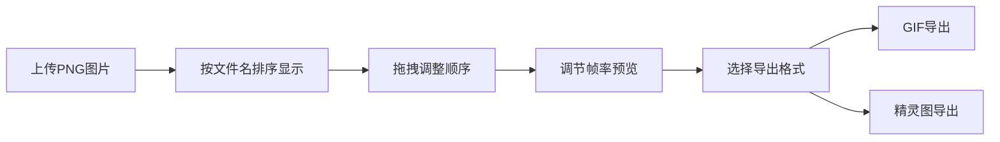

## 1. 产品概述

帧动画编辑器是一款面向动画设计师和开发者的轻量级 Web 工具，支持上传 PNG 帧序列、实时预览循环动画效果，并一键导出为 GIF 动图或精灵图。

- 核心价值：快速将静态帧序列转换为可预览的动画，简化动画制作与导出流程
- 目标用户：游戏开发者、UI 动效设计师、前端工程师

## 2. 核心功能

### 2.1 用户角色

| 角色 | 注册方式 | 核心权限 |
|------|----------|----------|
| 普通用户 | 无需注册 | 上传图片、预览动画、导出文件 |

### 2.2 功能模块

1. **帧管理模块**：拖拽/点击上传、缩略图轨道、排序调整
2. **动画预览模块**：大图预览、播放控制、帧率调节
3. **导出模块**：GIF 导出、精灵图导出

### 2.3 页面详情

| 页面名称 | 模块名称 | 功能描述 |
|----------|----------|----------|
| 主页面 | 顶部信息栏 | 显示总帧数、当前帧序号、每帧尺寸 |
| 主页面 | 左侧帧管理面板 | 上传区域、缩略图轨道、拖拽排序 |
| 主页面 | 右侧预览区 | 大图预览（棋盘格背景）、淡入过渡 |
| 主页面 | 播放控制栏 | 播放/暂停按钮、帧率滑块、数值显示 |
| 主页面 | 导出下拉菜单 | 导出 GIF、导出精灵图 |

## 3. 核心流程

用户上传 PNG 图片 → 系统按文件名排序显示缩略图 → 用户可拖拽调整顺序 → 用户调节帧率并播放预览 → 用户选择导出格式 → 系统生成并下载文件

## 4. 用户界面设计

### 4.1 设计风格

- **主色调**：深色主题，背景 `#1E1E1E`，字体 `#D4D4D4`
- **强调色**：选中边框 `#007ACC` 蓝色
- **按钮样式**：圆角 6px，悬停背景变浅
- **字体**：系统无衬线字体，清晰易读
- **布局风格**：左右分栏，左侧固定 300px，右侧自适应

### 4.2 页面设计概览

| 页面名称 | 模块名称 | UI 元素 |
|----------|----------|---------|
| 主页面 | 顶部信息栏 | 深色背景、白色文字、三项信息并排 |
| 主页面 | 帧管理面板 | 虚线上传区、80x80px 缩略图、8px 间距、序号标签 |
| 主页面 | 预览区 | 棋盘格背景、最大 400x400px、居中显示、0.2s 淡入动画 |
| 主页面 | 控制栏 | 播放按钮、5-24fps 滑块、步长 1、数值显示 |
| 主页面 | 导出菜单 | 下拉样式、两个选项、悬停高亮 |

### 4.3 响应式

- 桌面端（≥768px）：左右分栏布局，左侧面板固定 300px
- 移动端（<768px）：上下布局，左侧面板折叠为顶部横向缩略图条（高度 100px）

### 4.4 交互动效

- 帧切换：0.2 秒淡入过渡
- 按钮悬停：背景色变浅
- 缩略图选中：2px 蓝色实线边框
- 拖拽排序：视觉反馈

## 5. 性能要求

- 上传 12 张 1024x1024 图片后，帧切换响应时间 ≤ 0.5 秒
- GIF 导出时间 ≤ 5 秒
