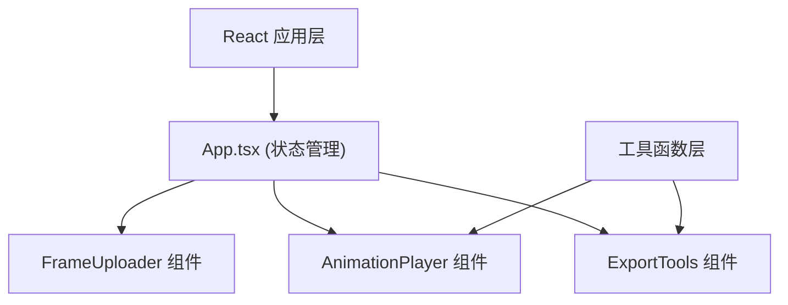

## 1. 架构设计



## 2. 技术描述

- **前端框架**：React 18 + TypeScript
- **构建工具**：Vite 5
- **样式方案**：原生 CSS（CSS Modules 或内联样式）
- **GIF 合成**：gif.js 库
- **状态管理**：React useState/useEffect（轻量场景，无需额外状态库）

## 3. 文件结构

```
├── package.json
├── index.html
├── vite.config.ts
├── tsconfig.json
└── src/
    ├── App.tsx            # 主组件，状态管理与布局
    ├── FrameUploader.tsx  # 文件上传与帧管理
    ├── AnimationPlayer.tsx # 动画播放器
    └── ExportTools.tsx    # 导出工具
```

## 4. 核心数据结构

```typescript
interface Frame {
  id: string;
  file: File;
  url: string;
  name: string;
  width: number;
  height: number;
}

interface AppState {
  frames: Frame[];
  currentFrameIndex: number;
  fps: number;
  isPlaying: boolean;
  selectedFrameIndex: number;
}
```

## 5. 关键技术点

### 5.1 图片上传与预览
- 使用 `URL.createObjectURL` 创建本地预览 URL
- 拖拽上传使用 `dragover` / `drop` 事件
- 文件名排序：`localeCompare` 自然排序

### 5.2 拖拽排序
- 使用 HTML5 Drag and Drop API
- 缩略图设置 `draggable="true"`
- 通过 `dataTransfer` 传递索引信息

### 5.3 动画播放
- 使用 `setInterval` 控制帧切换
- 帧率变化时清除旧定时器并创建新定时器
- 循环播放：索引取模

### 5.4 GIF 导出
- 使用 gif.js 库（需要引入 worker 文件）
- 按第一帧尺寸统一输出
- 白色背景填充透明区域

### 5.5 精灵图导出
- 使用 Canvas API 横向拼接
- 每帧之间 2px 白色分隔线
- 导出为 PNG 格式下载

## 6. 性能优化

- 图片预加载：所有帧 URL 提前创建
- Canvas 离屏渲染用于导出
- 避免不必要的重渲染（合理使用 useMemo/useCallback）
