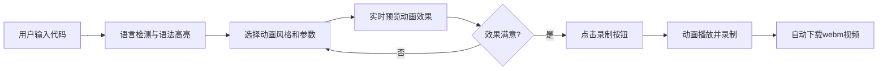

## 1. 产品概述

代码动画编辑器是一款面向技术博主、开发者的代码可视化工具，用于快速生成带有动态特效的代码片段演示视频。
- 解决手动录屏剪辑效率低的问题，一键生成高质量代码动画视频
- 帮助内容创作者提升技术分享内容的视觉表现力

## 2. 核心功能

### 2.1 用户角色
| 角色 | 注册方式 | 核心权限 |
|------|----------|----------|
| 普通用户 | 无需注册 | 输入代码、选择动画、实时预览、导出视频 |

### 2.2 功能模块
1. **代码编辑器**：代码输入、语言自动检测、浅语法高亮
2. **动画预览**：Canvas实时渲染、三种动画风格、播放/暂停控制
3. **控制面板**：动画风格选择、速度调节、颜色配置、重置
4. **视频导出**：录制动画、webm格式导出、自动下载

### 2.3 页面详情
| 页面名称 | 模块名称 | 功能描述 |
|-----------|-------------|---------------------|
| 主页面 | 代码编辑器 | textarea输入代码、语言检测、语法高亮、语言标签显示 |
| 主页面 | 动画预览 | 800x600 Canvas区域、30fps帧率、播放/暂停控制、帧渲染 |
| 主页面 | 控制面板 | 三栏卡片式动画风格选择、速度滑块、颜色选择器、重置/录制按钮 |
| 主页面 | 视频导出 | MediaRecorder录制、自动下载webm文件 |

## 3. 核心流程

用户输入代码 → 自动检测语言并高亮 → 选择动画风格和参数 → 点击播放预览效果 → 调整参数直至满意 → 点击录制按钮 → 动画完整播放并录制 → 自动下载webm视频文件

## 4. 用户界面设计

### 4.1 设计风格
- 主色：暗色主题 #1E1E1E
- 强调色：蓝色 #0E639C、绿色 #2ECC40、红色 #E74C3C
- 按钮样式：圆角过渡动画 0.2s
- 字体：Fira Code（代码）、sans-serif（界面）
- 布局：三栏布局（左40% / 中50% / 右15%+200px）
- 图标：SVG简单图标嵌入组件中

### 4.2 页面设计概述
| 页面名称 | 模块名称 | UI元素 |
|-----------|-------------|-------------|
| 主页面 | 代码编辑器 | 语言标签、深色textarea、Fira Code字体、行高1.6 |
| 主页面 | 动画预览 | Canvas画布、圆角边框、播放/暂停按钮居中 |
| 主页面 | 控制面板 | 卡片式选择、滑块控件、颜色选择、录制圆形按钮 |
| 主页面 | 整体布局 | 内边距20px、圆角8px、边框过渡动画 |

### 4.3 响应式
- Desktop-first，最小宽度支持1024px
- 中间预览区最小宽600px

### 4.4 性能要求
- 帧率稳定30fps
- 每帧渲染时间 ≤ 30ms
- 代码超过5000字符时每帧 ≤ 40ms
