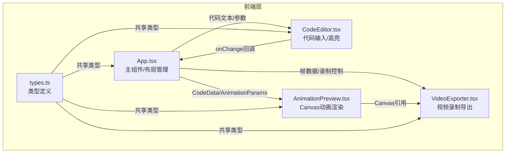

## 1. 架构设计



## 2. 技术描述
- 前端：React@18 + TypeScript@5 + Vite@5
- 初始化工具：vite-init
- 后端：无（纯前端应用）
- 数据库：无
- 主要依赖：
  - react, react-dom
  - file-saver（文件下载）
  - @types/file-saver（类型定义）

## 3. 路由定义
| 路由 | 用途 |
|-------|---------|
| / | 主应用页面（单页应用无路由） |

## 4. API 定义

### 4.1 核心类型定义

```typescript
// 代码数据
interface CodeData {
  code: string;
  language: 'javascript' | 'python' | 'html' | 'unknown';
}

// 动画参数
interface AnimationParams {
  style: 'typewriter' | 'fade' | 'highlight';
  speed: number;           // 0.5 - 3
  highlightColor: string;  // #FFD700 | #00BFFF | #FF69B4
  backgroundColor: string; // #1E1E1E | #FFFFFF
}

// 导出数据
interface ExportData {
  canvas: HTMLCanvasElement;
  duration: number;
  fps: number;
}

// 语法高亮Token
interface SyntaxToken {
  type: 'keyword' | 'string' | 'comment' | 'default';
  value: string;
  color: string;
}
```

## 5. 数据模型
本应用为纯前端，无持久化数据模型。状态管理通过React useState在App组件中集中管理：
- code: string - 代码文本
- animationParams: AnimationParams - 动画参数
- isPlaying: boolean - 播放状态
- isRecording: boolean - 录制状态

## 6. 组件通信与数据流

### 数据流
1. 用户在 CodeEditor 输入代码 → onChange 回调 → App 更新 code state
2. 用户在控制面板（App 内嵌）调整参数 → App 更新 animationParams state
3. App 将 code + animationParams 传给 AnimationPreview
4. AnimationPreview 使用 Canvas 渲染动画帧
5. VideoExporter 接收 Canvas 引用 → MediaRecorder 录制 → Blob → file-saver 下载

### 动画帧渲染流程
- 使用 requestAnimationFrame 调度
- 固定帧率 30fps（使用时间戳控制）
- 三种风格各自计算当前帧应显示的内容
- Canvas 2D API 绘制文字、背景、高亮区域
