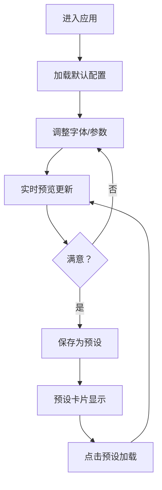

## 1. 产品概述

字体排印对比工具是一款面向前端开发者和设计师的专业字体搭配调试工具，解决在选择正文与标题字体组合时难以直观比较排版效果的痛点。

- **核心价值**：通过实时预览和参数化控制，帮助用户快速找到最和谐的标题与正文字体组合
- **目标用户**：前端开发者、UI设计师、排版工程师
- **市场定位**：专业级字体调试工具，提升排版决策效率

## 2. 核心功能

### 2.1 功能模块

1. **字体选择模块**：标题字体和正文字体各15种Google Fonts选择，带字体预览小样
2. **参数控制模块**：字号、字重、行高、间距的精细化调节
3. **背景切换模块**：5种预设背景色，支持深色背景自动切换文字颜色
4. **预设管理模块**：保存最多6个字体搭配方案，一键加载切换
5. **实时预览模块**：中英文混合排版示例，包含h1、h2、p、blockquote四种元素

### 2.2 页面详情

| 页面名称 | 模块名称 | 功能描述 |
|-----------|-------------|---------------------|
| 主页面 | 控制面板 | 字体选择下拉框、字重按钮组、参数滑块、背景色切换、预设卡片区 |
| 主页面 | 预览区域 | 实时渲染排版示例，根据参数动态更新样式 |

## 3. 核心流程

用户进入应用后，默认加载预设字体组合，通过控制面板调整字体、字重、大小、行高、间距和背景色，预览区实时更新效果。满意后可保存为预设，后续点击预设卡片即可快速加载。

## 4. 用户界面设计

### 4.1 设计风格
- **主色调**：#3B82F6（蓝色）作为强调色
- **中性色**：#F8FAFC（浅灰背景）、#334155（文字）、#E2E8F0（边框）
- **控件风格**：统一圆角8px，简约扁平设计，避免过重阴影
- **动效**：数值变化0.2秒ease-in-out缓动，悬停缩放1.1倍
- **字体选择**：15种Google Fonts，标题与正文独立选择

### 4.2 页面布局
- **整体结构**：左右两栏固定布局
- **左侧控制面板**：340px固定宽度，背景#F8FAFC，内边距24px，右侧边框#E2E8F0
- **右侧预览区**：自适应宽度，最小700px，内容区24px padding

### 4.3 响应式
- 桌面端优先设计，保证1024px以上屏幕完整显示
- 预览区最小宽度700px，确保排版效果真实

### 4.4 控件细节
- **字体选择下拉框**：带A-Z和0-9预览小样，12px字号
- **字重按钮组**：5个按钮（300-700），选中时边框加粗，按钮文字使用对应字重
- **参数滑块**：实时数值显示，步长控制
- **背景色按钮**：圆形色块，直径28px，选中时边框#3B82F6，宽度2px
- **预设卡片**：80×50px，圆角8px，悬停放大1.1倍
