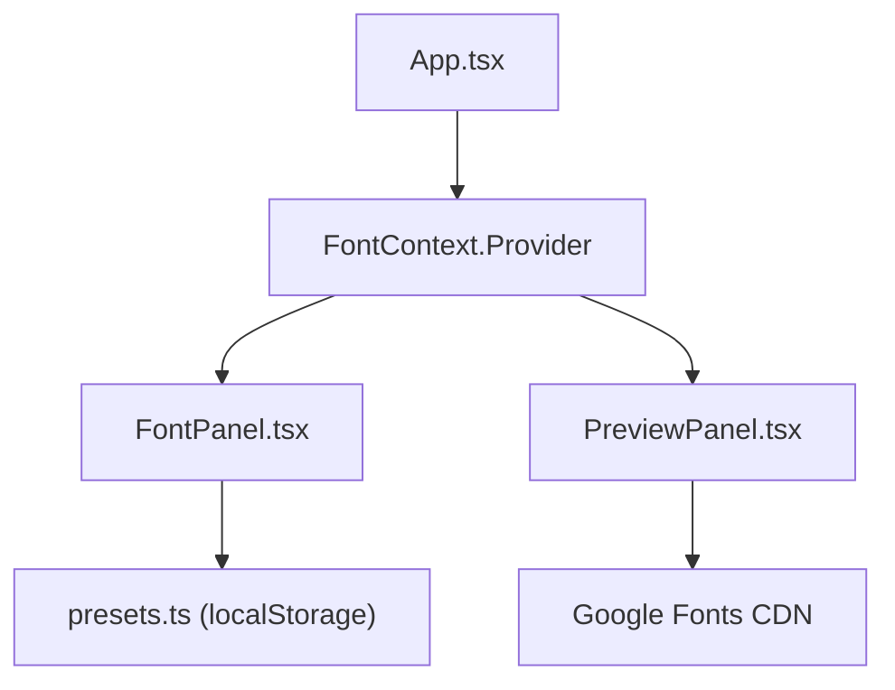

## 1. 架构设计



## 2. 技术栈说明

- **前端框架**：React 18 + TypeScript
- **构建工具**：Vite 5
- **状态管理**：React Context API
- **样式方案**：原生CSS + CSS变量
- **字体加载**：Google Fonts CDN
- **数据持久化**：localStorage（预设存储）

## 3. 目录结构

```
src/
├── App.tsx                 # 主组件，布局容器，Context Provider
├── context/
│   └── FontContext.tsx     # 全局状态管理
├── components/
│   ├── FontPanel.tsx       # 左侧控制面板
│   └── PreviewPanel.tsx    # 右侧预览区
└── utils/
    └── presets.ts          # 预设管理工具函数
```

## 4. 状态管理设计

### FontContext 状态定义

```typescript
interface FontState {
  headingFont: string;
  bodyFont: string;
  headingWeight: number;
  bodyWeight: number;
  headingSize: number;
  bodySize: number;
  lineHeight: number;
  headingSpacing: number;
  backgroundColor: string;
}

interface FontContextType extends FontState {
  setHeadingFont: (font: string) => void;
  setBodyFont: (font: string) => void;
  setHeadingWeight: (weight: number) => void;
  setBodyWeight: (weight: number) => void;
  setHeadingSize: (size: number) => void;
  setBodySize: (size: number) => void;
  setLineHeight: (lh: number) => void;
  setHeadingSpacing: (spacing: number) => void;
  setBackgroundColor: (color: string) => void;
  loadPreset: (preset: Preset) => void;
}
```

## 5. 数据模型

### 预设数据结构

```typescript
interface Preset {
  id: string;
  name: string;
  headingFont: string;
  bodyFont: string;
  headingWeight: number;
  bodyWeight: number;
  headingSize: number;
  bodySize: number;
  lineHeight: number;
  headingSpacing: number;
  backgroundColor: string;
  createdAt: string;
}
```

## 6. 性能优化策略

1. **实时更新优化**：使用CSS变量驱动样式变化，避免React重渲染瓶颈
2. **字体加载优化**：预连接Google Fonts，使用font-display: swap
3. **状态更新**：滑块使用useCallback优化，避免不必要的重渲染
4. **localStorage操作**：异步读写，不阻塞UI线程
5. **性能目标**：滑块/字体选择更新 < 50ms，预设切换 < 100ms

## 7. 字体列表（15种）

1. Inter
2. Playfair Display
3. JetBrains Mono
4. Space Grotesk
5. Merriweather
6. Roboto
7. Open Sans
8. Lato
9. Montserrat
10. Poppins
11. Nunito
12. Raleway
13. Ubuntu
14. Noto Serif SC
15. Noto Sans SC
