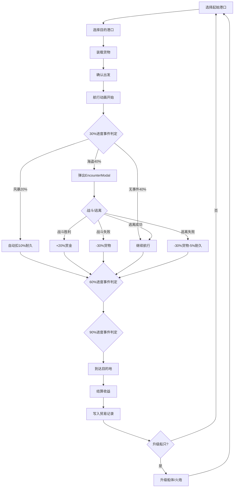

## 1. 产品概述

海上贸易航线规划与随机遭遇事件模拟应用——一款以古代航海贸易为背景的经营模拟游戏，玩家选择港口建立贸易航线，装载货物出发后自动航行，途中遭遇海盗或风暴事件，最终到达目的地结算收益，并通过利润升级船只。

- 目标用户：喜欢经营策略与航海冒险的休闲玩家
- 核心价值：将航线规划、货物买卖与战斗判定的闭环玩法在浏览器内完整呈现

## 2. 核心功能

### 2.1 用户角色

| 角色 | 注册方式 | 核心权限 |
|------|----------|----------|
| 玩家 | 无需注册，直接进入 | 规划航线、买卖货物、战斗判定、升级船只 |

### 2.2 功能模块

1. **主游戏页面**：港口地图、航线规划、航行动画、事件触发、收益结算、贸易记录与升级

### 2.3 页面详情

| 页面名称 | 模块名称 | 功能描述 |
|----------|----------|----------|
| 主游戏页面 | 港口地图区（左侧70%） | 绘制4-6个港口节点（圆形#E76F51），贝塞尔曲线连接航线，鼠标悬停高亮#E0FBFC，点击港口弹出信息面板 |
| 主游戏页面 | 港口信息面板 | 半透明#293241背景，圆角12px，显示可购买/出售货物列表（Emoji图标），设定装载量 |
| 主游戏页面 | 航线航行动画 | 船只图标沿贝塞尔曲线匀速移动（2-4秒），每30%进度触发随机事件 |
| 主游戏页面 | 海盗遭遇模态框 | 显示双方战力对比条，胜率渐变条（绿#2ECC71→红#E74C3C），战斗/逃离按钮，战斗动画（CSS keyframes晃动+闪烁#FF0000） |
| 主游戏页面 | 风暴事件 | 自动扣除10%耐久度，红色波形文字特效（CSS text-shadow闪烁0.5秒循环） |
| 主游戏页面 | 操作面板区（右侧30%） | 渐变背景#1D3557→#457B9D，圆角8px，贸易记录列表、船只升级按钮 |
| 主游戏页面 | 贸易记录侧边栏 | 每次航行生成记录（时间、起始港口、利润、事件摘要），渐变背景 |
| 主游戏页面 | 船只升级 | 金色#F4A261边框按钮，0.2秒缩放动画，升级船体（最高5级，+50吨/级）或火炮（+10战力/级） |

## 3. 核心流程

玩家在地图上选择起始港口和目的港口→在港口信息面板中选择货物并设定装载量→确认航线出发→船只沿贝塞尔曲线航行（动画2-4秒）→每30%进度随机事件判定：海盗（40%）或风暴（20%）→海盗遭遇弹出EncounterModal进行战斗/逃离判定→风暴自动扣耐久→到达目的地结算收益→贸易记录写入侧边栏→使用利润升级船只→循环

## 4. 用户界面设计

### 4.1 设计风格

- 主色调：暗海蓝#0B1D3A背景 + 暖色#E76F51港口节点 + 红色#E63946交互按钮
- 辅助色：渐变面板#1D3557→#457B9D，金色#D4A373边框，文字#F1FAEE
- 按钮风格：扁平化圆角，#E63946主色调，悬停#FF6B6B，点击缩放0.95
- 字体：Cinzel（标题展示字体，古典航海风）+ Noto Sans SC（正文UI字体）
- 布局风格：左右分栏，左70%地图区+右30%操作面板
- 图标/Emoji：货物用Emoji表示（🧂香料、🧶丝绸、🏺瓷器、☕茶叶、💎宝石）

### 4.2 页面设计概览

| 页面名称 | 模块名称 | UI元素 |
|----------|----------|--------|
| 主游戏页面 | 地图区 | 暗海蓝#0B1D3A背景，网格线#1A3A5C透明度0.3，圆形港口节点#E76F51半径40px，贝塞尔曲线航线，已探索港口白色光圈box-shadow 0 0 15px #FFF |
| 主游戏页面 | 港口信息面板 | 半透明#293241背景，圆角12px，货物Emoji列表，装载量滑块 |
| 主游戏页面 | 操作面板 | 渐变#1D3557→#457B9D，圆角8px，贸易记录列表，升级按钮金色#F4A261边框 |
| 主游戏页面 | 事件模态框 | 半透明黑色#00000080遮罩，木纹纹理linear-gradient框体，金色边框#D4A373，复古X关闭按钮 |
| 主游戏页面 | 战斗动画 | CSS keyframes左右晃动0.3秒，闪烁#FF0000，胜率渐变条绿#2ECC71→红#E74C3C |

### 4.3 响应式设计

- 桌面优先设计，最小宽度1024px
- 地图区使用SVG绘制，自适应容器尺寸
- 操作面板在窄屏下可折叠

### 4.4 3D场景指引

- 不涉及3D场景
