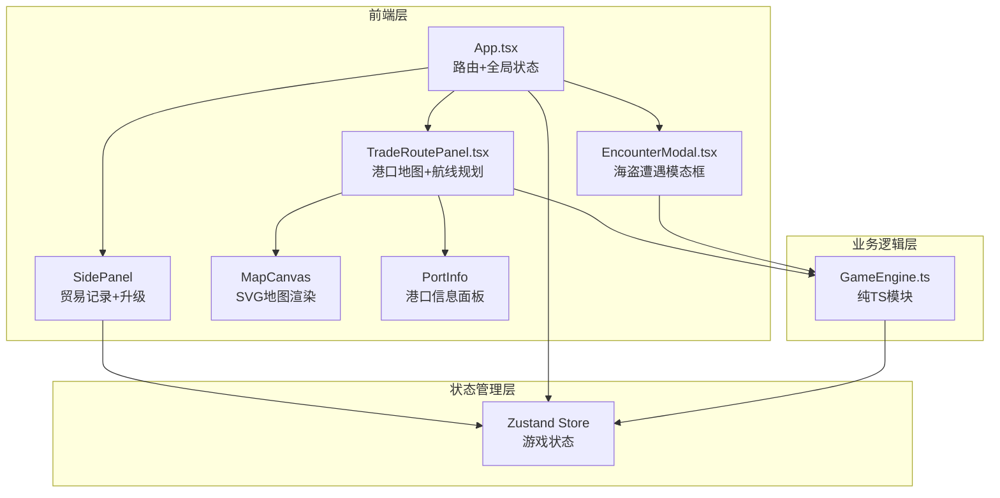
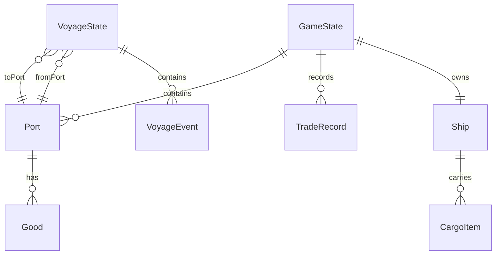

## 1. 架构设计



## 2. 技术说明

- 前端：React@18 + TypeScript + Vite + TailwindCSS
- 初始化工具：vite-init（react-ts模板）
- 后端：无（纯前端）
- 数据库：无（内存状态 + Zustand持久化）
- 状态管理：Zustand

## 3. 路由定义

| 路由 | 用途 |
|------|------|
| / | 主游戏页面（单页应用，无路由切换） |

## 4. API定义

无后端API，所有数据通过GameEngine纯TS模块处理。

### 核心数据类型定义

```typescript
interface Port {
  id: string;
  name: string;
  x: number;
  y: number;
  goods: Good[];
  isExplored: boolean;
}

interface Good {
  id: string;
  name: string;
  emoji: string;
  weight: number;
  basePrice: number;
  sellPrice: number;
}

interface Ship {
  hullLevel: number;
  cannonLevel: number;
  maxCapacity: number;
  durability: number;
  maxDurability: number;
}

interface VoyageState {
  fromPort: Port;
  toPort: Port;
  cargo: CargoItem[];
  progress: number;
  events: VoyageEvent[];
  status: 'idle' | 'sailing' | 'encounter' | 'storm' | 'completed';
}

interface CargoItem {
  good: Good;
  quantity: number;
}

interface VoyageEvent {
  type: 'pirate' | 'storm';
  progress: number;
  resolved: boolean;
  result?: 'victory' | 'defeat' | 'flee_success' | 'flee_fail';
}

interface TradeRecord {
  id: string;
  timestamp: number;
  fromPort: string;
  toPort: string;
  profit: number;
  events: string[];
}

interface GameState {
  ship: Ship;
  gold: number;
  currentPort: Port | null;
  voyage: VoyageState | null;
  tradeRecords: TradeRecord[];
  ports: Port[];
}
```

### GameEngine接口定义

```typescript
interface GameEngine {
  calculateRouteDistance(from: Port, to: Port): number;
  calculateVoyageDuration(distance: number): number;
  calculateCargoProfit(cargo: CargoItem[], destination: Port): number;
  calculatePlayerPower(ship: Ship): number;
  calculateWinRate(playerPower: number, piratePower: number): number;
  generatePiratePower(): number;
  checkEncounter(): 'pirate' | 'storm' | 'none';
  resolveBattle(winRate: number): 'victory' | 'defeat';
  resolveFlee(): 'success' | 'fail';
  calculateSettlement(voyage: VoyageState): SettlementResult;
}
```

## 5. 服务器架构图

无后端服务器。

## 6. 数据模型

### 6.1 数据模型定义



### 6.2 数据定义语言

使用Zustand内存状态管理，初始数据硬编码：

- 5个港口：泉州、广州、占城、满剌加、天竺
- 5种货物：香料🧂、丝绸🧶、瓷器🏺、茶叶☕、宝石💎
- 初始船只：船体1级、火炮1级、载重200吨、耐久100%
