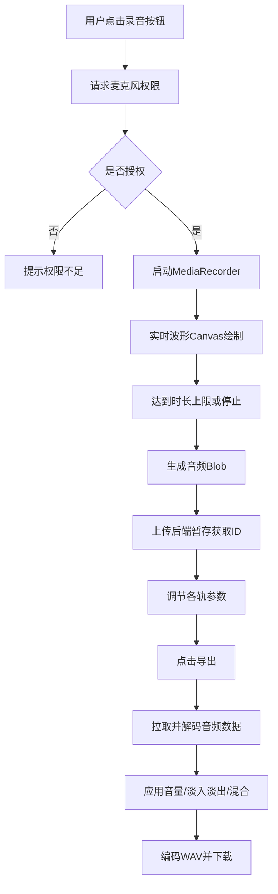

## 1. 产品概述

多轨录音混音器是一款面向音乐制作人和播客创作者的浏览器端Web应用，解决在缺少专业DAW软件时快速录制多轨音频并混音导出的问题。用户可在浏览器中直接录制最多4轨人声或乐器，实时查看波形，调整各轨音量、静音/独奏、设置淡入淡出效果，最终导出为WAV格式的混音文件。

- 主要用途：快速多轨录音、实时波形可视化、音频参数调节、混音导出
- 目标用户：音乐制作人、播客创作者、语音记录员、独立音乐人
- 产品价值：无需安装专业软件，零门槛使用，随时随地完成多轨录音与混音

## 2. 核心功能

### 2.1 用户角色
本应用无多角色区分，所有用户均以访客身份直接使用全部功能。

### 2.2 功能模块
1. **音轨管理模块**：4个独立音轨（A/B/C/D），彩色标签，录音/播放/静音/独奏控制
2. **实时录音模块**：浏览器麦克风权限请求，16位PCM 44100Hz采样，最长120秒
3. **波形可视化模块**：Canvas实时绘制（30fps），静态波形自适应显示，颜色与音轨标签同步
4. **音频控制模块**：音量滑块（-20dB~+6dB），淡入淡出时长设置（0~5秒）
5. **混音导出模块**：主音量调节，多轨混合运算，16位立体声WAV编码下载

### 2.3 页面详情
| 页面名称 | 模块名称 | 功能描述 |
|---------|---------|---------|
| 主应用页 | 顶部标题栏 | 显示应用名称、返回/清空按钮 |
| 主应用页 | 音轨列表区 | 4个音轨卡片，包含波形Canvas、控制按钮组 |
| 主应用页 | 右侧控制面板 | 各音轨音量、淡入淡出参数调节 |
| 主应用页 | 底部混音导出栏 | 主音量滑块、导出按钮 |

## 3. 核心流程

### 3.1 录音流程
用户选择音轨 → 点击录音按钮 → 浏览器请求麦克风权限 → 授权成功后开始录制 → 实时波形绘制（30fps）→ 达到120秒或用户点击停止 → 波形自适应显示 → 自动上传至后端暂存

### 3.2 混音导出流程
用户调节各轨参数（音量/静音/独奏/淡入淡出）→ 调节主音量 → 点击导出按钮 → AudioMixer从后端拉取或前端直接获取各轨音频数据 → 解码为Float32Array → 应用音量增益与淡入淡出包络 → 多轨求和混合 → 编码为WAV格式 → 触发浏览器下载

## 4. 用户界面设计

### 4.1 设计风格
- **配色方案**：暗色专业DAW风格，主背景#1A1A1A，卡片背景#2A2A2A，文字#E0E0E0，辅助文字#888，边框#3A3A3A
- **音轨色板**：红#FF6B6B（A轨）、青#4ECDC4（B轨）、黄#FFE66D（C轨）、绿#95E1D3（D轨）
- **按钮风格**：圆角8px，0.15s ease过渡动画，录音按钮非录制态#555/悬停#FF6B6B，录制态红色脉冲动画（0.6s周期）
- **字体**：Google Fonts Inter，无衬线体，标题14px，正文12-14px
- **布局**：三栏式（顶部标题栏+左侧音轨区75%+右侧控制面板25%+底部导出栏）
- **视觉效果**：静音时波形透明度0.4，独奏时其他音轨半透明条纹覆盖，淡入淡出黑色渐变覆盖层

### 4.2 页面设计概述
| 页面名称 | 模块名称 | UI元素 |
|---------|---------|-------|
| 主应用页 | 顶部标题栏 | 背景#2D2D2D，高60px，居中白色标题，左侧返回箭头图标，点击清空所有录音 |
| 主应用页 | 音轨列表区 | 宽度75%，背景#1A1A1A，内边距16px，音轨卡片圆角8px/背景#2A2A2A/间距12px |
| 主应用页 | 音轨卡片 | 彩色标签+波形Canvas+按钮组（录音/播放/静音/独奏），每个按钮独立状态样式 |
| 主应用页 | 右侧控制面板 | 宽度25%最小240px，背景#141414，音量滑块（轨道#555/按钮16px圆形）、淡入淡出数字输入框 |
| 主应用页 | 底部混音导出栏 | 固定高80px，背景#242424，主音量滑块（轨道#333/按钮白色），导出按钮#00BFFF/悬停#0099CC/加载旋转动画 |

### 4.3 响应式设计
- **桌面端**（≥768px）：三栏式布局正常显示
- **移动端**（<768px）：左侧音轨区宽度100%，右侧控制面板变为底部可弹出面板，通过切换按钮显示/隐藏，背景#141414高度自适应

### 4.4 动画与交互
- 录音按钮：录制时scale脉冲动画0.6s周期，box-shadow发光
- 所有按钮：0.15s ease过渡（颜色、背景、transform）
- 导出按钮：点击后禁用，添加CSS旋转加载动画
- 波形绘制：30fps流畅更新，静态波形自适应宽度
