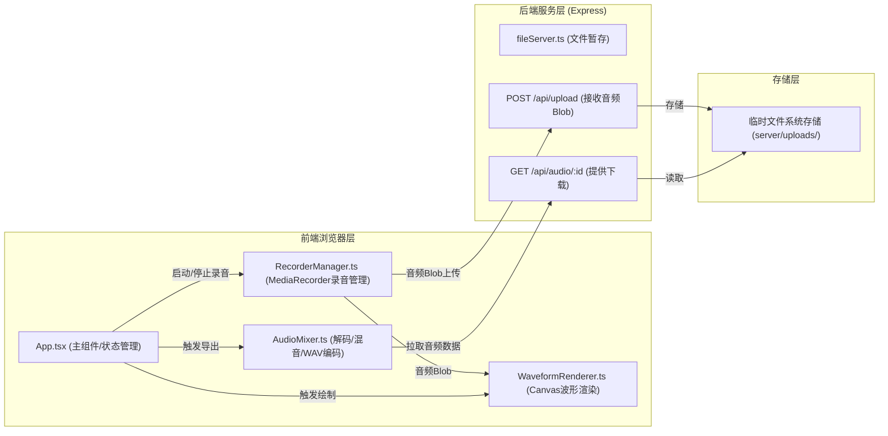

## 1. 架构设计



## 2. 技术选型说明

- **前端框架**：React 18 + TypeScript（严格模式）
- **构建工具**：Vite 5（热更新、快速构建）
- **Vite插件**：@vitejs/plugin-react（React JSX支持）
- **后端框架**：Express 4（轻量级HTTP服务）
- **中间件**：
  - cors：跨域请求支持
  - multer：处理multipart/form-data文件上传
  - uuid：生成唯一音频文件ID
- **音频处理**：
  - Web Audio API：AudioContext解码、AudioBuffer混合
  - MediaRecorder API：录制浏览器麦克风输入（audio/webm;codecs=pcm格式优先）
  - Canvas 2D：实时/静态波形绘制
- **开发辅助**：concurrently（并行启动前后端服务器）
- **字体**：Google Fonts Inter
- **运行端口**：前端Vite :5173，后端Express :3001，Vite代理/api → :3001

## 3. 目录结构与路由定义

| 路径 | 用途 |
|-----|------|
| / | 应用唯一入口页面，渲染完整多轨录音混音器 |
| package.json | 依赖配置与启动脚本 |
| index.html | Vite入口HTML |
| vite.config.ts | Vite配置（React插件 + API代理） |
| tsconfig.json | TypeScript严格模式配置 |
| src/App.tsx | React主组件：状态管理+UI渲染+模块协调 |
| src/recorder/RecorderManager.ts | MediaRecorder封装类 |
| src/waveform/WaveformRenderer.ts | Canvas波形渲染类 |
| src/mixer/AudioMixer.ts | 多轨混音与WAV导出类 |
| server/fileServer.ts | Express文件服务器：上传/下载接口 |
| server/uploads/ | 后端临时音频存储目录 |

## 4. API接口定义

### 4.1 POST /api/upload
- **用途**：接收前端录制完成的音频Blob，暂存并返回唯一ID
- **Content-Type**：multipart/form-data
- **请求体字段**：
  - `audio`：音频文件（Blob）
- **响应（200 OK）**：
  ```typescript
  interface UploadResponse {
    success: true;
    id: string;        // UUID格式的文件唯一标识
    filename: string;  // 服务器端存储的文件名
    size: number;      // 文件大小（字节）
  }
  ```
- **错误响应（400/500）**：
  ```typescript
  interface ErrorResponse {
    success: false;
    error: string;
  }
  ```

### 4.2 GET /api/audio/:id
- **用途**：根据ID获取已上传的音频文件
- **URL参数**：`id` - 上传时返回的UUID
- **响应（200 OK）**：音频文件二进制流，Content-Type根据文件扩展名设置
- **错误响应（404）**：`{ success: false, error: "File not found" }`

## 5. 核心模块类型定义

### 5.1 音轨状态类型
```typescript
interface TrackState {
  id: 'A' | 'B' | 'C' | 'D';
  label: string;
  labelColor: string;
  isRecording: boolean;
  isPlaying: boolean;
  isMuted: boolean;
  isSolo: boolean;
  volumeDb: number;       // -20 ~ +6 dB
  fadeInSec: number;      // 0 ~ 5 秒
  fadeOutSec: number;     // 0 ~ 5 秒
  audioBlob: Blob | null;
  audioUrl: string | null;
  audioId: string | null; // 后端存储ID
  durationSec: number;
}
```

### 5.2 RecorderManager接口
```typescript
class RecorderManager {
  constructor(trackId: string, sampleRate?: number);
  start(): Promise<void>;
  stop(): Promise<Blob>;
  pause(): void;
  resume(): void;
  isRecording: boolean;
  getLatestData(): Blob | null;
  onDataAvailable: (chunk: Blob) => void;  // 回调：用于实时波形
}
```

### 5.3 WaveformRenderer接口
```typescript
class WaveformRenderer {
  constructor(canvas: HTMLCanvasElement, options?: RenderOptions);
  renderStatic(blob: Blob, color?: string): Promise<void>;
  renderRealtime(data: Float32Array | number[], color?: string): void;
  clear(): void;
  applyMuteEffect(isMuted: boolean): void;
  applySoloEffect(isSoloed: boolean, otherSoloed: boolean): void;
  applyFadeOverlay(fadeInSec: number, fadeOutSec: number, totalDurationSec: number): void;
}
```

### 5.4 AudioMixer接口
```typescript
class AudioMixer {
  static decodeAudio(blobOrUrl: Blob | string, sampleRate?: number): Promise<AudioBuffer>;
  static applyGain(buffer: AudioBuffer, gainDb: number): AudioBuffer;
  static applyFadeInOut(buffer: AudioBuffer, fadeInSec: number, fadeOutSec: number): AudioBuffer;
  static mixBuffers(buffers: AudioBuffer[], masterGainDb?: number, sampleRate?: number): AudioBuffer;
  static encodeWAV(audioBuffer: AudioBuffer, isStereo?: boolean, bitDepth?: number): ArrayBuffer;
  static downloadWAV(arrayBuffer: ArrayBuffer, filename?: string): void;
}
```

## 6. 数据模型与状态管理

### 6.1 前端状态树（React useState/useReducer）
```
AppState
├── tracks: TrackState[4]   // A/B/C/D四轨
├── masterVolumeDb: number  // -10 ~ +3
├── isExporting: boolean    // 导出状态
├── isMobilePanelOpen: boolean  // 移动端控制面板开关
└── hasSoloTrack: boolean   // 是否有音轨处于Solo状态
```

### 6.2 后端存储结构
```
server/uploads/
└── <uuid>.webm  // 以UUID命名的原始录音文件，保留原始格式
```
- 临时文件可通过Node.js定时清理机制（可选）或在服务重启时清理
- 无需数据库，文件系统直接映射UUID到文件

## 7. 关键实现要点

### 7.1 性能要求
- **混音处理性能**：4轨×120秒×44100Hz ≈ 21,168,000样本点，要求30秒内完成（≈700k样本/秒），采用Float32Array批量运算
- **波形绘制帧率**：requestAnimationFrame驱动，但限流到30fps以平衡CPU占用
- **内存管理**：录音Blob及时转URL并在重新录音时revokeObjectURL释放内存

### 7.2 音频格式链
- 录制：MediaRecorder → WebM/PCM → Blob
- 解码：Blob → fetch/FileReader → ArrayBuffer → AudioContext.decodeAudioData → AudioBuffer(Float32)
- 处理：增益(dB→linear) × 淡入淡出包络(线性渐变) × 多轨求和(限幅/硬截断防溢出)
- 输出：AudioBuffer → 16位PCM交错 → WAV头(44字节RIFF) → Blob → download

### 7.3 静音/独奏逻辑
```
计算某轨最终是否发声：
if (hasSoloTrack) {
  shouldPlay = track.isSolo && !track.isMuted
} else {
  shouldPlay = !track.isMuted
}
```
