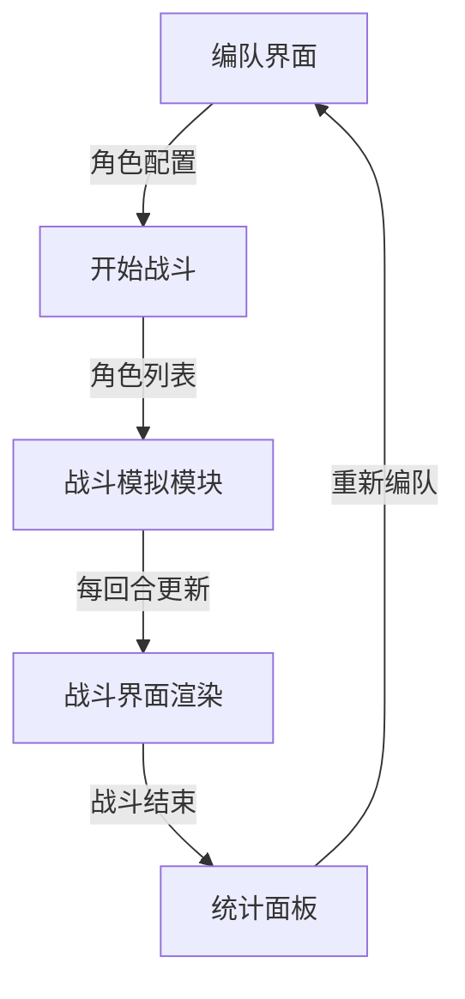

## 1. 产品概述

地牢探险组队战斗模拟器——一款面向独立游戏团队的快速原型验证工具，用于测试不同队伍配置（坦克、治疗、输出）对回合制战斗结果的影响。目标用户为游戏设计师和开发人员，核心价值在于通过可视化战斗模拟快速迭代职业平衡与编队策略。

## 2. 核心功能

### 2.1 功能模块

1. **编队界面**：角色池选择、4槽位编队、快速预设方案
2. **战斗界面**：回合制自动战斗、实时血条与战斗日志
3. **统计面板**：战斗结束后展示伤害/治疗/承伤统计与角色贡献

### 2.2 页面详情

| 页面名称 | 模块名称 | 功能描述 |
|---------|---------|---------|
| 编队界面 | 角色选择区 | 4个角色槽位，从8+预设角色池中选择，已选不可重复 |
| 编队界面 | 角色卡展示 | 显示职业图标、头像、名字、属性条（生命/攻击） |
| 编队界面 | 快速预设区 | 4个预设编队方案一键填充 |
| 战斗界面 | 我方状态栏 | 左上角显示队伍头像、血条、名字 |
| 战斗界面 | 敌方Boss栏 | 右上角显示Boss头像、血条、名字 |
| 战斗界面 | 战斗日志 | 下方滚动日志区域，实时记录行动 |
| 统计面板 | 总览统计 | 总回合数、我方/敌方总伤害、总治疗量、总承伤量 |
| 统计面板 | 角色贡献 | 水平条形图展示各角色伤害/治疗/承伤占比 |
| 统计面板 | 重新编队按钮 | 返回编队界面 |

## 3. 核心流程

1. 玩家在编队界面选择最多4名角色，或使用预设方案
2. 点击"开始战斗"进入战斗界面
3. 系统自动进行回合制战斗（最多15回合）
4. 战斗过程实时显示血条变化与行动日志
5. 战斗结束后弹出统计面板
6. 可选择"重新编队"返回编队界面

## 4. 界面设计

### 4.1 设计风格

- **主背景色**：#1a1a2e（深色地牢）
- **卡片背景**：#16213e（深蓝灰）
- **强调色**：#e94560（血红色按钮与高亮）
- **辅助色**：#0f3460（面板与血条背景）
- **文字主色**：#e0e0e0（浅灰白）
- **金色**：#feca57（暴击数字、特殊数值）
- **职业色**：坦克#ff6b6b、治疗#48dbfb、输出#feca57
- **圆角**：卡片12px，按钮8px，统计面板16px
- **字体**：等宽字体用于日志，装饰性字体用于标题
- **布局**：编队水平4卡，战斗左右布局，统计居中卡片

### 4.2 页面设计概览

| 页面名称 | 模块名称 | UI元素 |
|---------|---------|--------|
| 编队界面 | 角色卡 | 160x200px卡片，职业色边框3px，悬停上移8px+发光，选中缩放1.05 |
| 战斗界面 | 血条 | 平滑过渡动画 transition: width 0.3s ease |
| 战斗界面 | 日志区域 | 背景#0f3460，文字#e0e0e0，最近一条高亮#00d2ff |
| 统计面板 | 覆盖层 | 全屏半透明黑rgba(0,0,0,0.7)，居中卡片650px宽 |
| 统计面板 | 条形图 | 水平条形，职业色区分 |
| 统计面板 | 重新编队按钮 | 背景#e94560，悬停缩放1.05 |

### 4.3 响应式

- 桌面优先设计
- 小屏（<768px）角色卡纵向排列，宽度自适应
- 战斗界面小屏时我方/敌方上下排列

### 4.4 动效

- 战斗界面从右向左滑入（translateX(100%)→0，0.4s ease-out）
- 角色卡悬停上移+外发光（职业色模糊12px）
- 血条宽度平滑过渡（0.3s ease）
- 日志最新条目高亮色#00d2ff
