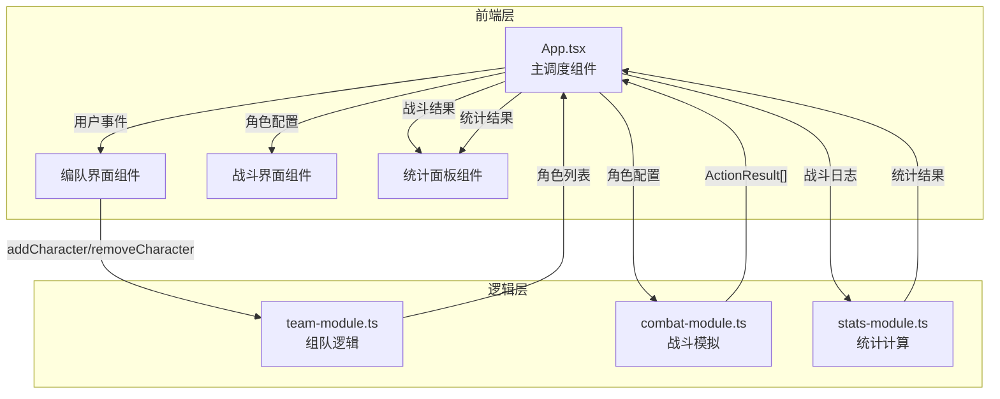

## 1. 架构设计



## 2. 技术说明

- **前端框架**：React 18 + TypeScript（严格模式）
- **构建工具**：Vite
- **状态管理**：Zustand
- **样式方案**：CSS Modules + CSS 变量（暗黑主题）
- **图标**：lucide-react
- **后端**：无（纯前端模拟）
- **数据库**：无（内存状态）

## 3. 路由定义

本项目为单页面应用，无路由切换，通过状态控制界面切换：

| 状态 | 对应界面 |
|------|---------|
| `team` | 编队界面 |
| `combat` | 战斗界面 |
| `stats` | 统计面板（覆盖层） |

## 4. 数据模型

### 4.1 核心接口定义

```typescript
interface ICharacter {
  id: string;
  name: string;
  class: "tank" | "healer" | "dps";
  hp: number;
  maxHp: number;
  atk: number;
  def: number;
  speed: number;
  skill: ISkill;
  skillCooldown: number;
  currentCooldown: number;
  isAlive: boolean;
}

interface ISkill {
  name: string;
  description: string;
  effect: "taunt" | "heal" | "crit";
  cooldown: number;
}

interface ActionResult {
  round: number;
  actorId: string;
  actorName: string;
  action: string;
  targetId: string;
  targetName: string;
  value: number;
  isCrit: boolean;
}

interface BattleStats {
  totalRounds: number;
  totalDamageDealt: number;
  totalDamageTaken: number;
  totalHealing: number;
  isVictory: boolean;
  characterContributions: CharacterContribution[];
}

interface CharacterContribution {
  characterId: string;
  characterName: string;
  class: "tank" | "healer" | "dps";
  damageDealt: number;
  damageTaken: number;
  healingDone: number;
}
```

## 5. 文件结构

```
├── index.html
├── package.json
├── vite.config.ts
├── tsconfig.json
├── src/
│   ├── App.tsx                    # 主应用组件，界面调度
│   ├── main.tsx                   # 入口文件
│   ├── index.css                  # 全局样式
│   ├── team-module.ts             # 组队模块
│   ├── combat-module.ts           # 战斗模拟模块
│   ├── stats-module.ts            # 统计模块
│   ├── store.ts                   # Zustand 状态管理
│   ├── types.ts                   # 类型定义
│   ├── components/
│   │   ├── TeamBuilder.tsx        # 编队界面组件
│   │   ├── CharacterCard.tsx      # 角色卡组件
│   │   ├── PresetPanel.tsx        # 预设方案面板
│   │   ├── BattleArena.tsx        # 战斗界面组件
│   │   ├── BattleLog.tsx          # 战斗日志组件
│   │   ├── HealthBar.tsx          # 血条组件
│   │   ├── StatsPanel.tsx         # 统计面板组件
│   │   └── ContributionBar.tsx    # 贡献条形图组件
```

## 6. 数据流向

```
用户操作 → App(状态管理) → team-module → 角色配置
角色配置 → App → combat-module → 战斗模拟 → ActionResult[]
ActionResult[] → App → stats-module → BattleStats
BattleStats → App → StatsPanel 渲染
```

## 7. 性能约束

- 战斗模拟计算单回合 ≤ 16ms
- 战斗日志仅保留最近50条DOM记录
- 血条动画使用CSS transition避免重排
- 使用 requestAnimationFrame 驱动战斗回合
