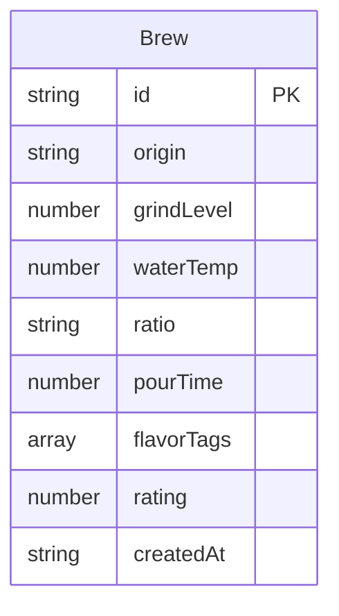

## 1. 架构设计

```mermaid
flowchart TB
    "Frontend[前端 React + Vite]" --> "API[Express API :3001]"
    "API" --> "DataStore[内存数据存储]"
    "Frontend" --> "Router[React Router]"
    "Router" --> "BrewForm[冲煮记录页]"
    "Router" --> "History[历史记录页]"
    "Router" --> "Stats[统计面板页]"
```

## 2. 技术说明

- 前端：React@18 + TypeScript + Vite + Recharts + React Router
- 初始化工具：vite-init（react-express-ts 模板）
- 后端：Express@4 + TypeScript + cors + uuid
- 数据库：内存数组存储（开发阶段），无需外部数据库
- 样式方案：CSS Modules + CSS 变量（暖色调主题）

## 3. 路由定义

| 路由 | 用途 |
|------|------|
| / | 冲煮记录页 - 填写冲煮参数表单 |
| /history | 历史记录页 - 瀑布流卡片浏览 |
| /stats | 统计面板页 - 评分趋势与产地对比 |

## 4. API 定义

### 4.1 数据类型

```typescript
interface Brew {
  id: string;
  origin: string;
  grindLevel: 1 | 2 | 3 | 4 | 5;
  waterTemp: number;
  ratio: string;
  pourTime: number;
  flavorTags: string[];
  rating: number;
  createdAt: string;
}

interface BrewsResponse {
  data: Brew[];
  page: number;
  totalPages: number;
  total: number;
}

interface StatsResponse {
  ratingTrend: { date: string; rating: number }[];
  originStats: { origin: string; avgRating: number; count: number }[];
}
```

### 4.2 接口定义

| 方法 | 路径 | 请求参数 | 响应 |
|------|------|----------|------|
| POST | /api/brews | Brew（不含id和createdAt） | { success: boolean, data: Brew } |
| GET | /api/brews | page?: number, limit?: number | BrewsResponse |
| GET | /api/brews/stats | range?: "all" \| "30d" \| "7d" | StatsResponse |
| DELETE | /api/brews/:id | - | { success: boolean } |

## 5. 服务器架构

```mermaid
flowchart LR
    "Controller[路由控制器]" --> "DataStore[数据存储模块]"
    "DataStore" --> "MemoryArray[内存数组]"
```

- server.ts：Express 服务器入口，定义路由和中间件
- dataStore.ts：数据操作模块，导出 addBrew、getBrews、getStats 函数

## 6. 数据模型

### 6.1 数据模型定义



### 6.2 文件结构

```
├── package.json
├── index.html
├── vite.config.ts
├── tsconfig.json
├── src/
│   └── modules/
│       ├── frontend/
│       │   ├── App.tsx          # 主组件，路由和布局
│       │   ├── BrewForm.tsx     # 冲煮记录表单
│       │   ├── History.tsx      # 历史记录列表
│       │   └── Stats.tsx        # 统计面板
│       └── backend/
│           ├── server.ts        # Express 服务器
│           └── dataStore.ts     # 数据存储模块
```
