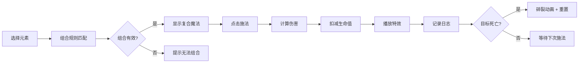

## 1. 产品概述

元素魔法组合与战斗特效预览应用，用于游戏工作室快速验证元素相生相克与连携效果对战斗数值和视觉表现的影响。玩家通过组合基础元素生成复合魔法，实时预览伤害数值与粒子特效动画。

- **目标用户**：游戏设计师、战斗策划、特效美术
- **核心价值**：快速迭代元素组合规则，直观验证战斗数值与视觉效果

## 2. 核心功能

### 2.1 功能模块
1. **组合面板**：元素选择区、组合槽、组合结果展示、施法按钮
2. **战斗场景**：目标水晶、生命值条、伤害飘字、受击动画
3. **战斗日志**：回合记录、魔法名称、伤害值、剩余生命值
4. **特效系统**：粒子动画、光晕效果、屏幕震动、水晶碎裂

### 2.2 页面详情
| 页面名称 | 模块名称 | 功能描述 |
|----------|----------|----------|
| 主页面 | 组合面板 | 4种基础元素选择，组合槽（最多3个），组合结果名称与描述 |
| 主页面 | 战斗场景 | 目标水晶展示，生命值条，伤害飘字，抗性调节滑块 |
| 主页面 | 战斗日志 | 可滚动日志列表，记录每次施法信息，最多30条 |
| 主页面 | 特效层 | Canvas粒子特效，屏幕震动，水晶碎裂动画 |

## 3. 核心流程

用户从左侧组合面板选择元素 → 系统自动匹配组合规则 → 显示组合结果魔法 → 点击施法按钮 → 计算伤害并扣减目标生命值 → 播放粒子特效与受击动画 → 记录战斗日志 → 目标死亡后播放碎裂动画并重置

## 4. 用户界面设计

### 4.1 设计风格
- **主题**：暗色魔法风格，深邃神秘
- **主背景**：#0D0D1A 深紫色黑色
- **面板背景**：#20232A 深蓝灰色
- **强调色**：火红#FF4500、水蓝#1E90FF、风绿#32CD32、雷黄#FFD700
- **按钮渐变**：#FF416C 到 #FF4B2B 橙红渐变
- **字体**：sans-serif 无衬线字体
- **布局**：左右分栏3:7比例，中间2px分隔线

### 4.2 页面设计概览
| 页面名称 | 模块名称 | UI元素 |
|----------|----------|--------|
| 主页面 | 组合面板 | 元素图标（60x60px，圆角12px，悬停放大1.1倍）、组合槽、魔法名称与描述、施法按钮（流光动画）、日志列表 |
| 主页面 | 战斗场景 | 目标水晶（脉动发光#00BFFF）、生命值条（#00BFFF->#FF6347渐变）、伤害飘字、抗性滑块 |
| 主页面 | 特效层 | Canvas全屏覆盖、粒子系统、屏幕震动效果 |

### 4.3 动画效果
- 元素图标悬停：0.2s ease-out 放大至1.1倍
- 施法按钮点击：缩小至0.95倍后立即恢复
- 技能名称流光：从左到右白色渐变移动，1.5s循环
- 目标受击：缩放抖动动画
- 水晶脉动：2s周期，不透明度0.5-1.0变化
- 伤害飘字：向上飘移200px后消失
- 水晶碎裂：粒子向四周爆散，持续1秒

### 4.4 响应式
- 桌面端优先设计
- 最小宽度支持：1024px
