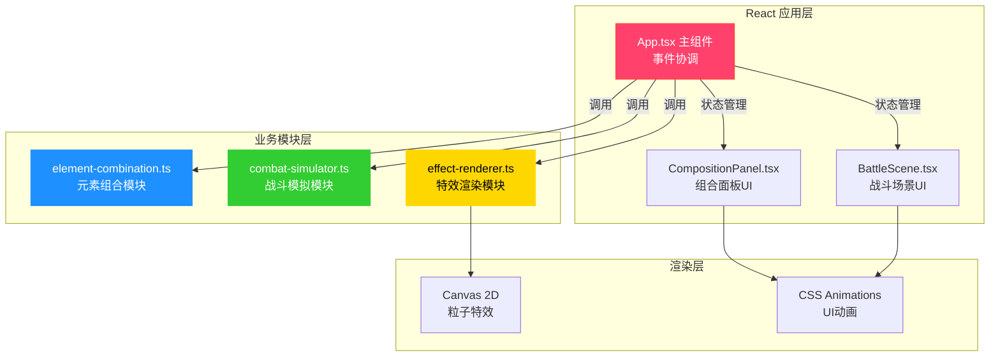

## 1. 架构设计



## 2. 技术描述

- **前端框架**：React 18 + TypeScript
- **构建工具**：Vite 5
- **样式方案**：原生CSS + CSS Modules
- **特效渲染**：Canvas 2D API
- **状态管理**：React useState / useRef
- **事件通信**：自定义事件 + 回调函数

## 3. 模块划分

### 3.1 元素组合模块 (element-combination.ts)
- **职责**：元素数据定义、组合规则字典、组合匹配函数
- **输入**：元素字符串数组（2-3个）
- **输出**：复合魔法对象（名称、类型、基础伤害、特效类型、特效颜色）
- **核心数据结构**：
  - `Element` 类型：火、水、风、雷
  - `Spell` 接口：魔法对象定义
  - `combinationRules` Map：组合规则字典

### 3.2 战斗模拟模块 (combat-simulator.ts)
- **职责**：战斗状态管理、伤害计算、生命值管理、战斗日志
- **输入**：魔法对象、目标抗性
- **输出**：战斗结果（伤害值、剩余生命值、日志条目）
- **核心功能**：
  - 计算实际伤害：基础伤害 × (1 - 抗性%)
  - 维护目标生命值（0-100）
  - 管理战斗日志（最多30条）
  - 目标死亡检测与重置

### 3.3 特效渲染模块 (effect-renderer.ts)
- **职责**：Canvas粒子系统、光晕效果、屏幕震动
- **输入**：魔法类型、强度、目标位置
- **核心类**：`EffectRenderer`
- **粒子系统**：
  - 最多200个粒子
  - 每帧更新位置
  - 支持不同发射模式（爆炸、喷射、环绕）
- **特效类型**：
  - 火焰粒子
  - 水流粒子
  - 风旋粒子
  - 雷电粒子
  - 水晶碎裂

## 4. 文件结构

```
src/
├── App.tsx                      # 主组件，协调模块通信
├── main.tsx                     # 应用入口
├── index.css                    # 全局样式
├── modules/
│   ├── element-combination.ts   # 元素组合模块
│   ├── combat-simulator.ts      # 战斗模拟模块
│   └── effect-renderer.ts       # 特效渲染模块
├── components/
│   ├── CompositionPanel.tsx     # 组合面板组件
│   └── BattleScene.tsx          # 战斗场景组件
```

## 5. 数据模型

### 5.1 元素类型
```typescript
type ElementType = 'fire' | 'water' | 'wind' | 'thunder';
```

### 5.2 魔法对象
```typescript
interface Spell {
  name: string;
  type: string;
  baseDamage: number;
  effectType: 'fire' | 'water' | 'wind' | 'thunder' | 'steam' | 'storm' | 'blizzard';
  effectColor: string;
  description: string;
}
```

### 5.3 战斗日志
```typescript
interface CombatLog {
  round: number;
  spellName: string;
  damage: number;
  remainingHp: number;
  timestamp: number;
}
```

### 5.4 粒子对象
```typescript
interface Particle {
  x: number;
  y: number;
  vx: number;
  vy: number;
  life: number;
  maxLife: number;
  color: string;
  size: number;
  type: 'circle' | 'spark' | 'smoke';
}
```

## 6. 事件通信

模块间通过自定义事件和回调函数通信：
- **组合变化事件**：组合面板 → 主组件 → 元素组合模块
- **施法事件**：组合面板 → 主组件 → 战斗模拟模块 + 特效渲染模块
- **伤害事件**：战斗模拟模块 → 主组件 → 战斗场景组件
- **特效完成事件**：特效渲染模块 → 主组件 → 战斗场景组件

## 7. 性能约束

- 特效动画帧率：≥ 55fps
- 粒子数量上限：200个
- 组合计算响应时间：< 16ms
- 使用 `requestAnimationFrame` 进行动画循环
- 粒子对象池复用，减少GC压力
