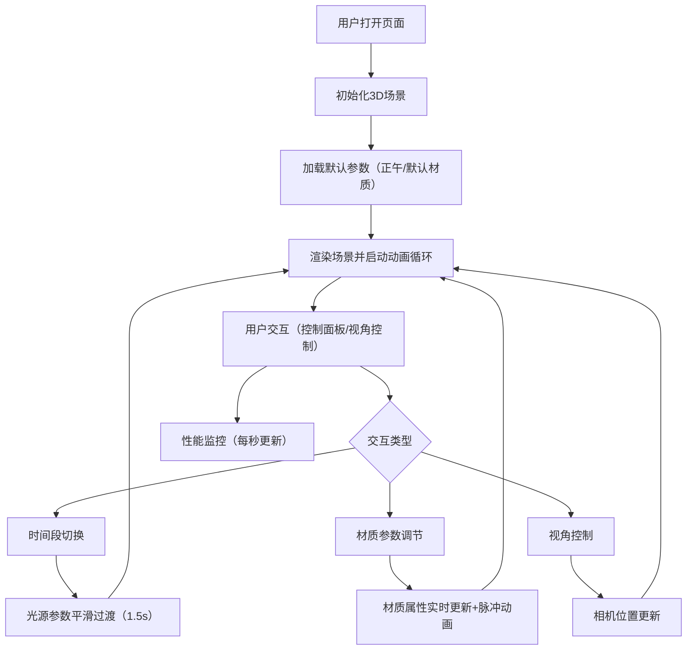

## 1. 产品概述

3D交互式光照与材质调节器是一款面向建筑和室内设计师的浏览器端可视化工具。用户可在3D场景中实时调整光照条件、材质属性和玻璃透光率，直观预览不同时间段的室内光影效果。

- **核心目的**：帮助设计师快速验证和演示室内设计方案在不同光照条件下的视觉表现
- **目标用户**：建筑设计师、室内设计师、装修方案演示人员
- **市场价值**：提供轻量化、无需安装的3D设计预览工具，降低设计沟通成本

## 2. 核心功能

### 2.1 用户角色
| 角色 | 注册方式 | 核心权限 |
|------|----------|----------|
| 设计师用户 | 无需注册，直接使用 | 调整所有光照和材质参数，实时预览3D场景 |

### 2.2 功能模块
1. **3D场景渲染**：6×4×3单位房间场景，包含地板、四面墙、窗户、中央桌子
2. **光照控制系统**：时间段切换（清晨/正午/黄昏/夜晚）、色温调节、光照强度调节
3. **材质调节系统**：桌面颜色选择、粗糙度调节、金属度调节、玻璃透光率调节
4. **实时性能监控**：FPS显示、光源数量统计、三角形数量统计
5. **视角交互**：鼠标拖拽旋转、滚轮缩放

### 2.3 页面详情
| 页面名称 | 模块名称 | 功能描述 |
|----------|----------|----------|
| 主页面 | 3D画布区域 | Three.js渲染的室内场景，支持OrbitControls交互 |
| 主页面 | 左侧控制面板 | 半透明深色面板，分为光照控制区和材质控制区 |
| 主页面 | 右上角性能面板 | 实时显示FPS、光源数量、三角形数量 |

## 3. 核心流程

用户打开页面后，默认加载正午光照和默认材质的室内场景。用户可通过左侧控制面板切换时间段、调节色温和光照强度，或调整桌子材质参数。所有修改实时反馈到3D场景中，系统每秒更新性能监控数据。

## 4. 用户界面设计

### 4.1 设计风格
- **主色调**：深色半透明面板 `rgba(30,30,30,0.85)`，强调色金色 `#FFD700`
- **按钮风格**：圆形时间段按钮（60×60px），选中时金色外发光效果
- **滑块设计**：扁平化轨道（高6px），圆形滑块（直径18px），右侧实时数值显示
- **字体**：现代无衬线字体，数字使用等宽字体提升可读性
- **布局**：桌面端优先，左侧固定控制面板（300px宽），右侧全屏3D画布
- **图标风格**：使用emoji图标表示时间段（🌅清晨、☀️正午、🌇黄昏、🌙夜晚）

### 4.2 页面设计概述
| 页面名称 | 模块名称 | UI元素 |
|----------|----------|--------|
| 主页面 | 3D画布区域 | 全屏Canvas，ACES电影色调映射，柔和阴影 |
| 主页面 | 控制面板顶部 | 场景标题、当前时间段图标和名称 |
| 主页面 | 光照控制区 | 4个圆形时间段按钮、色温渐变滑块、光照强度滑块 |
| 主页面 | 材质控制区 | 颜色取色盘、粗糙度滑块（纹理背景）、金属度滑块（纹理背景）、透光率滑块 |
| 主页面 | 性能面板 | 白色半透明背景，FPS（绿/黄/红三色）、光源数、三角形数 |

### 4.3 响应式
- 桌面端优先设计，面板固定左侧
- 小屏幕下面板改为可折叠浮动面板
- 触屏设备支持双指缩放和单指旋转

### 4.4 3D场景指导
- **环境氛围**：室内空间，根据时间段呈现从暖橙到冷蓝的色调变化
- **光照设置**：方向光模拟太阳光（带阴影），环境光提供基础照明，夜晚增加微弱泛光
- **相机设置**：默认位置(0, 1.6, 4.5)，OrbitControls旋转速度0.5，缩放范围1.0-6.0
- **构图焦点**：中央桌子为视觉中心，窗户提供背景光源
- **交互动画**：时间段切换时光源1.5秒平滑过渡，材质变化时0.3秒颜色脉冲反馈
- **后期效果**：ACESFilmicToneMapping色调映射，sRGB输出编码，抗锯齿
- **资源与性能**：所有纹理使用Canvas程序化生成，阴影贴图2048×2048，目标帧率≥40FPS
