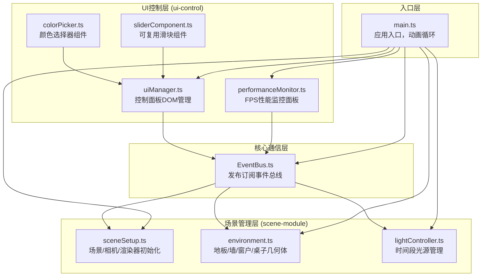

## 1. 架构设计



## 2. 技术描述

- **前端框架**：原生 TypeScript + DOM 操作（用户明确指定不使用React渲染层，仅使用@vitejs/plugin-react作为Vite插件）
- **3D引擎**：Three.js r150+
- **构建工具**：Vite 5.x
- **开发语言**：TypeScript 5.x（严格模式，目标ES2020）
- **无后端**：纯前端单页应用
- **无数据库**：所有状态内存管理

## 3. 模块文件清单

| 文件路径 | 职责描述 |
|----------|----------|
| `src/EventBus.ts` | 全局事件总线，实现发布订阅模式，定义事件类型常量 |
| `src/scene-module/sceneSetup.ts` | 创建THREE.Scene、PerspectiveCamera、WebGLRenderer，配置抗锯齿、色调映射、像素比 |
| `src/scene-module/environment.ts` | 使用BoxGeometry/PlaneGeometry创建房间、地板、墙、窗户、桌子，Canvas程序化生成木纹和凹凸纹理 |
| `src/scene-module/lightController.ts` | 创建DirectionalLight、AmbientLight，管理4个时间段配置，使用Lerp线性插值+easeInOutCubic缓动实现1.5秒平滑过渡 |
| `src/ui-control/uiManager.ts` | 创建300px宽半透明控制面板DOM，布局时间段按钮、滑块区，绑定事件监听并通过EventBus发送参数 |
| `src/ui-control/colorPicker.ts` | Canvas实现HSL取色盘，输出选中颜色的十六进制值 |
| `src/ui-control/sliderComponent.ts` | 可复用滑块组件，支持自定义轨道渐变、背景纹理、步长，实时显示数值 |
| `src/ui-control/performanceMonitor.ts` | 创建右上角性能面板，统计FPS（三色分级）、光源数、三角形数，每秒刷新 |
| `src/main.ts` | 初始化EventBus、场景管理器、UI管理器，启动requestAnimationFrame动画循环 |

## 4. 事件总线定义

| 事件名 | 触发方 | 监听方 | 数据载荷 |
|--------|--------|--------|----------|
| `TIME_PERIOD_CHANGE` | uiManager | lightController | `{ period: 'morning' \| 'noon' \| 'dusk' \| 'night' }` |
| `COLOR_TEMP_CHANGE` | uiManager | lightController | `{ temperature: number (2700-6500) }` |
| `LIGHT_INTENSITY_CHANGE` | uiManager | lightController | `{ intensity: number (0.2-2.0) }` |
| `TABLE_COLOR_CHANGE` | uiManager | environment | `{ color: string (#RRGGBB) }` |
| `TABLE_ROUGHNESS_CHANGE` | uiManager | environment | `{ roughness: number (0.0-1.0) }` |
| `TABLE_METALNESS_CHANGE` | uiManager | environment | `{ metalness: number (0.0-1.0) }` |
| `GLASS_TRANSMISSION_CHANGE` | uiManager | environment | `{ transmission: number (0.1-1.0) }` |
| `GET_STATS_REQUEST` | performanceMonitor | sceneSetup + lightController | - |
| `GET_STATS_RESPONSE` | sceneSetup + lightController | performanceMonitor | `{ lightCount: number, triangleCount: number }` |

## 5. 时间段光照配置

| 时间段 | 环境光颜色 | 方向光颜色 | 方向光位置 | 方向光强度 | 环境光强度 |
|--------|-----------|-----------|-----------|-----------|-----------|
| 清晨 | #FFA07A | #FF8C00 | (3, 2, -3) | 0.6 | 0.4 |
| 正午 | #FFFACD | #FFFFFF | (0, 4, -2) | 1.2 | 0.6 |
| 黄昏 | #DDA0DD | #FF69B4 | (-3, 1.5, -3) | 0.5 | 0.3 |
| 夜晚 | #191970 | #4169E1 | (2, 1, 2) | 0.2 | 0.15 |

## 6. 几何与材质参数

| 对象 | 几何体 | 尺寸 (单位) | 材质类型 | 默认参数 |
|------|--------|------------|----------|----------|
| 地板 | PlaneGeometry | 6 × 3 | MeshStandardMaterial | 木纹纹理，颜色#D2B48C，roughness=0.8，metalness=0.0 |
| 墙面(4面) | PlaneGeometry | 6×4 和 3×4 | MeshStandardMaterial | 白色#F0EAD6，程序化凹凸纹理 |
| 窗户 | PlaneGeometry | 2 × 2 | MeshPhysicalMaterial | 半透明，transmission=0.5，transparent=true |
| 桌面 | BoxGeometry | 2 × 1 × 0.1 | MeshStandardMaterial | 颜色#D4A574，roughness=0.5，metalness=0.0（可调） |
| 桌腿(4根) | BoxGeometry | 0.08 × 0.08 × 0.7 | MeshStandardMaterial | 与桌面同材质 |

## 7. 渲染器配置

```typescript
{
  antialias: true,
  pixelRatio: Math.min(window.devicePixelRatio, 1.5),
  toneMapping: THREE.ACESFilmicToneMapping,
  outputColorSpace: THREE.SRGBColorSpace,
  shadowMap.enabled: true,
  shadowMap.type: THREE.PCFSoftShadowMap
}
```

## 8. 性能优化策略

1. 像素比限制为1.5，平衡画质与性能
2. 所有纹理使用Canvas程序化生成，避免网络请求
3. 使用PCFSoftShadowMap配合2048×2048阴影贴图，bias=-0.001减少阴影瑕疵
4. 阴影相机范围精确匹配房间尺寸，避免无效渲染
5. 材质属性直接更新而非重建材质对象
6. 事件驱动更新，避免每帧无意义计算
