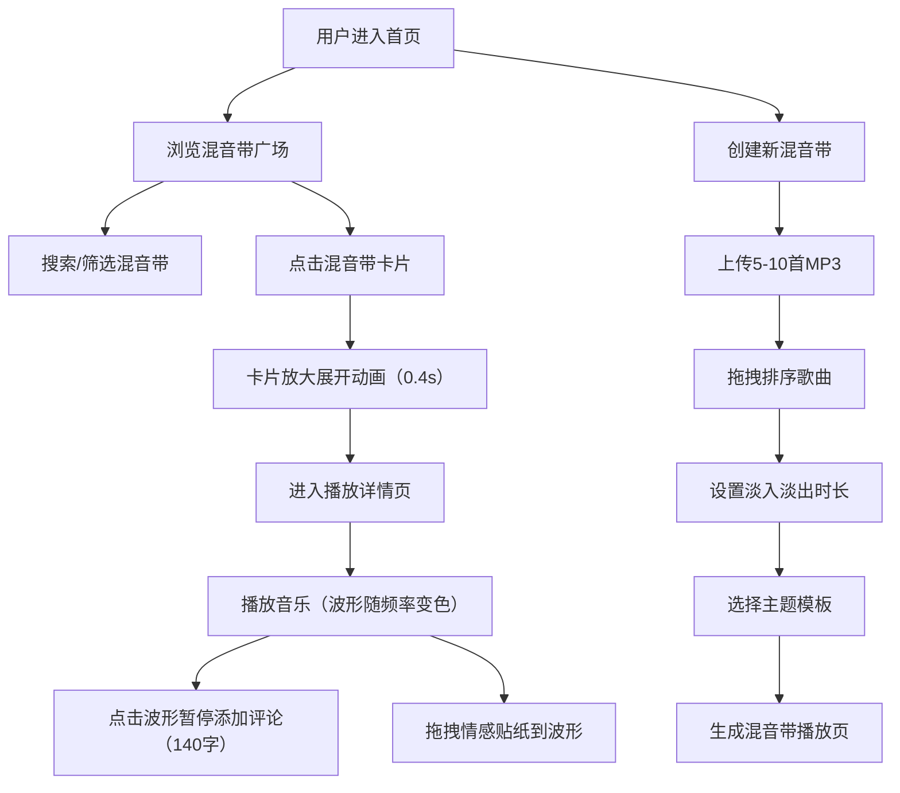

## 1. 产品概述

混音带工坊是一个面向独立音乐人和音频爱好者的个性化音乐分享平台，解决音乐推荐和分享中缺乏深度互动、情感表达不够直观的痛点。用户可以创建、编辑和分享混音带，听众可以通过片段评论和情感贴纸与音乐进行深度互动。

- **核心价值**：让音乐分享不再是简单的歌曲列表，而是充满情感表达和互动体验的艺术作品
- **目标用户**：独立音乐人、DJ、音频爱好者、音乐播客创作者

## 2. 核心特性

### 2.1 用户角色
| 角色 | 注册方式 | 核心权限 |
|------|----------|----------|
| 创作者 | 无需注册（本地使用） | 创建、编辑混音带，上传MP3文件，设置淡入淡出效果 |
| 听众 | 无需注册 | 浏览混音带广场，播放音乐，添加片段评论，使用情感贴纸互动 |

### 2.2 功能模块
1. **混音带创建页**：MP3上传、歌曲拖拽排序、淡入淡出设置、主题模板选择
2. **混音带广场（首页）**：瀑布流展示、搜索功能、卡片动画
3. **播放详情页**：波形播放器、时间锚点评论、情感贴纸互动

### 2.3 页面详情
| 页面名称 | 模块名称 | 功能描述 |
|-----------|-------------|---------------------|
| 混音带创建页 | 歌曲上传模块 | 支持多MP3文件上传，显示文件名和时长 |
| 混音带创建页 | 排序编辑模块 | 拖拽排序5-10首歌曲，支持删除 |
| 混音带创建页 | 淡入淡出控制 | 滑块控制0.5-3秒，实时预览音量曲线 |
| 混音带创建页 | 主题选择模块 | 3种主题：经典磁带、霓虹撞色、极简白 |
| 混音带广场 | 瀑布流布局 | 卡片宽280px，圆角16px，渐变背景 |
| 混音带广场 | 搜索模块 | 标题搜索，0.3秒防抖，关键词高亮 |
| 播放详情页 | 波形播放器 | Canvas绘制，颜色随频率变化 |
| 播放详情页 | 评论锚点 | 时间戳圆点钉在波形上，悬停展开气泡 |
| 播放详情页 | 情感贴纸 | 6种贴纸拖拽粘贴，重叠自动偏移，点赞计数 |

## 3. 核心流程

## 4. 界面设计

### 4.1 设计风格
- **主色调**：深色主题，背景#0F0F0F，内容区#1A1A2E
- **强调色**：#FF6B6B（亮红，悬停激活）、#3498DB（评论锚点）、#F1C40F（搜索高亮）
- **情感贴纸色**：心形#FF4757、火焰#FF6348、闪电#FDCB6E、星星#6C5CE7、月亮#A29BFE、音符#00CEC9
- **圆角风格**：统一12px圆角，卡片16px圆角
- **动画过渡**：0.2-0.3秒CSS过渡，卡片展开0.4秒
- **字体**：系统默认无衬线字体

### 4.2 页面设计概览
| 页面名称 | 模块名称 | UI元素 |
|-----------|-------------|-------------|
| 混音带广场 | 瀑布流卡片 | 渐变背景#1E272E→#2D3436，封面置灰占60%，底部显示歌曲数/时长/贴纸数 |
| 混音带广场 | 搜索框 | 顶部固定，输入防抖0.3s，匹配词黄色高亮 |
| 播放详情页 | 波形进度条 | Canvas绘制，频率数据驱动颜色变化，评论锚点#3498DB圆点 |
| 播放详情页 | 评论气泡 | 悬停0.2秒淡入，140字限制，移动端底部弹出 |
| 播放详情页 | 贴纸面板 | 左侧6种半透明圆形贴纸，拖拽粘贴，重叠自动偏移 |
| 混音带创建页 | 音量曲线预览 | 滑块拖动实时更新淡入淡出曲线可视化 |

### 4.3 响应式设计
- **桌面端**：播放器左侧贴纸面板，右侧波形和评论区
- **移动端**：单列布局，评论气泡改为底部弹出，贴纸面板改为底部横向滚动
- **触摸优化**：增大点击热区，支持触摸拖拽排序和贴纸

## 5. 性能指标
- 轨道切换延迟 ≤ 200ms
- 评论和贴纸渲染 ≤ 50ms
- 首屏加载 ≤ 2s
- 动画帧率 ≥ 60fps
