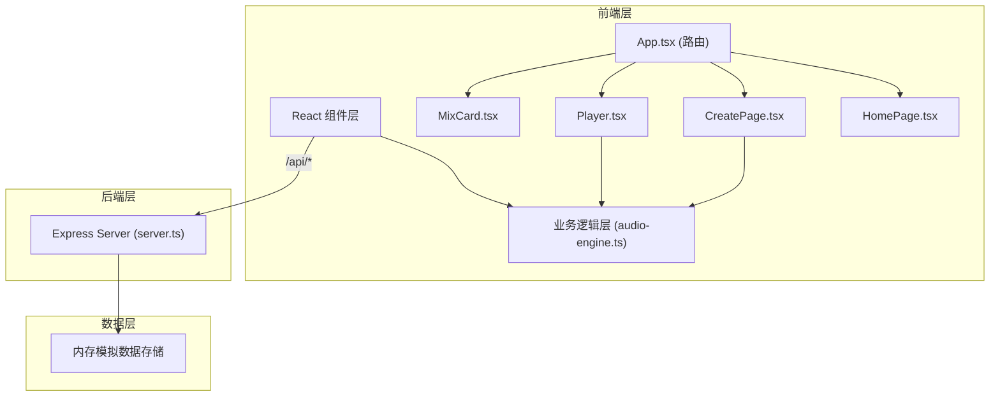
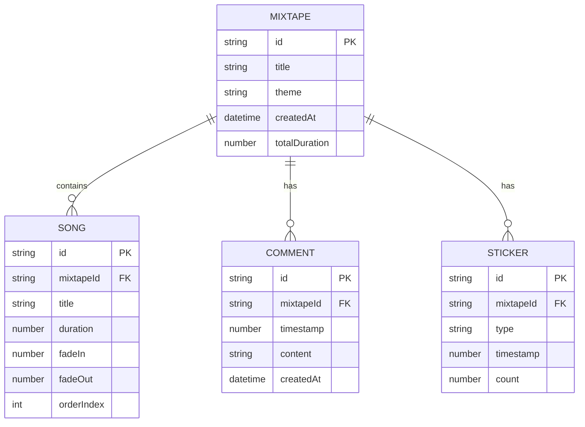

## 1. 架构设计



## 2. 技术选型

- **前端框架**：React 18 + TypeScript + Vite
- **路由管理**：react-router-dom v6
- **音频处理**：Web Audio API (AudioContext, AnalyserNode)
- **样式方案**：CSS Modules + CSS Variables
- **后端服务**：Express 4 + CORS
- **构建工具**：Vite 5
- **数据存储**：内存模拟（无需数据库）

## 3. 目录结构

```
auto14/
├── package.json
├── index.html
├── vite.config.js
├── tsconfig.json
├── server.ts
└── src/
    ├── main.tsx
    ├── App.tsx
    ├── components/
    │   ├── MixCard.tsx
    │   └── Player.tsx
    ├── business/
    │   └── audio-engine.ts
    └── styles/
        └── global.css
```

## 4. 路由定义

| 路由 | 页面 | 用途 |
|-------|------|------|
| `/` | HomePage | 混音带广场，瀑布流展示所有公开混音带 |
| `/play/:id` | PlayerPage | 播放详情页，包含波形播放器、评论、贴纸 |
| `/create` | CreatePage | 创建新混音带，上传、排序、设置效果 |

## 5. API 定义

### 5.1 类型定义

```typescript
interface Song {
  id: string;
  title: string;
  artist: string;
  duration: number;
  fadeIn: number;
  fadeOut: number;
  url: string;
  albumCover?: string;
}

interface Mixtape {
  id: string;
  title: string;
  description: string;
  songs: Song[];
  theme: 'classic' | 'neon' | 'minimal';
  createdAt: string;
  totalDuration: number;
  coverUrl?: string;
}

interface Comment {
  id: string;
  mixtapeId: string;
  timestamp: number;
  content: string;
  createdAt: string;
}

interface Sticker {
  id: string;
  type: 'heart' | 'fire' | 'lightning' | 'star' | 'moon' | 'note';
  timestamp: number;
  position: { x: number; y: number };
  count: number;
}
```

### 5.2 接口列表

| 方法 | 路径 | 描述 | 请求体 | 响应 |
|------|------|------|--------|------|
| GET | `/api/mixtapes` | 获取混音带列表 | - | `Mixtape[]` |
| GET | `/api/mixtapes/:id` | 获取单条详情 | - | `{ mixtape: Mixtape, comments: Comment[], stickers: Sticker[] }` |
| POST | `/api/mixtapes/:id/comments` | 添加评论 | `{ timestamp: number, content: string }` | `Comment[]` |
| POST | `/api/mixtapes/:id/stickers` | 更新贴纸计数 | `{ type: StickerType, timestamp: number }` | `Sticker[]` |
| POST | `/api/mixtapes` | 创建混音带 | `Partial<Mixtape>` | `Mixtape` |

## 6. 核心模块设计

### 6.1 AudioEngine 音频引擎

```typescript
class AudioEngine {
  // 1. 解码音频并分析波形峰值
  async decodeAudio(arrayBuffer: ArrayBuffer): Promise<{
    peaks: number[];
    duration: number;
    sampleRate: number;
  }>;
  
  // 2. 计算淡入淡出增益曲线
  calculateFadeCurve(
    duration: number,
    fadeIn: number,
    fadeOut: number,
    sampleRate: number
  ): number[];
  
  // 3. 时间戳转换为波形位置百分比
  timestampToPosition(timestamp: number, totalDuration: number): number;
  
  // 4. 实时频率分析
  getFrequencyData(): Uint8Array;
}
```

### 6.2 性能优化策略

1. **音频预加载**：下一首歌曲提前2秒预加载
2. **Canvas节流**：波形绘制使用requestAnimationFrame，频率数据60fps更新
3. **虚拟滚动**：瀑布流卡片使用IntersectionObserver懒加载
4. **防抖处理**：搜索输入0.3秒防抖，避免频繁API调用
5. **评论批量渲染**：评论锚点使用DocumentFragment批量插入DOM

## 7. 数据模型


