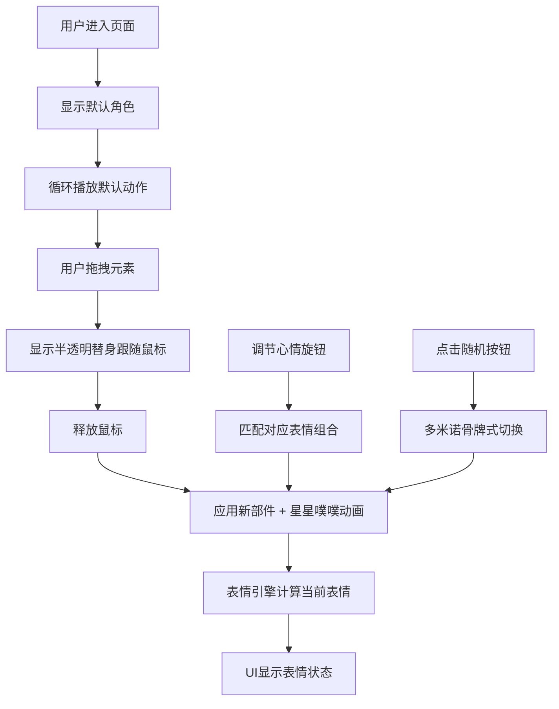

## 1. 产品概述

涂鸦风格动画角色表情与肢体生成器是一个交互式创意工具，用户可以通过拖拽预设视觉元素（发型、眼睛、嘴巴、手臂姿势）实时组合生成原创涂鸦风格动画角色。

- **核心价值**：降低创意门槛，让用户无需绘画基础即可快速生成个性化卡通角色，满足表情包制作、头像设计、社交分享等场景需求
- **目标用户**：设计爱好者、社交媒体用户、教育工作者、内容创作者

## 2. 核心功能

### 2.1 功能模块

1. **角色预览区**：SVG绘制的实时角色展示，支持默认循环动画、平滑过渡动画、波浪式重组动画
2. **元素选择面板**：分类展示可选部件（发型、眼睛、嘴巴、手臂），支持选中状态和弹性动效
3. **拖拽交互系统**：从面板拖拽元素到预览区，显示半透明替身，释放时应用新部件并触发反馈动画
4. **随机角色生成**：一键生成随机组合，带多米诺骨牌式切换动画
5. **心情调节系统**：圆环滑块旋钮调节情绪基调，自动匹配对应表情组合
6. **底部工具栏**：保存为PNG、重置角色、切换颜色主题

### 2.2 页面详情

| 页面名称 | 模块名称 | 功能描述 |
|-----------|-------------|---------------------|
| 主页面 | 角色预览区 | SVG角色实时渲染、循环动画、波浪式重组动画、部件平滑过渡 |
| 主页面 | 元素选择面板 | 垂直滚动分类展示、卡片选中动效、拖拽源 |
| 主页面 | 心情旋钮 | 自定义圆环滑块、径向脉冲动画、情绪基调调节 |
| 主页面 | 随机角色按钮 | 闪电图标、悬停旋转放大、多米诺切换动画 |
| 主页面 | 底部工具栏 | 磨砂玻璃效果、保存PNG、重置、主题切换 |

## 3. 核心流程

### 3.1 主要用户流程

用户进入页面 → 看到默认角色和循环动画 → 从右侧面板拖拽元素到预览区 → 角色实时更新并触发反馈动画 → 可通过心情旋钮调节整体情绪 → 点击随机按钮生成新角色 → 使用工具栏保存或重置

## 4. 用户界面设计

### 4.1 设计风格

- **主色调**：米白#FFF8E7背景、肤色#FFE0B2、橙色#FF7043（强调）、蓝色#29B6F6（功能按钮）、黄色#FFD54F（星星）
- **字体**：标题使用 Indie Flower 手写字体，正文使用系统无衬线字体
- **视觉风格**：手绘涂鸦风格，1px黑色描边，轻微旋转随机偏差，便签纸/笔记本质感
- **背景纹理**：方格纸纹理（1px #E0E0E0线条，间距20px）
- **卡片样式**：128px方形，圆角16px，白色背景带咖啡渍纹理SVG
- **按钮样式**：圆形随机按钮（直径56px，蓝色背景白色闪电图标）
- **动效原则**：所有交互都有平滑过渡（0.2-0.6秒），弹性缓动函数，60FPS性能目标

### 4.2 页面设计概述

| 页面名称 | 模块名称 | UI 元素 |
|-----------|-------------|-------------|
| 主页面 | 角色预览区 | 60%宽度、居中、虚线边框、卷角效果、SVG角色、默认循环动画 |
| 主页面 | 元素选择面板 | 35%宽度、右侧、垂直滚动、卡片网格、选中动效 |
| 主页面 | 心情旋钮 | 角色上方、圆环渐变#FFCDD2→#E3F2FD、径向脉冲动画 |
| 主页面 | 随机角色按钮 | 右下角、圆形、悬停旋转15°放大1.1倍 |
| 主页面 | 底部工具栏 | 水平居中、磨砂玻璃backdrop-filter: blur(8px)、半透明#FAFAFACC |

### 4.3 响应式设计

- 桌面端优先设计，保持左右布局
- 移动端自适应：元素面板改为底部抽屉式，预览区占满宽度
- 触摸设备优化：增大拖拽热区，支持触摸拖拽事件

### 4.4 动画细节

- **默认循环**：角色左右轻微摆动 + 随机眨眼
- **部件切换**：0.4秒波浪式重组，各部件从原位置散开再聚合
- **拖拽释放**：头顶弹出#FFD54F星星 + "噗"拟声词动画（1秒）
- **随机角色**：各部件按0.3-0.6秒随机延迟依次消失再出现（多米诺效果）
- **卡片选中**：边框#BDBDBD→#FF7043，0.2秒弹性放大1.05倍再恢复
- **心情旋钮**：拖动时径向脉冲动画

## 5. 非功能需求

### 5.1 性能要求

- 所有动画稳定保持60FPS
- 拖拽响应延迟<16ms
- 部件切换过渡流畅无卡顿
- SVG渲染性能优化，避免过度重绘

### 5.2 可维护性

- 模块化架构，职责分离清晰
- 部件配置与逻辑分离，便于扩展新部件
- TypeScript类型安全

### 5.3 兼容性

- 支持现代浏览器（Chrome、Firefox、Safari、Edge最新版）
- 使用CSS变量便于主题切换
