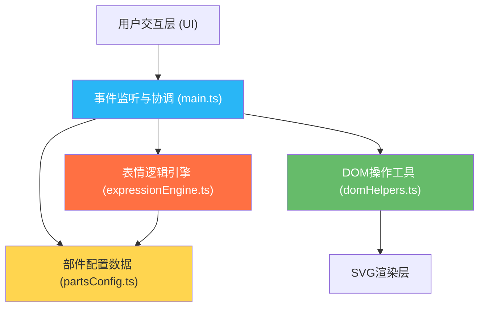

## 1. 架构设计



**架构说明**：
- **数据层**：`data/partsConfig.ts` 独立存储所有部件配置，与业务逻辑完全分离
- **业务逻辑层**：`src/expressionEngine.ts` 封装表情计算逻辑，纯函数无副作用
- **工具层**：`src/domHelpers.ts` 提供SVG创建、属性操作、动画控制等原子能力
- **协调层**：`src/main.ts` 作为入口，负责初始化、事件绑定、状态管理和模块协调

## 2. 技术描述

- **前端框架**：无框架，使用 Vanilla TypeScript + 原生 DOM API
- **构建工具**：Vite 5.x
- **开发语言**：TypeScript 5.x（严格模式）
- **渲染技术**：原生 SVG 2.0
- **动画方案**：CSS Animations + CSS Transitions + requestAnimationFrame
- **样式方案**：内联CSS + CSS变量（无需预处理器）
- **包管理**：npm
- **编译目标**：ES2020

**项目结构**：
```
auto16/
├── data/
│   └── partsConfig.ts          # 部件配置数据
├── src/
│   ├── main.ts                 # 主逻辑入口
│   ├── expressionEngine.ts     # 表情逻辑引擎
│   └── domHelpers.ts           # DOM操作工具
├── index.html                  # 入口HTML
├── package.json
├── tsconfig.json
└── vite.config.js
```

## 3. 核心数据结构

### 3.1 部件配置类型定义

```typescript
// 部件类型
type PartType = 'hair' | 'eyes' | 'mouth' | 'arm';

// 表情标签
type ExpressionTag = 'happy' | 'sad' | 'angry' | 'surprised' | 'neutral' | 'confused';

// 单个部件配置
interface PartConfig {
  id: string;
  type: PartType;
  name: string;
  svgPath: string;           // SVG路径数据
  fillColor: string;
  strokeColor: string;
  positionOffset: { x: number; y: number };  // 相对部位中心的偏移
  rotationRange: number;     // 随机旋转最大角度
  expressionTags: ExpressionTag[];  // 适配的表情标签
}

// 部件分类集合
interface PartsCollection {
  hair: PartConfig[];
  eyes: PartConfig[];
  mouth: PartConfig[];
  arm: PartConfig[];
}

// 当前选中的部件ID集合
interface SelectedParts {
  hair: string;
  eyes: string;
  mouth: string;
  arm: string;
}

// 表情计算结果
interface ExpressionResult {
  type: ExpressionTag;
  emoji: string;
  cssClass: string;
  label: string;
}

// 心情基调
type MoodLevel = 'angry' | 'sad' | 'happy' | 'surprised';
```

### 3.2 动画状态类型

```typescript
interface AnimationState {
  isDragging: boolean;
  dragPartType: PartType | null;
  dragPartId: string | null;
  ghostElement: SVGElement | null;
  animationFrameId: number | null;
  defaultAnimationTimeout: number | null;
}
```

## 4. 核心模块职责

### 4.1 data/partsConfig.ts
- **职责**：纯数据文件，导出所有部件的配置信息
- **内容**：发型4款、眼睛4款、嘴巴4款、手臂姿势4款，共16个部件
- **约束**：无逻辑代码，仅导出常量

### 4.2 src/domHelpers.ts
- **职责**：提供所有DOM和SVG操作的工具函数
- **核心函数**：
  - `createSVGElement(tagName: string, attrs?: object): SVGElement` - 创建SVG元素
  - `setAttributes(el: SVGElement, attrs: object): void` - 批量设置属性
  - `applyAnimation(el: SVGElement, animationClass: string, duration?: number): void` - 应用动画类
  - `removeAnimation(el: SVGElement, animationClass: string): void` - 移除动画类
  - `getElementCenter(el: SVGElement): { x: number; y: number }` - 计算元素中心
  - `createPartSVG(part: PartConfig): SVGElement` - 根据配置创建部件SVG
  - `toggleClass(el: HTMLElement, className: string, force?: boolean): void` - CSS类切换

### 4.3 src/expressionEngine.ts
- **职责**：根据当前部件组合计算表情状态，根据心情基调匹配部件
- **核心函数**：
  - `calculateExpression(selected: SelectedParts, parts: PartsCollection): ExpressionResult` - 计算当前表情
  - `matchPartsForMood(mood: MoodLevel, parts: PartsCollection): SelectedParts` - 根据心情匹配部件
  - `getExpressionScore(partIds: string[], targetTag: ExpressionTag, parts: PartsCollection): number` - 计算表情匹配度

### 4.4 src/main.ts
- **职责**：应用入口，协调所有模块
- **核心流程**：
  1. 初始化页面结构和CSS样式
  2. 初始化SVG角色骨架（头部、身体、四肢占位）
  3. 创建右侧元素面板
  4. 创建心情旋钮、随机按钮、底部工具栏
  5. 绑定拖拽事件监听（mousedown/mousemove/mouseup + touch事件）
  6. 绑定面板元素点击事件
  7. 启动默认循环动画
  8. 提供`updateCharacter()`方法更新角色
  9. 提供`triggerReassembleAnimation()`方法触发波浪重组动画
  10. 提供`triggerRandomCharacter()`方法触发多米诺随机切换

## 5. 性能优化策略

### 5.1 渲染性能
- 使用CSS `transform` 和 `opacity` 实现动画（触发合成层，避免重排重绘）
- 动画元素启用 `will-change: transform` 提示浏览器优化
- SVG元素使用 `transform-origin` 中心点定位，避免布局抖动
- 拖拽时使用 `requestAnimationFrame` 同步刷新位置

### 5.2 事件性能
- 拖拽事件使用事件委托，避免频繁绑定解绑
- `mousemove` 事件使用 `passive: true` 提升滚动性能
- 拖拽位置计算缓存边界矩形，避免每次触发 `getBoundingClientRect()`

### 5.3 内存管理
- 动画结束后及时移除临时元素（如拖拽替身）
- `requestAnimationFrame` 在组件销毁时取消
- 事件监听器在适当的时候移除

## 6. 动画实现方案

### 6.1 CSS动画关键帧
```css
/* 波浪式重组动画 */
@keyframes reassemble {
  0% { transform: translate(0, 0) rotate(var(--base-rotate)); opacity: 1; }
  50% { transform: translate(var(--scatter-x), var(--scatter-y)) rotate(calc(var(--base-rotate) + 15deg)); opacity: 0.3; }
  100% { transform: translate(0, 0) rotate(var(--base-rotate)); opacity: 1; }
}

/* 星星弹出动画 */
@keyframes starPop {
  0% { transform: scale(0) translateY(0); opacity: 0; }
  30% { transform: scale(1.2) translateY(-20px); opacity: 1; }
  100% { transform: scale(1) translateY(-40px); opacity: 0; }
}

/* "噗"拟声词动画 */
@keyframes poofText {
  0% { transform: scale(0.5); opacity: 0; }
  40% { transform: scale(1.1); opacity: 1; }
  100% { transform: scale(1); opacity: 0; }
}

/* 默认摆动动画 */
@keyframes sway {
  0%, 100% { transform: rotate(-2deg); }
  50% { transform: rotate(2deg); }
}

/* 眨眼动画 */
@keyframes blink {
  0%, 90%, 100% { transform: scaleY(1); }
  95% { transform: scaleY(0.1); }
}

/* 多米诺消失动画 */
@keyframes dominoOut {
  0% { transform: scale(1) rotate(var(--base-rotate)); opacity: 1; }
  100% { transform: scale(0) rotate(calc(var(--base-rotate) + 90deg)); opacity: 0; }
}

/* 多米诺出现动画 */
@keyframes dominoIn {
  0% { transform: scale(0) rotate(calc(var(--base-rotate) - 90deg)); opacity: 0; }
  100% { transform: scale(1) rotate(var(--base-rotate)); opacity: 1; }
}

/* 卡片选中弹性动画 */
@keyframes cardBounce {
  0% { transform: scale(1); }
  50% { transform: scale(1.05); }
  100% { transform: scale(1); }
}

/* 旋钮脉冲动画 */
@keyframes knobPulse {
  0% { box-shadow: 0 0 0 0 rgba(41, 182, 246, 0.4); }
  70% { box-shadow: 0 0 0 15px rgba(41, 182, 246, 0); }
  100% { box-shadow: 0 0 0 0 rgba(41, 182, 246, 0); }
}
```

### 6.2 缓动函数
- 弹性效果：`cubic-bezier(0.68, -0.55, 0.265, 1.55)`
- 平滑过渡：`cubic-bezier(0.4, 0, 0.2, 1)`
- 快速进入：`cubic-bezier(0.0, 0.0, 0.2, 1)`

## 7. 浏览器兼容性处理

- 使用CSS变量存储主题色，支持动态切换
- 前缀处理由Vite构建时自动完成（通过@vitejs/plugin-legacy可选）
- 触摸事件与鼠标事件并行支持
- `backdrop-filter` 提供降级方案（半透明背景替代）
