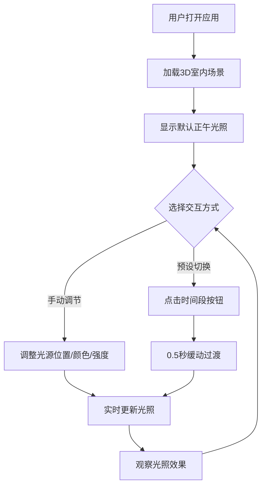

## 1. 产品概述

三维建筑空间光环境模拟与交互调整应用——让用户在浏览器中加载一个室内场景（包含墙壁、地板、窗户和家具），通过调整光源位置、颜色和强度实时观察光照效果变化，并能够切换不同时间段（清晨、正午、黄昏、夜晚）模拟自然光变化。

- 面向建筑师、室内设计师及光照爱好者，提供直观的3D光照预览和调试工具
- 目标是降低光照设计门槛，实现所见即所得的光环境调整体验

## 2. 核心功能

### 2.1 功能模块

1. **3D室内场景展示**：4m×3m×3m封闭房间，含窗户和家具
2. **光源交互控制**：方向光（太阳）+ 两盏可调点光源
3. **时间段模拟**：清晨/正午/黄昏/夜晚预设，平滑过渡动画
4. **相机交互**：OrbitControls拖拽旋转、滚轮缩放

### 2.2 页面详情

| 页面名称 | 模块名称 | 功能描述 |
|----------|----------|----------|
| 主场景页 | 3D视口 | 渲染室内场景，占据主要视口（约85%宽度） |
| 主场景页 | dat.GUI控制面板 | 时间滑块、光源选择、颜色拾取、强度调节、预设按钮 |
| 主场景页 | 时间预设按钮 | 四个胶囊按钮：清晨/正午/黄昏/夜晚，点击平滑过渡 |

## 3. 核心流程

用户打开应用 → 加载3D室内场景 → 通过控制面板调整光源参数（位置/颜色/强度） → 实时观察光照效果 → 点击时间段预设按钮切换自然光 → 或通过时间滑块手动微调 → 光源位置小球体脉冲呼吸动画提供视觉反馈

## 4. 用户界面设计

### 4.1 设计风格

- **主色调**：深色主题，背景 #1E1E2E，面板 #2A2A3E
- **按钮样式**：圆角胶囊形状，背景 #3A3A4A，按下 #5A5AB0，悬停高亮 #4A4A5E
- **字体**：使用现代无衬线字体，控制面板文字清晰可读
- **布局风格**：3D场景占85%宽度，右侧半透明深色控制面板，圆角8px
- **动画**：光源小球体0.3秒脉冲呼吸动画，按钮点击短暂缩小效果

### 4.2 页面设计概览

| 页面名称 | 模块名称 | UI元素 |
|----------|----------|--------|
| 主场景页 | 3D视口 | Three.js渲染画布，深色背景，占据主要视口 |
| 主场景页 | 控制面板 | 半透明深色背景，圆角8px，时间滑块带刻度，颜色拾取器渐变圆环 |
| 主场景页 | 预设按钮 | 四个胶囊按钮横排，悬停/按下反馈动画 |

### 4.3 响应式设计

- 桌面优先设计，3D场景占85%宽度，控制面板占15%宽度
- 面板在窄屏时可折叠至底部

### 4.4 3D场景指引

- **环境**：封闭室内房间，4m×3m×3m，一面墙开窗1.5m×1.2m
- **光照**：方向光模拟太阳（随时间变化），两盏点光源模拟室内灯具
- **相机**：初始位置在房间中心稍高处，俯视角度，OrbitControls交互
- **交互**：光源位置用小球体可视化，脉冲呼吸动画
- **材质**：墙面 #F5F0E8，地板 #8B7355，家具 #D4A574，带有合适粗糙度和金属度
- **性能**：保持30FPS以上，光源更新延迟不超过50ms
