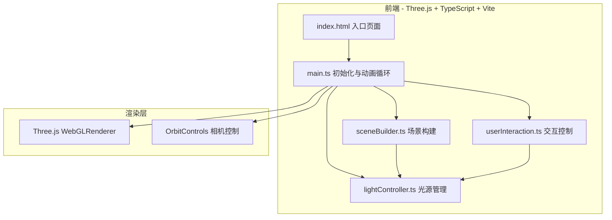

## 1. 架构设计

## 2. 技术说明

- **前端框架**：TypeScript + Three.js + Vite（纯前端项目，无后端）
- **构建工具**：Vite
- **3D引擎**：Three.js（含OrbitControls）
- **UI控制**：dat.GUI
- **语言**：TypeScript（严格模式）

### 依赖清单

| 依赖包 | 版本 | 用途 |
|--------|------|------|
| three | latest | 3D渲染引擎 |
| dat.gui | latest | 交互控制面板 |
| typescript | latest | 类型安全的开发语言 |
| vite | latest | 构建与开发服务器 |
| @vitejs/plugin-react | latest | Vite插件（用户指定依赖） |

## 3. 文件结构与路由

| 文件路径 | 用途 |
|----------|------|
| package.json | 项目依赖与启动脚本 |
| index.html | 入口HTML页面 |
| vite.config.js | Vite构建配置 |
| tsconfig.json | TypeScript配置（严格模式） |
| src/main.ts | 初始化Three.js场景、相机、渲染器，加载场景模型并启动动画循环 |
| src/sceneBuilder.ts | 构建室内场景（墙壁、地板、天花板、窗户、家具） |
| src/lightController.ts | 管理所有光源（方向光、点光源），时间预设切换 |
| src/userInteraction.ts | dat.GUI控制面板，监听变化并调用lightController |

## 4. 核心模块设计

### 4.1 sceneBuilder.ts

- 构建房间（4m×3m×3m）
- 四面墙壁（BoxGeometry），其中一面开窗（1.5m×1.2m）
- 地板和天花板
- 家具：桌子、椅子、书柜（至少三件）
- 每个物体带MeshStandardMaterial材质
- 材质颜色：墙面 #F5F0E8，地板 #8B7355，家具 #D4A574

### 4.2 lightController.ts

- 方向光（DirectionalLight）模拟太阳
  - 位置随时间滑块变化（0-24小时）
  - 清晨：色温 #FFD700，正午：#FFFFFF，黄昏：#FF8C00，夜晚：关闭
  - 强度在0.5-2.0之间变化
- 两盏点光源（PointLight）模拟室内灯具
  - 可调位置（x/y/z微调滑块）
  - 可调颜色（色轮拾取）
  - 可调强度（0-10）
  - 光源位置用小球体可视化（发光自发光材质）
- 时间预设切换函数（0.5秒缓动过渡）

### 4.3 userInteraction.ts

- dat.GUI控制面板
  - 时间滑块（0-24，带刻度标记）
  - 光源选择下拉菜单
  - 颜色拾取器
  - 强度滑块
  - 四个时间预设按钮（清晨6/正午12/黄昏18/夜晚0）
- 监听变化并调用lightController更新

### 4.4 main.ts

- 初始化Three.js场景、PerspectiveCamera、WebGLRenderer
- 加载场景模型（调用sceneBuilder）
- 初始化光照（调用lightController）
- 初始化交互（调用userInteraction）
- OrbitControls相机控制
- 动画循环（requestAnimationFrame）
- 光源小球体脉冲呼吸动画（0.3秒周期）

## 5. 性能要求

- 场景保持30FPS以上
- 光源更新延迟不超过50ms
- 使用requestAnimationFrame驱动渲染循环
- 避免在动画循环中创建新对象，复用几何体和材质
