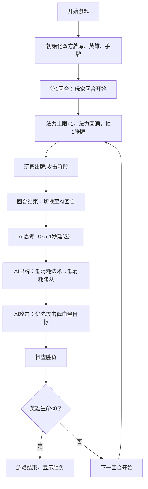

## 1. 产品概述

卡牌对战模拟器是一个模拟多人在线卡牌对战（炉石传说风格）的对局引擎与视觉表现应用，主要解决游戏开发中策略卡牌对战的核心逻辑与前端即时反馈深度绑定的问题。
- 主要目的：为游戏开发者提供可参考的回合制卡牌对战核心逻辑实现和丰富的视觉反馈系统
- 目标用户：游戏开发者、卡牌游戏爱好者
- 产品价值：提供完整的卡牌对战流程实现，包含回合制、法力值、抽牌、出牌、攻击、生命值等核心机制，以及精美的可视化界面

## 2. 核心功能

### 2.1 用户角色

| 角色 | 注册方式 | 核心权限 |
|------|----------|----------|
| 玩家 | 无需注册，进入即玩 | 与AI对手进行卡牌对战 |
| AI对手 | 系统内置 | 自动决策，优先出低消耗法术，召唤低消耗随从，优先攻击低血量目标 |

### 2.2 功能模块

1. **对战核心逻辑模块**：回合制系统、法力值管理、抽牌机制、出牌判定、攻击判定、胜负判定、AI决策
2. **战场可视化模块**：双方英雄展示、随从位渲染、卡牌样式设计、攻击动画、法术效果动画
3. **手牌交互模块**：扇形排列、悬停放大、拖拽出牌、回弹动画
4. **HUD信息展示模块**：回合数显示、生命值条、法力水晶、回合横幅动画

### 2.3 页面详情

| 页面名称 | 模块名称 | 功能描述 |
|-----------|-------------|---------------------|
| 对战主界面 | 对战核心逻辑 | 2人回合制对战，法力值增长（每回合+1上限，最多10），自动抽牌（牌库30张，抽空扣2血），随从/法术出牌，攻击判定，胜负判定 |
| 对战主界面 | 战场可视化 | 左右各5个随从位，卡牌样式（120x170px），攻击滑动抖动动画，被攻击闪烁红色，法术全屏变色效果 |
| 对战主界面 | 手牌交互 | 底部扇形排列，悬停放大1.2倍上移30px，柔和阴影，拖拽出牌，落入选牌区出牌否则回弹 |
| 对战主界面 | HUD信息 | 顶部中央回合数，英雄圆形头像（40px半径），生命值条（200px宽渐变），法力水晶行，回合横幅动画 |

## 3. 核心流程

游戏开始时初始化两位玩家（玩家与AI）的牌库、手牌、英雄状态。每回合开始自动增加法力上限并回满法力，抽1张牌。玩家回合可拖拽出牌消耗法力，随从召唤至战场（首回合不可攻击），法术立即生效。回合结束后AI行动，使用最低消耗法术→召唤最低消耗随从→所有可攻击随从攻击对方最低血量随从或英雄。攻击时双方互相造成伤害，英雄生命降至0则游戏结束。

## 4. 用户界面设计

### 4.1 设计风格

- **主色调**：深蓝紫渐变背景（#1A1A2E → #16213E），深褐色卡牌（#3D2B1F），金色边框（#C9A94E）
- **辅助色**：攻击力红（#FF0000），生命值绿（#00FF00/渐变），法力蓝（水晶蓝色）
- **文字颜色**：米白色（#F5F5F5）
- **卡牌样式**：120px宽×170px高，纯色渐变插画，金色边框，攻击力左上角红色数字，生命值右下角绿色数字，法力消耗顶部蓝色水晶
- **按钮风格**：深色奇幻风格，金色描边，悬停发光效果
- **字体**：使用具有奇幻风格的无衬线字体，提升游戏氛围
- **布局风格**：中央对战桌布局，顶部HUD，底部手牌区，左右对称战场
- **动画风格**：卡牌攻击前滑+抖动，被攻击闪烁+晃动，法术全屏变色，手牌悬停放大，回合横幅缩放动画

### 4.2 页面设计概述

| 页面名称 | 模块名称 | UI元素 |
|-----------|-------------|-------------|
| 对战主界面 | 顶部HUD | 回合数文字（中央）、英雄头像（圆形40px半径）、生命值条（200px宽渐变填充）、法力水晶行（12个） |
| 对战主界面 | 战场区域 | 牌桌中央点状网格纹理，左右各5个随从位（对称布局），随从卡牌悬停高亮 |
| 对战主界面 | 手牌区域 | 底部扇形排列卡牌，鼠标悬停放大1.2倍+上移30px+柔和阴影，拖拽跟随鼠标，释放回弹/出牌 |
| 对战主界面 | 动画系统 | 攻击动画（前滑80px+0.15s抖动）、受击动画（0.2s红色闪烁+晃动）、法术效果（治疗绿0.1s/伤害红0.15s全屏变色）、回合横幅（1s缩放动画） |

### 4.3 响应式

- 桌面优先设计，主要适配1440px和1920px宽屏
- 使用CSS变量和相对单位实现自适应缩放
- 所有元素在不同分辨率下保持清晰可读
- 核心布局采用Flexbox和Grid，确保对称性和对齐

### 4.4 性能要求

- 所有动画帧率不低于50FPS（优先使用CSS transform和opacity属性实现动画）
- AI决策延迟控制在1秒以内（0.5-1秒随机延迟）
- 出牌、攻击等核心操作逻辑响应在0.05秒内完成
- 使用requestAnimationFrame管理复杂动画序列
