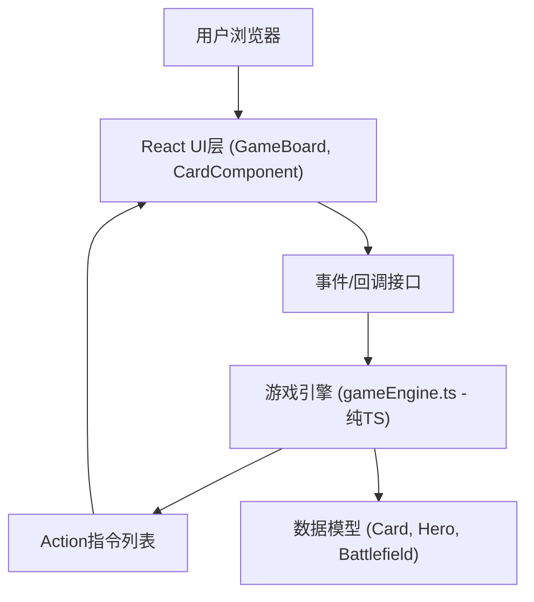

## 1. 架构设计

本项目采用前端单页应用架构，将游戏核心逻辑与UI渲染层完全分离，通过明确的接口和事件机制进行数据传递。



## 2. 技术描述

- **前端框架**: React 18 + TypeScript 5
- **构建工具**: Vite 5
- **Vite插件**: @vitejs/plugin-react
- **样式方案**: 纯CSS + CSS变量（深色奇幻主题）
- **动画方案**: CSS Transitions/Animations + requestAnimationFrame管理复杂动画序列
- **状态管理**: React useState/useReducer（局部状态），游戏状态由Engine统一管理

## 3. 路由定义

本项目为单页面应用，无多路由需求。

| 路由 | 用途 |
|-------|---------|
| / | 游戏主界面，包含对战面板、手牌区、HUD |

## 4. 文件结构与模块定义

### 4.1 项目根目录文件

| 文件 | 说明 |
|------|------|
| package.json | 项目依赖与脚本配置（react, react-dom, typescript, vite, @vitejs/plugin-react） |
| index.html | Vite入口HTML，标题：卡牌对战模拟器 |
| vite.config.js | Vite配置，启用React插件 |
| tsconfig.json | TypeScript配置（严格模式，target ES2020） |

### 4.2 src目录结构

| 文件 | 职责 | 类型 |
|------|------|------|
| src/gameEngine.ts | 游戏核心逻辑：类型定义、牌库生成、洗牌、抽牌、法力管理、攻击判定、AI决策，导出Engine类 | 纯TypeScript |
| src/CardComponent.tsx | 卡牌UI组件：渲染卡牌样式，支持悬停放大、选中状态、鼠标拖拽事件 | React组件 |
| src/GameBoard.tsx | 游戏主面板：渲染战场、英雄、HUD、手牌区，管理全局游戏状态，驱动动画序列 | React组件 |
| src/main.tsx | React入口：初始化Engine实例，挂载GameBoard组件，启动游戏 | React入口 |
| src/index.css | 全局样式：主题CSS变量、深色奇幻风格背景、动画关键帧定义 | 样式文件 |

### 4.3 核心数据模型定义

```typescript
// 卡牌类型
type CardType = 'minion' | 'spell';
type SpellEffect = 'damage' | 'heal' | 'draw';

interface Card {
  id: string;              // 唯一ID
  name: string;            // 卡牌名称
  cost: number;            // 法力消耗
  type: CardType;          // 卡牌类型
  attack?: number;         // 攻击力（随从）
  health?: number;         // 生命值（随从）
  effect?: SpellEffect;    // 法术效果
  effectValue?: number;    // 效果数值
  targetType?: 'enemy' | 'friendly' | 'any' | 'none'; // 目标类型
  gradientFrom: string;    // 插画渐变起始色
  gradientTo: string;      // 插画渐变结束色
}

interface MinionOnBoard extends Card {
  instanceId: string;      // 场上实例ID
  currentHealth: number;   // 当前生命值
  canAttack: boolean;      // 本回合是否可攻击
  hasAttacked: boolean;    // 本回合是否已攻击
}

interface Hero {
  health: number;          // 当前生命值
  maxHealth: number;       // 最大生命值
  mana: number;            // 当前法力
  maxMana: number;         // 法力上限（最大10）
}

interface Player {
  id: 'player' | 'ai';
  hero: Hero;
  deck: Card[];           // 牌库
  hand: Card[];           // 手牌
  board: MinionOnBoard[]; // 战场（最多5个）
  fatigueDamage: number;  // 疲劳伤害计数
}

interface GameState {
  turn: number;            // 回合数
  currentPlayer: 'player' | 'ai';
  player: Player;
  ai: Player;
  gameOver: boolean;
  winner: 'player' | 'ai' | null;
}

// Action指令类型 - 引擎生成，UI消费
type ActionType = 
  | 'START_TURN'
  | 'END_TURN' 
  | 'DRAW_CARD'
  | 'PLAY_CARD'
  | 'ATTACK'
  | 'SPELL_EFFECT'
  | 'TAKE_FATIGUE'
  | 'GAME_OVER';

interface Action {
  type: ActionType;
  player: 'player' | 'ai';
  payload?: Record<string, any>;
  timestamp: number;
}
```

## 5. 游戏引擎核心API（Engine类）

```typescript
class Engine {
  // 初始化新游戏，返回初始状态
  constructor();
  
  // 获取当前游戏状态（只读）
  getState(): Readonly<GameState>;
  
  // 开始游戏，生成初始Action（抽初始手牌）
  startGame(): Action[];
  
  // 玩家尝试打出卡牌，返回执行后的Action列表
  playCard(playerId: 'player' | 'ai', cardId: string, targetInstanceId?: string): Action[];
  
  // 随从攻击，返回Action列表
  attack(attackerInstanceId: string, targetInstanceId: string | 'hero'): Action[];
  
  // 结束当前回合，切换至对方回合，返回Action列表
  endTurn(): Action[];
  
  // AI决策，返回AI要执行的Action列表（带延迟信息）
  aiDecide(): { actions: Action[]; delay: number };
}
```

## 6. 组件层级与通信

```mermaid
graph TD
    A["main.tsx"] --> B["GameBoard.tsx"]
    B --> C["Engine实例"]
    B --> D["HeroPanel (英雄头像+生命条) x2"]
    B --> E["ManaBar (法力水晶行) x2"]
    B --> F["Battlefield (随从战场) x2"]
    F --> G["CardComponent (随从卡牌)"]
    B --> H["HandArea (手牌区)"]
    H --> G
    B --> I["TurnHUD (回合信息横幅)"]
    B --> J["FullscreenEffect (法术全屏效果)"]
    
    G -.->|onDragStart/onDrop/onClick| B
    B -.->|playCard/attack/endTurn| C
    C -.->|Action[] 指令| B
    B -.->|props + animation state| G
```

### 6.1 数据流方向
1. **用户交互** → CardComponent/DOM事件 → GameBoard事件处理函数
2. **GameBoard** → 调用Engine方法（playCard/attack/endTurn）
3. **Engine** → 执行业务逻辑，修改内部GameState，返回Action[]
4. **GameBoard** → 接收Action[]，按顺序调度动画更新UI状态
5. **React渲染** → 根据最新state重新渲染所有组件

### 6.2 动画调度策略
- 所有Action携带timestamp，UI层按时间差顺序执行
- 简单动画：CSS transition/class切换（0.05s内响应）
- 复杂序列（攻击→受击→死亡）：requestAnimationFrame链式调度
- AI思考动画：setTimeout 0.5-1s随机延迟

## 7. 性能优化策略

1. **动画性能**：优先使用transform和opacity属性（可GPU加速），避免触发layout/paint
2. **React优化**：
   - CardComponent使用React.memo避免不必要重渲染
   - 状态分片：动画状态与游戏状态分离存储
   - 批量更新：useTransition处理非紧急UI更新
3. **逻辑层**：
   - Engine纯函数计算，无side effect，所有状态变更可追溯
   - 卡牌ID/实例ID使用Map/Set快速查找，O(1)复杂度
4. **拖拽性能**：使用pointer events + transform实时位置更新，避免频繁DOM读写
