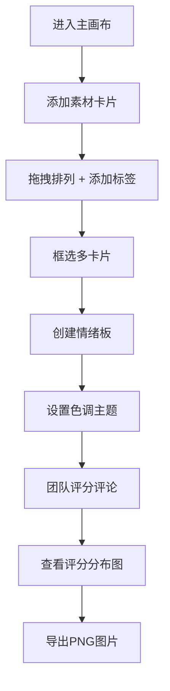

## 1. 产品概述

灵感画布是一款面向设计团队的创意协作工具，帮助团队在项目前期快速收集灵感素材、组织情绪板并进行设计评审。解决素材分散管理、团队缺乏统一组织和投票反馈机制的核心痛点。

- 目标用户：UI/UX设计师、视觉设计师、产品经理、创意团队
- 核心价值：将分散的灵感素材统一管理，通过可视化画布和情绪板提升团队创意协作效率

## 2. 核心功能

### 2.1 功能模块

1. **主画布页面**：无限画布、素材卡片管理、工具栏、框选创建情绪板
2. **情绪板页面**：网格布局展示、色调主题、评分分布图、PNG导出

### 2.2 页面详情

| 页面名称 | 模块名称 | 功能描述 |
|----------|----------|----------|
| 主画布页面 | 无限画布 | 支持鼠标滚轮缩放（0.5x-4x，阻尼0.85）、拖拽平移 |
| 主画布页面 | 素材卡片 | 支持URL图片加载和本地上传、标签描述、自由拖拽定位 |
| 主画布页面 | 左侧工具栏 | 折叠式菜单（48px→200px，0.3s动画）、添加图片/新建情绪板/评分筛选 |
| 主画布页面 | 框选功能 | 拖拽框选多卡片、创建情绪板 |
| 情绪板页面 | 网格布局 | 3x3固定网格、卡片间距16px |
| 情绪板页面 | 色调主题 | 6种预设色调、自动应用浅色变体到卡片背景边框 |
| 情绪板页面 | 评分系统 | 1-5星评分、文字评论、平均分自动计算 |
| 情绪板页面 | 评分分布图 | 顶部柱状图、按评分从高到低排序、0.3s生长动画 |
| 情绪板页面 | PNG导出 | html2canvas截图、隐藏操作控件、保留卡片和背景色 |

## 3. 核心流程

用户进入主画布后，通过左侧工具栏添加素材图片（URL或本地上传），在画布上自由拖拽排列卡片位置，为卡片添加灵感描述标签。框选一组卡片创建情绪板，进入情绪板页面设置色调主题，团队成员对卡片进行评分和评论，系统自动生成评分分布图，最后可导出情绪板为PNG图片。

## 4. 用户界面设计

### 4.1 设计风格

- **主色调**：浅灰背景#F5F5F5，卡片白底#FFFFFF
- **6种预设色调主题**：暖橙#E65100、冷蓝#1565C0、自然绿#2E7D32、柔和粉#F48FB1、暗黑#424242、复古棕#795548
- **卡片样式**：圆角8px、阴影0 2px 8px rgba(0,0,0,0.08)、拖拽时缩放1.05+半透明#B0BEC5（0.3s过渡）
- **工具栏样式**：简洁线条图标、选中时背景为色调主题100亮度色
- **字体**：系统默认无衬线字体，标题16px加粗，正文14px常规

### 4.2 页面设计概述

| 页面名称 | 模块名称 | UI元素 |
|----------|----------|--------|
| 主画布页面 | 无限画布 | 全屏浅灰背景、平移视差效果、缩放平滑过渡 |
| 主画布页面 | 左侧工具栏 | 垂直折叠菜单、悬停展开效果、图标按钮+文字标签 |
| 主画布页面 | 素材卡片 | 圆角卡片、图片预览区、标签区、拖拽手柄视觉反馈 |
| 情绪板页面 | 评分分布图 | 顶部横向柱状图、300亮度填充色、0.3s高度动画 |
| 情绪板页面 | 网格卡片 | 3x3布局、色调主题背景边框、星级评分组件 |
| 情绪板页面 | 评论区 | 评论输入框、评论列表、时间戳展示 |

### 4.3 响应式设计

- 桌面端（>768px）：左侧垂直工具栏+全屏画布
- 移动端（≤768px）：底部水平导航栏+适配画布区域
- 触摸优化：支持手势拖拽、双指缩放

### 4.4 性能要求

- 帧率稳定45FPS以上
- 拖拽、平移、缩放动画流畅无卡顿
- 使用requestAnimationFrame优化动画循环
- 合理使用useMemo/useCallback避免不必要重渲染
