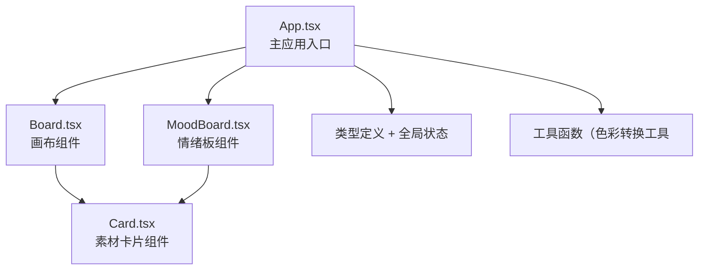

## 1. 架构设计



## 2. 技术描述

- **前端框架**：React@18 + TypeScript@5
- **构建工具**：Vite@5 + @vitejs/plugin-react@4
- **核心依赖**：
  - react-dom@18
  - html2canvas@1（PNG导出
  - uuid@9（唯一ID生成
- **样式方案**：原生CSS + CSS变量（动态主题切换
- **状态管理**：React Hooks（useState/useCallback/useRef
- **动画方案**：CSS transitions + requestAnimationFrame

## 3. 路由定义

本项目为单页应用，通过内部状态切换视图：

| 视图状态 | 目的 |
|----------|------|
| 'board' | 主画布视图，展示和编辑素材卡片 |
| 'moodboard' | 情绪板视图，网格展示和评分 |

## 4. 数据模型

### 4.1 TypeScript类型定义

```typescript
interface Card {
  id: string;
  imageUrl: string;
  x: number;
  y: number;
  width: number;
  height: number;
  tags: string[];
  ratings: Rating[];
  comments: Comment[];
}

interface Rating {
  id: string;
  userId: string;
  score: 1 | 2 | 3 | 4 | 5;
  createdAt: number;
}

interface Comment {
  id: string;
  userId: string;
  content: string;
  createdAt: number;
}

interface MoodBoard {
  id: string;
  cardIds: string[];
  themeColor: ThemeColor;
}

type ThemeColor = 'warm' | 'cool' | 'nature' | 'soft' | 'dark' | 'vintage';

interface ThemeConfig {
  main: string;
  light: string;
  lighter: string;
  lightest: string;
}
```

### 4.2 色调主题配置

```typescript
const THEMES: Record<ThemeColor, ThemeConfig> = {
  warm:    { main: '#E65100', light: '#FF8A65', lighter: '#FFAB91', lightest: '#FBE9E7' },
  cool:    { main: '#1565C0', light: '#64B5F6', lighter: '#90CAF9', lightest: '#E3F2FD' },
  nature:  { main: '#2E7D32', light: '#81C784', lighter: '#A5D6A7', lightest: '#E8F5E9' },
  soft:    { main: '#F48FB1', light: '#F8BBD0', lighter: '#FCE4EC', lightest: '#FCE4EC' },
  dark:    { main: '#424242', light: '#757575', lighter: '#BDBDBD', lightest: '#EEEEEE' },
  vintage: { main: '#795548', light: '#A1887F', lighter: '#BCAAA4', lightest: '#EFEBE9' },
};
```

## 5. 性能优化策略

### 5.1 画布渲染性能：

- 使用transform硬件加速：transform/translate3d GPU加速
- useMemo缓存卡片列表渲染
- useCallback事件处理器
- React.memo包装Card组件
- requestAnimationFrame实现平滑拖拽和缩放动画

### 5.2 核心性能：

- 拖拽防抖节流
- 缩放使用CSS transform而非top/left
- 卡片虚拟化（如有大量卡片时
- 图片懒加载

## 6. 文件结构

```
src/
├── App.tsx          # 主组件，状态管理，路由切换
├── Board.tsx        # 画布组件（平移/缩放/拖拽/框选
├── MoodBoard.tsx    # 情绪板组件（网格/色调/评分图/导出
├── Card.tsx         # 卡片组件（图片/标签/评分/评论
├── types.ts         # TypeScript类型定义
├── themes.ts        # 色调主题配置
└── utils.ts         # 工具函数
```

## 7. 核心算法

### 7.1 画布视口变换：

- 鼠标滚轮缩放：scale = clamp(scale \* (1 + (deltaY \* dampingFactor)
- 视口坐标转换：screenToWorld = (screen - pan) / scale
- 框选检测：AABB碰撞检测

### 7.2 评分分布统计：

- 平均分计算：sum(scores) / count
- 柱状图排序：按卡片平均降序排列
- 高度映射：score -> barHeight映射
