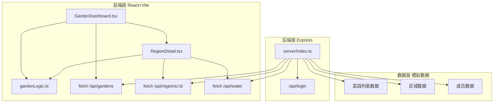
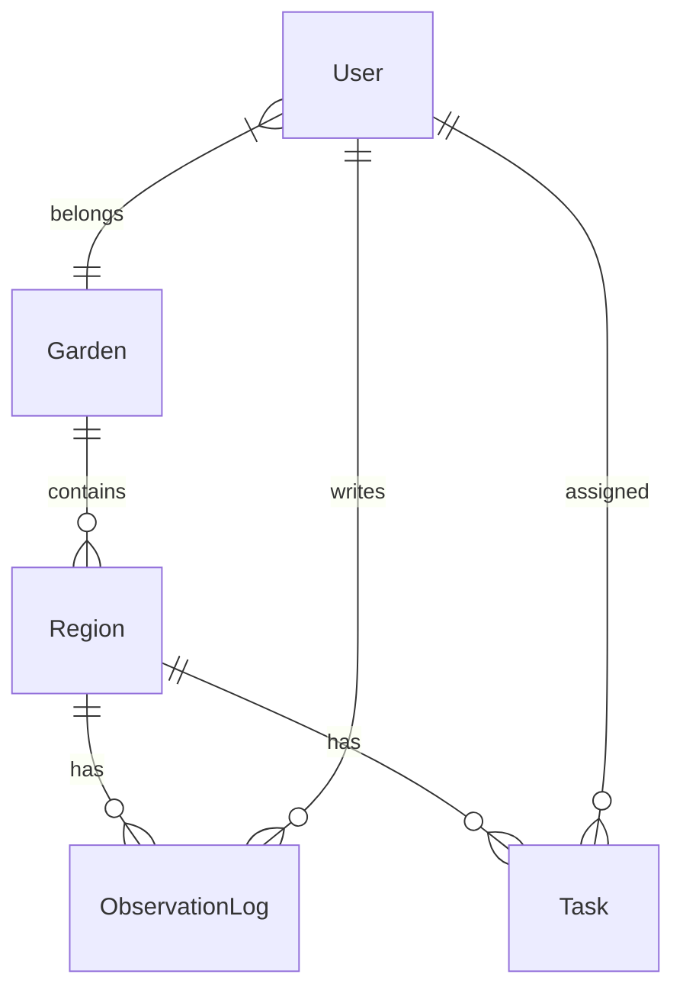

## 1. 架构设计



## 2. 技术说明

- 前端：React@18 + TypeScript + Vite + Tailwind CSS
- 初始化工具：vite-init (react-express-ts模板)
- 后端：Express@4 + TypeScript + CORS
- 数据库：无，使用内存模拟数据
- 状态管理：Zustand
- 路由：react-router-dom

## 3. 路由定义

| 路由 | 用途 |
|------|------|
| /login | 登录页面 |
| / | 菜园概览主页，展示区域卡片网格 |
| /region/:id | 区域详情页，展示作物详情、浇水、日志、任务 |
| /profile | 个人资料页，展示积分和等级 |

## 4. API定义

### 4.1 POST /api/login
请求：
```typescript
interface LoginRequest {
  username: string;
  role: 'manager' | 'member';
}
```
响应：
```typescript
interface LoginResponse {
  token: string;
  user: {
    id: string;
    username: string;
    role: 'manager' | 'member';
    points: number;
    avatar: string;
  };
}
```

### 4.2 GET /api/gardens
响应：
```typescript
interface Garden {
  id: string;
  name: string;
  regions: Region[];
}

interface Region {
  id: string;
  name: string;
  gardenId: string;
  cropName: string;
  plantDate: string;
  expectedHarvestDate: string;
  lastWateredAt: string | null;
  status: 'normal' | 'nearHarvest' | 'needsWater';
  imageUrl: string;
}
```

### 4.3 GET /api/regions/:id
响应：
```typescript
interface RegionDetail {
  id: string;
  name: string;
  gardenId: string;
  cropName: string;
  plantDate: string;
  expectedHarvestDate: string;
  lastWateredAt: string | null;
  status: 'normal' | 'nearHarvest' | 'needsWater';
  imageUrl: string;
  logs: ObservationLog[];
  tasks: Task[];
}

interface ObservationLog {
  id: string;
  regionId: string;
  authorId: string;
  authorName: string;
  content: string;
  photoUrl: string | null;
  createdAt: string;
}

interface Task {
  id: string;
  regionId: string;
  assigneeId: string;
  assigneeName: string;
  type: 'weeding' | 'fertilizing' | 'harvesting';
  status: 'pending' | 'completed';
  createdAt: string;
  completedAt: string | null;
}
```

### 4.4 POST /api/water
请求：
```typescript
interface WaterRequest {
  regionId: string;
  userId: string;
}
```
响应：
```typescript
interface WaterResponse {
  success: boolean;
  message: string;
  lastWateredAt: string;
  cooldownRemaining: number;
}
```

### 4.5 POST /api/logs
请求：
```typescript
interface CreateLogRequest {
  regionId: string;
  authorId: string;
  content: string;
  photoUrl: string | null;
}
```

### 4.6 POST /api/tasks
请求：
```typescript
interface CreateTaskRequest {
  regionId: string;
  assigneeId: string;
  type: 'weeding' | 'fertilizing' | 'harvesting';
}
```

### 4.7 POST /api/tasks/:id/complete
响应：
```typescript
interface CompleteTaskResponse {
  success: boolean;
  pointsEarned: number;
  totalPoints: number;
}
```

## 5. 服务端架构图

```mermaid
flowchart LR
    "Express路由层" --> "模拟数据存储"
    "模拟数据存储" --> "内存对象"
    "Express路由层" --> "CORS中间件"
    "Express路由层" --> "JSON解析中间件"
```

## 6. 数据模型

### 6.1 数据模型定义



### 6.2 业务逻辑模块 gardenLogic.ts

- `getWaterCooldown(lastWateredAt: string | null): number` — 计算浇水冷却剩余秒数（36小时冷却，首次可浇）
- `getHarvestCountdown(plantDate: string, cropType: string): { days: number; hours: number }` — 基于种植日期和作物类型计算收获倒计时
- `calculatePoints(action: 'water' | 'log' | 'harvest'): number` — 计算积分（浇水+10、日志+20、收获+50）
- `getUserLevel(points: number): { level: number; progress: number; color: string }` — 根据积分计算等级和进度（每100分升一级，颜色渐变#8BC34A→#4CAF50→#388E3C）
