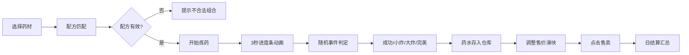

## 1. 产品概述

学院魔药工坊是一款以中世纪魔法学院为背景的模拟经营小游戏，玩家扮演魔法学院的药剂师，通过管理药材库存、炼制魔药并在学院商店售卖来赚取金币。游戏融合了策略配方组合、随机事件模拟和经营管理等元素，带来丰富的魔法炼金体验。

- 核心玩法：药材选择 → 配方组合 → 炼药过程（随机事件） → 药水入库 → 商店售卖 → 日结算
- 目标用户：喜欢休闲模拟经营类游戏的玩家
- 产品价值：提供轻松有趣的炼金经营体验，随机事件机制增加游戏可玩性和重复挑战价值

## 2. 核心功能

### 2.1 功能模块

1. **药材原料面板**：展示4种魔法药材（月光草、火焰花、龙鳞、独角兽泪），支持点击选择加入配方槽
2. **炼药核心区**：中央坩埚展示，3秒炼药进度条，粒子特效，随机事件触发
3. **仓库商店区**：药水库存管理，价格滑块调整，售卖功能，日收入结算

### 2.2 页面详情

| 页面名称 | 模块名称 | 功能描述 |
|---------|---------|---------|
| 主界面 | 药材原料面板 | 4列网格展示药材卡片，点击选中/移除，最多选4种，配方槽显示名称和重量 |
| 主界面 | 炼药核心区 | 256x256px坩埚SVG，液面动画，进度条（蓝→紫渐变），粒子特效，随机事件反馈 |
| 主界面 | 仓库商店区 | 药水列表（名称、品质、数量、售价），价格滑块，售卖按钮，今日总收入，结算按钮 |

## 3. 核心流程

玩家在药材面板选择药材 → 系统自动匹配配方 → 点击开始炼药 → 3秒炼药过程（进度条+粒子） → 随机事件判定（成功/小炸/大炸/完美） → 药水存入仓库 → 调整售价 → 点击售卖 → 日结算汇总

## 4. 用户界面设计

### 4.1 设计风格

- **主色调**：深紫 #3E2723 为主，金色 #FFD700 点缀，营造中世纪魔法学院氛围
- **布局**：三栏布局（左20%药材面板、中50%炼药区、右30%仓库商店）
- **按钮样式**：金色边框 + 深紫背景，点击水波扩散效果（0.15秒）
- **卡片样式**：圆角8px，阴影2px，悬停上浮3px，0.2秒过渡
- **字体**：标题用衬线体营造古典感，正文清晰易读
- **品质星星**：普通⭐ 优秀⭐⭐ 史诗⭐⭐⭐

### 4.2 页面设计概览

| 页面名称 | 模块名称 | UI元素 |
|---------|---------|-------|
| 主界面 | 药材原料面板 | 深褐背景 #4E342E，4列网格，64x64px药材卡片，悬停上浮动画 |
| 主界面 | 炼药核心区 | 灰色背景 #ECEFF1，256x256px坩埚SVG，液面波动动画，进度条（蓝→紫渐变），粒子特效 |
| 主界面 | 仓库商店区 | 顶部收入数字，药水卡片（高80px，渐进式展开动画），价格滑块，金色按钮 |

### 4.3 响应式

- 桌面端：三栏横向布局
- 移动端（<900px）：三栏改为上下顺序（药材→炼药→商店），每栏全宽
- 触摸优化：按钮和卡片足够大，便于触控操作

### 4.4 动效设计

- **液面波动**：周期2秒，颜色随药材组合动态变化
- **进度条**：3秒从0到100%，颜色蓝→紫渐变
- **卡片展开**：渐进式展开动画
- **数字滚动**：日结算时从0滚动到目标值，0.5秒
- **按钮点击**：水波扩散效果，0.15秒
- **不合法提示**：0.3秒淡入淡出
- **粒子特效**：完美品质时爆发光效
