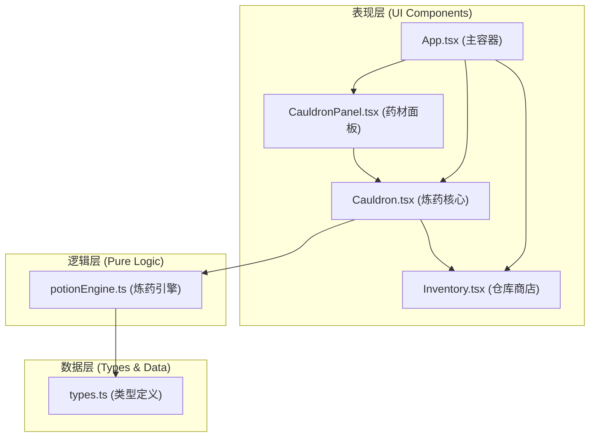

## 1. 架构设计

本项目为纯前端 React 应用，采用组件化架构，按职责划分配件。状态管理通过 React Hooks (useState, useEffect, useRef) 在组件内部管理，组件间通过 props 传递数据。



**数据流向：**
1. CauldronPanel 管理药材选择状态 → 通过 props 传递给 Cauldron
2. Cauldron 接收药材列表 → 调用 potionEngine 进行炼制判定
3. potionEngine 返回炼制结果 → Cauldron 将产出药水传递给 Inventory
4. Inventory 管理库存状态 → 售卖时从库存移除并累加收入

## 2. 技术描述

- **前端框架**：React 18 + TypeScript
- **构建工具**：Vite 5.x
- **样式方案**：原生 CSS + CSS Modules（或全局CSS，按用户指定文件结构）
- **动画方案**：CSS 动画 + requestAnimationFrame（性能要求60FPS）
- **无后端**：纯前端应用，数据全部在客户端内存中管理

**文件结构：**
```
src/
├── potionEngine.ts    # 纯逻辑模块：配方表、随机事件、炼药判定
├── Cauldron.tsx       # 炼药核心组件：坩埚UI、进度条、粒子特效
├── CauldronPanel.tsx  # 药材面板：药材选择、配方槽
├── Inventory.tsx      # 仓库商店：药水库存、价格、售卖、结算
├── App.tsx            # 主应用组件：三栏布局、状态管理
├── main.tsx           # 入口文件
└── index.css          # 全局样式
```

## 3. 核心数据模型

### 3.1 药材 (Ingredient)

| 字段 | 类型 | 说明 |
|------|------|------|
| id | string | 唯一标识 |
| name | string | 药材名称 |
| icon | string | emoji图标 |
| baseSuccessRate | number | 基础成功率加成 |
| color | string | 药材颜色（用于液面混合） |

### 3.2 药水 (Potion)

| 字段 | 类型 | 说明 |
|------|------|------|
| id | string | 唯一标识 |
| name | string | 药水名称 |
| quality | 'common' \| 'fine' \| 'epic' | 品质 |
| quantity | number | 数量 |
| basePrice | number | 基础售价 |

### 3.3 炼药结果 (BrewResult)

| 字段 | 类型 | 说明 |
|------|------|------|
| eventType | 'success' \| 'minorBoom' \| 'majorBoom' \| 'perfect' | 事件类型 |
| potionName | string | 药水名称 |
| quality | 'common' \| 'fine' \| 'epic' | 品质 |
| quantity | number | 产出数量 |
| goldPenalty | number | 金币惩罚（大炸时） |

### 3.4 配方 (Recipe)

| 字段 | 类型 | 说明 |
|------|------|------|
| ingredients | string[] | 药材id列表（排序后匹配） |
| results | PotionResult[] | 可能的产出列表（带概率） |

## 4. 核心算法与逻辑

### 4.1 配方匹配算法
- 将选中的药材id排序后生成字符串key
- 在配方表中查找完全匹配的key
- 不匹配则返回错误

### 4.2 随机事件判定
- 概率分布：成功50%、小炸25%、大炸10%、完美15%
- 使用 Math.random() 生成0-1随机数
- 根据累计概率区间判定事件类型

### 4.3 产出计算
- 成功：基础数量 × 1，品质不变
- 小炸：基础数量 × 0.5（向下取整），品质不变
- 大炸：数量 = 0，扣5金币
- 完美：基础数量 × 2，品质提升一档

### 4.4 液面颜色混合
- 根据选中药材的颜色进行RGB加权平均
- 未选药材时显示默认颜色

## 5. 性能优化

- **动画驱动**：所有动画使用 requestAnimationFrame 保证60FPS
- **状态更新**：React 状态更新批量处理，避免不必要的重渲染
- **DOM操作**：尽量减少DOM操作次数，使用CSS transform而非top/left
- **内存管理**：及时清理定时器和requestAnimationFrame回调
- **性能指标**：
  - 随机事件判定延迟 ≤ 16ms
  - 炼药状态切换更新 ≤ 50ms
  - 所有动画保持 60FPS

## 6. 响应式布局

- **断点**：900px
- **桌面端（≥900px）**：三栏横向布局，flex布局
  - 左栏：20% 宽度
  - 中栏：50% 宽度
  - 右栏：30% 宽度
- **移动端（<900px）**：三栏纵向堆叠，每栏100%宽度
  - 顺序：药材面板 → 炼药区 → 仓库商店
