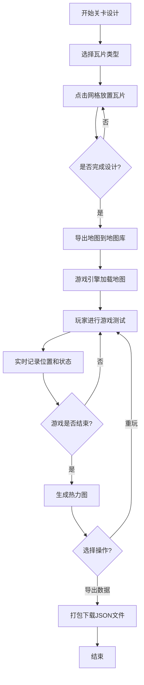

## 1. 产品概述

关卡工坊·平台跳跃原型测试器是一款面向独立游戏开发者的2D平台跳跃游戏关卡快速原型化工具。它解决了传统纸上设计难以验证手感、碰撞体调试费时、缺乏量化数据支撑关卡迭代的痛点，让开发者能够在几分钟内完成关卡设计、物理测试和数据收集。

- **目标用户**：独立游戏开发者、关卡设计师、游戏原型制作者
- **核心价值**：快速验证关卡设计手感，收集玩家操作热力数据，支撑数据驱动的关卡迭代

## 2. 核心功能

### 2.1 用户角色

| 角色 | 注册方式 | 核心权限 |
|------|----------|----------|
| 开发者用户 | 无需注册，直接使用 | 完整的关卡编辑、游戏测试、数据导出功能 |

### 2.2 功能模块

1. **关卡编辑器**：10x15瓦片网格画布，支持4种基础瓦片的放置与擦除
2. **游戏物理引擎**：2D平台跳跃物理模拟，精确AABB碰撞检测
3. **热力图系统**：实时记录玩家位置，游戏结束后生成热力密度图
4. **数据反馈面板**：实时显示游戏状态，支持打包导出所有数据

### 2.3 页面详情

| 页面名称 | 模块名称 | 功能描述 |
|----------|----------|----------|
| 主工作区 | 编辑器画布 | 10x15网格瓦片绘制，支持Shift连续放置、右键擦除 |
| 主工作区 | 编辑器工具栏 | 瓦片选择面板、清除画布、导出地图按钮 |
| 主工作区 | 游戏画布 | 渲染关卡场景，处理玩家输入，运行物理引擎 |
| 主工作区 | 反馈面板 | 悬浮显示FPS、死亡次数、金币数、完成时间，提供重玩和导出按钮 |
| 主工作区 | 热力图叠加层 | 游戏结束后在关卡上叠加显示玩家位置热力图 |

## 3. 核心流程

用户在编辑器中放置瓦片设计关卡 → 点击导出地图存入地图库 → 游戏引擎读取地图数据渲染关卡 → 玩家使用WASD/方向键进行游戏测试 → 系统实时记录位置数据和游戏状态 → 游戏结束后生成热力图 → 用户可选择重玩或导出所有数据

## 4. 用户界面设计

### 4.1 设计风格

- **设计调性**：暗色科幻风格，营造专业的游戏开发工具氛围
- **主色调**：背景#0D1117，面板#161B22，边框#30363D
- **强调色**：按钮#238636（悬停#2EA043），选中高亮#FFD54F，金币#FFD700
- **渐变**：关卡背景使用#1A1A2E到#16213E的径向渐变
- **热力图渐变**：从#2196F3（冷色）到#F44336（暖色）
- **按钮样式**：圆角6px，白色文字，点击时下沉1px并缩放0.95（0.1秒动画）
- **字体**：使用Orbitron作为标题字体（科幻感），JetBrains Mono作为等宽数据显示字体，Noto Sans SC作为正文字体
- **布局**：左右分栏布局（各占50%），中间2px分隔线可拖拽调整

### 4.2 页面设计概述

| 页面名称 | 模块名称 | UI元素 |
|----------|----------|--------|
| 主工作区 | 编辑器画布 | 10x15网格，网格线#555555 1px实线，瓦片高亮#FFD54F，瓦片颜色区分（地面、墙壁、尖刺、金币） |
| 主工作区 | 编辑器工具栏 | 4个瓦片选择按钮（带颜色预览），清除按钮，导出按钮，状态提示文字 |
| 主工作区 | 游戏画布 | 16x16蓝色玩家方块，瓦片渲染，波纹动画（落地时#4FC3F7扩散），金币收集动画（#FFD700缩小消失） |
| 主工作区 | 反馈面板 | 右下角悬浮，宽200px，背景#1E1E2E 90%不透明度，圆角8px，FPS/死亡/金币/时间数据显示，重玩/导出按钮 |
| 主工作区 | 热力图叠加层 | 半透明热力点，半径8px，不透明度0.4，颜色从蓝到红渐变 |

### 4.3 响应性

- **桌面优先**：针对桌面端优化，支持1280px及以上分辨率
- **拖拽分隔**：中间分隔线支持鼠标拖拽调整左右面板比例
- **固定画布**：编辑器和游戏画布使用固定像素尺寸，保证瓦片显示精度

### 4.4 动画与交互

- **瓦片放置**：鼠标悬停时显示半透明预览，点击时缩放反馈
- **玩家落地**：底部产生#4FC3F7扩散波纹（0.3秒）
- **金币收集**：#FFD700缩小消失动画（0.3秒）
- **按钮交互**：悬停变色，点击下沉+缩放（0.1秒）
- **面板动画**：游戏结束时按钮滑入效果
