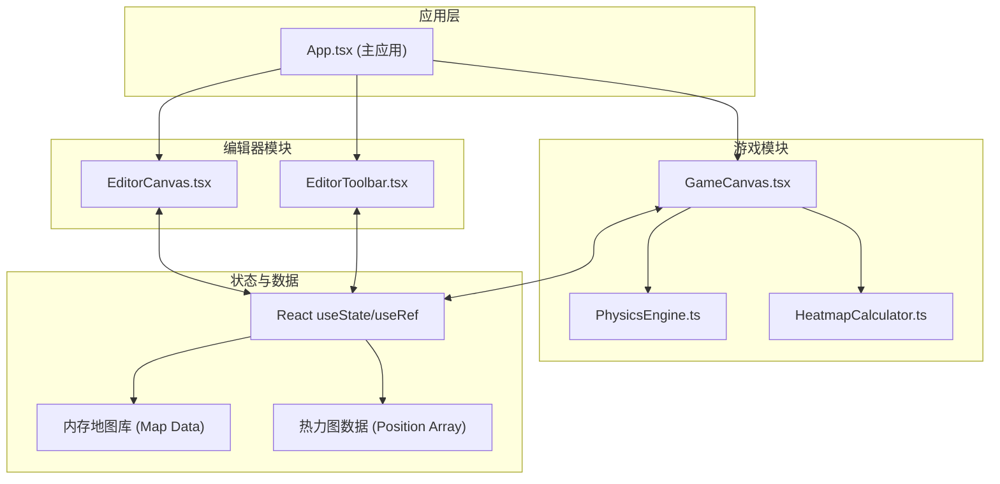
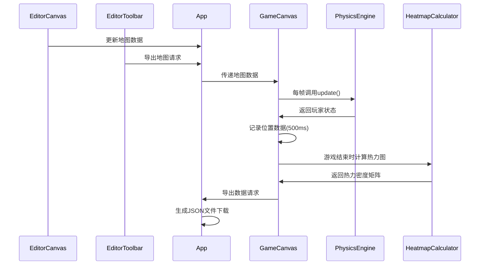

## 1. 架构设计

本项目采用纯前端架构，分为编辑器模块和游戏模块两大核心模块，使用React组件化开发，通过HTML5 Canvas进行图形渲染，状态管理采用React内置的useState和useRef，不引入额外的状态管理库以保持轻量。



## 2. 技术描述

- **前端框架**：React@18 + TypeScript@5
- **构建工具**：Vite@5 + @vitejs/plugin-react@4
- **渲染技术**：HTML5 Canvas 2D API
- **状态管理**：React useState / useRef（轻量级，无额外依赖）
- **样式方案**：原生CSS + CSS变量（无需Tailwind，避免依赖冗余）
- **项目初始化**：使用 `npm init vite-init` 创建 React + TypeScript 模板

## 3. 目录结构

```
src/
├── modules/
│   ├── editor/
│   │   ├── EditorCanvas.tsx      # 编辑器画布组件
│   │   └── EditorToolbar.tsx     # 编辑器工具栏组件
│   └── game/
│       ├── GameCanvas.tsx        # 游戏画布组件
│       ├── PhysicsEngine.ts      # 物理引擎模块
│       └── HeatmapCalculator.ts  # 热力图计算模块
├── types/
│   └── index.ts                  # 全局类型定义
├── App.tsx                       # 主应用组件
├── main.tsx                      # 应用入口
└── index.css                     # 全局样式
```

## 4. 核心类型定义

```typescript
// 瓦片类型
export type TileType = 0 | 1 | 2 | 3 | 4; // 0=空, 1=地面, 2=墙壁, 3=尖刺, 4=金币

// 地图数据 (15行 x 10列)
export type MapData = TileType[][];

// 玩家状态
export interface PlayerState {
  x: number;
  y: number;
  vx: number;
  vy: number;
  width: number;
  height: number;
  isGrounded: boolean;
  lives: number;
  coins: number;
}

// 位置点
export interface Position {
  x: number;
  y: number;
  timestamp: number;
}

// 游戏统计
export interface GameStats {
  fps: number;
  deaths: number;
  coins: number;
  playTime: number;
  isGameOver: boolean;
}

// 热力图数据
export interface HeatmapData {
  positions: Position[];
  densityMatrix: number[][];
}

// 导出数据包
export interface ExportData {
  mapData: MapData;
  heatmapData: HeatmapData;
  gameStats: Omit<GameStats, 'fps' | 'isGameOver'>;
  timestamp: string;
}
```

## 5. 核心模块设计

### 5.1 PhysicsEngine 类

```typescript
export class PhysicsEngine {
  private gravity: number = 0.5;
  private jumpVelocity: number = -10;
  private moveSpeed: number = 5;
  private friction: number = 0.8;
  private tileSize: number = 32;
  
  constructor(mapData: MapData, tileSize?: number);
  
  update(player: PlayerState, input: InputState): PlayerState;
  checkCollision(x: number, y: number, w: number, h: number): CollisionResult;
  applyGravity(player: PlayerState): PlayerState;
}
```

### 5.2 HeatmapCalculator 类

```typescript
export class HeatmapCalculator {
  private radius: number = 8;
  private opacity: number = 0.4;
  
  calculateDensity(positions: Position[], width: number, height: number): number[][];
  getColor(density: number, maxDensity: number): string;
  renderHeatmap(ctx: CanvasRenderingContext2D, densityMatrix: number[][]): void;
}
```

### 5.3 常量配置

```typescript
// 画布尺寸
export const CANVAS_WIDTH = 320;  // 10 tiles * 32px
export const CANVAS_HEIGHT = 480; // 15 tiles * 32px
export const TILE_SIZE = 32;

// 网格配置
export const GRID_COLS = 10;
export const GRID_ROWS = 15;
export const GRID_COLOR = '#555555';

// 瓦片颜色
export const TILE_COLORS: Record<number, string> = {
  0: 'transparent',
  1: '#6B7280', // 地面
  2: '#374151', // 墙壁
  3: '#EF4444', // 尖刺
  4: '#FFD700', // 金币
};

// 玩家配置
export const PLAYER_COLOR = '#3B82F6';
export const PLAYER_SIZE = 16;
```

## 6. 性能优化策略

1. **Canvas渲染优化**：使用 `requestAnimationFrame` 进行渲染循环，避免不必要的重绘
2. **热力图计算**：游戏结束后异步计算，使用 `setTimeout` 分块处理避免阻塞主线程
3. **输入处理**：使用键盘状态追踪而非事件触发，避免重复处理
4. **碰撞检测**：空间分区优化，只检测玩家附近的瓦片
5. **内存管理**：及时清理动画帧和定时器，避免内存泄漏

## 7. 路由定义

| 路由 | 用途 |
|------|------|
| / | 主工作区（单页应用，无路由切换） |

## 8. 数据流转


