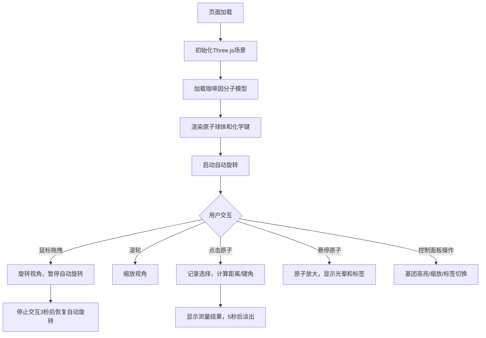

## 1. 产品概述

三维分子结构可视化与交互应用，面向化学学习者和研究人员，提供直观的分子模型观察与分析工具。通过交互式3D渲染，帮助用户理解有机分子的空间构型、原子间关系和化学基团特性。

### 核心价值
- 将抽象的分子结构转化为可交互的3D可视化模型
- 提供专业的化学分析工具（键长测量、键角计算、基团高亮）
- 科技感的暗色调界面，营造沉浸式科研体验

## 2. 核心功能

### 2.1 用户角色
| 角色 | 注册方式 | 核心权限 |
|------|----------|----------|
| 普通用户 | 无需注册 | 完整使用所有可视化和分析功能 |

### 2.2 功能模块
1. **主视图模块**：Three.js 3D场景渲染，分子模型展示，轨道控制
2. **控制面板模块**：dat.gui基团选择、缩放控制、标签切换
3. **交互分析模块**：点击测距测角、悬停高亮、自动旋转
4. **数据模型模块**：咖啡因分子数据、原子键计算方法

### 2.3 页面详情
| 页面名称 | 模块名称 | 功能描述 |
|----------|----------|----------|
| 主页面 | 3D视图区 | 全屏显示分子模型，支持鼠标旋转/缩放，深空蓝渐变背景，网格辅助线 |
| 主页面 | 右侧控制面板 | 260px宽半透明深色面板，包含基团下拉菜单、缩放滑条、标签复选框 |
| 主页面 | 信息浮窗 | 左上角显示距离和键角测量结果，5秒后自动淡出 |
| 主页面 | 原子标签 | CSS2DRenderer渲染的白色半透明文字标签，始终面向摄像机 |

## 3. 核心流程

## 4. 用户界面设计

### 4.1 设计风格
- **主色调**：深空蓝渐变（顶部#0B0B2B → 底部#1B1B4B），科技感暗色调
- **原子配色**：碳#808080、氢#FFFFFF、氧#FF0000、氮#0000FF
- **高亮色**：金黄色#FFD700（基团外发光）、黄色边框（选中原子）
- **面板样式**：半透明深色#1A1A2E（透明度0.85），圆角8px，间距12px
- **文字颜色**：#E0E0E0（面板）、白色半透明（标签）
- **字体**：14px无衬线（面板）、12px（原子标签）

### 4.2 页面设计概述
| 页面名称 | 模块名称 | UI元素 |
|----------|----------|--------|
| 主页面 | 3D场景 | 深空蓝渐变背景、网格辅助线、彩色原子球体、半透明灰色键、自动旋转动画 |
| 主页面 | 控制面板 | 右侧固定260px宽、下拉菜单、范围滑块、复选框、12px间距 |
| 主页面 | 交互反馈 | 悬停原子放大1.3倍（0.2秒过渡）、浅黄色光晕、跟随光标标签、选中原子黄色边框 |
| 主页面 | 测量显示 | 左上角白色半透明文本框、"距离: X.XX Å, 键角: XXX.X°"格式、0.3秒淡出动画 |

### 4.3 响应性
- 桌面端优先，主视图占满整个浏览器窗口
- 控制面板固定右侧，不随窗口缩放改变宽度
- 3D画布自适应窗口大小变化

### 4.4 3D场景指导
- **环境**：深空蓝渐变背景，营造太空/科技感氛围
- **光照**：环境光（0.4强度）+ 两点光源（主光0.8强度，辅光0.4强度），半透明辅助球体
- **相机**：PerspectiveCamera，初始距离15，视角60度
- **控制器**：OrbitControls，0.5秒惯性阻尼，自动旋转每10秒一周
- **交互**：拖拽旋转、滚轮缩放、点击选择、悬停放大
- **后处理**：半透明效果、外发光效果（emissive材质）
- **性能预算**：≤200原子、≤250键，帧率稳定≥50FPS

