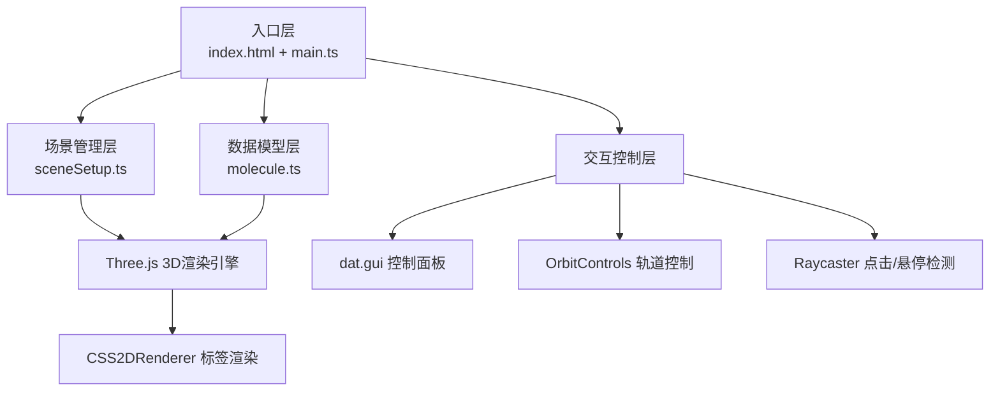

## 1. 架构设计



## 2. 技术描述

- **前端框架**：原生 TypeScript + Three.js，无需React/Vue等UI框架
- **构建工具**：Vite 5.x
- **3D引擎**：Three.js ^0.160.0
- **UI控件**：dat.gui ^0.7.9
- **类型系统**：TypeScript ^5.3.0（严格模式）
- **后端**：无（纯前端应用）
- **数据库**：无（预定义分子数据）

## 3. 项目结构

| 文件路径 | 职责 |
|----------|------|
| `package.json` | 项目依赖（three, dat.gui, typescript, vite）和启动脚本 |
| `index.html` | 入口页面，标题"分子结构查看器"，挂载Canvas容器 |
| `vite.config.js` | Vite基础构建配置 |
| `tsconfig.json` | TypeScript配置，启用strict严格模式 |
| `src/main.ts` | 主入口：初始化Three.js场景、相机、轨道控制器、加载分子模型、事件绑定、动画循环 |
| `src/molecule.ts` | 数据模型：原子/键接口定义、咖啡因分子数据、键长/键角计算方法 |
| `src/sceneSetup.ts` | 场景配置：环境光/点光源、半透明辅助球体、CSS2DRenderer文字标签 |

## 4. 核心数据模型

### 4.1 类型定义

```typescript
interface Atom {
  id: string;
  element: 'C' | 'H' | 'O' | 'N';
  position: { x: number; y: number; z: number };
  name: string;
  group?: string;
}

interface Bond {
  id: string;
  atom1: string;
  atom2: string;
  order: 1 | 2 | 3;
}

interface MoleculeData {
  atoms: Atom[];
  bonds: Bond[];
  name: string;
}

interface MeasurementResult {
  distance: number;
  angle: number;
  atom1: Atom;
  atom2: Atom;
  vertexAtom?: Atom;
}
```

### 4.2 原子属性配置

| 元素 | 颜色 | 半径 |
|------|------|------|
| 碳(C) | #808080 | 0.4 |
| 氢(H) | #FFFFFF | 0.2 |
| 氧(O) | #FF0000 | 0.35 |
| 氮(N) | #0000FF | 0.35 |

### 4.3 化学键配置

| 属性 | 值 |
|------|----|
| 颜色 | 灰色，半透明 |
| 半径 | 0.08 |
| 透明度 | 0.7 |

## 5. 核心算法

### 5.1 键长计算
```typescript
function calculateDistance(atom1: Atom, atom2: Atom): number {
  const dx = atom2.x - atom1.x;
  const dy = atom2.y - atom1.y;
  const dz = atom2.z - atom1.z;
  return Math.sqrt(dx * dx + dy * dy + dz * dz);
}
```

### 5.2 键角计算
```typescript
function calculateAngle(vertex: Atom, atom1: Atom, atom2: Atom): number {
  const v1 = { x: atom1.x - vertex.x, y: atom1.y - vertex.y, z: atom1.z - vertex.z };
  const v2 = { x: atom2.x - vertex.x, y: atom2.y - vertex.y, z: atom2.z - vertex.z };
  const dot = v1.x * v2.x + v1.y * v2.y + v1.z * v2.z;
  const mag1 = Math.sqrt(v1.x * v1.x + v1.y * v1.y + v1.z * v1.z);
  const mag2 = Math.sqrt(v2.x * v2.x + v2.y * v2.y + v2.z * v2.z);
  const cosAngle = dot / (mag1 * mag2);
  return Math.acos(Math.max(-1, Math.min(1, cosAngle))) * (180 / Math.PI);
}
```

### 5.3 化学键圆柱定向算法
使用Quaternion.setFromUnitVectors将圆柱从默认Y轴方向旋转到两个原子连线方向，位置设为两原子中点。

## 6. 性能优化策略

1. **几何体复用**：同种元素原子共享SphereGeometry实例，键共享CylinderGeometry实例
2. **材质复用**：相同属性的原子/键共享Material实例
3. **标签优化**：CSS2DRenderer仅在需要时创建/销毁标签，避免DOM冗余
4. **射线检测优化**：仅对原子网格进行Raycaster检测，忽略键和辅助物体
5. **动画优化**：使用requestAnimationFrame，仅在必要时更新矩阵
6. **内存管理**：场景清理时正确dispose几何体和材质

