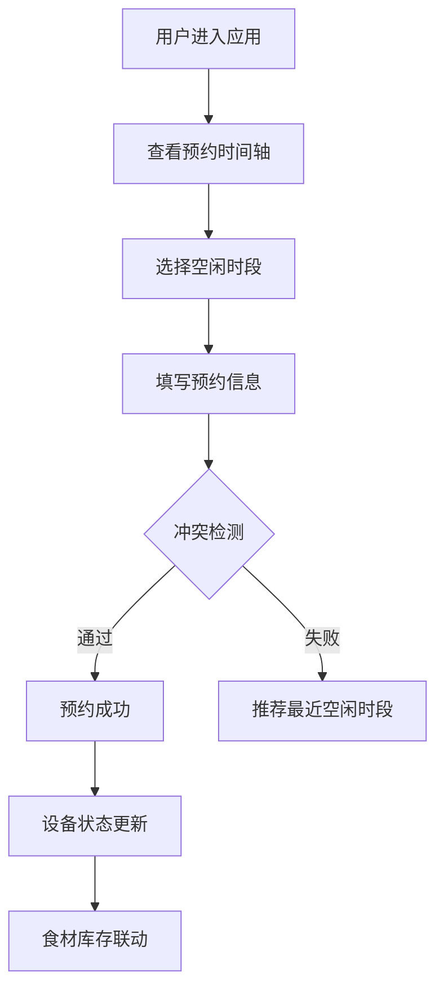

## 1. 产品概述

社区共享厨房协作管理与智能预约应用，解决社区厨房预约冲突、设备使用混乱和食材浪费问题。面向社区居民和厨房管理员，提供规范的预约管理、设备状态追踪和食材库存联动功能。

- 核心目标：规范化预约流程，实时追踪设备状态，智能联动食材库存，减少资源浪费
- 目标用户：社区共享厨房成员、厨房管理员

## 2. 核心功能

### 2.1 功能模块

1. **预约协作模块**：1小时粒度时段网格预约，冲突检测，推荐空闲时段
2. **设备状态追踪**：设备状态展示，设备锁定功能
3. **库存联动与过期预警**：食材库存管理，过期预警，消耗记录

### 2.2 页面详情

| 页面名称 | 模块名称 | 功能描述 |
|-----------|-------------|---------------------|
| 主应用页 | 预约面板 | 日视图时间轴，三列预约槽，预约/取消操作，冲突提示与推荐 |
| 主应用页 | 设备状态卡 | 横向滚动设备列表，状态展示，设备锁定功能 |
| 主应用页 | 库存面板 | 食材列表，过期预警，消耗操作，历史记录 |
| 主应用页 | 调试面板 | 当前数据 JSON 快照展示 |

## 3. 核心流程

### 3.1 预约流程
用户查看时间轴 → 选择空闲时段 → 填写预约信息（人数、用途）→ 系统检测冲突 → 预约成功/提示已满并推荐最近空闲时段

### 3.2 设备使用流程
用户查看设备状态 → 空闲设备可点击锁定 → 使用中设备显示预计结束时间 → 释放设备恢复空闲状态

### 3.3 库存管理流程
管理员添加食材 → 系统计算剩余保质期 → 接近过期显示预警 → 用户消耗食材 → 数量归零后移入历史记录

## 4. 用户界面设计

### 4.1 设计风格
- 主色调：暖橙 #FF8A65
- 辅助色：预约蓝 #42A5F5、库存健康绿 #66BB6A
- 背景色：暖白 #FAFAFA
- 卡片风格：圆角 8px，带 4px 左边界色条
- 字体：现代无衬线字体，清晰的层级结构
- 动效：悬停微上浮、阴影加深，状态切换平滑过渡

### 4.2 页面设计概览

| 页面名称 | 模块名称 | UI 元素 |
|-----------|-------------|-------------|
| 主应用页 | 预约面板 | 时间标签列（06:00-24:00），三列预约槽，蓝色填充卡片，悬停详情提示 |
| 主应用页 | 设备卡片 | 横向滚动，状态标签，使用中边框闪烁动画（#FF7043，1.5s周期） |
| 主应用页 | 库存卡片 | 两列网格，名称顶对齐/日期右对齐，过期预警红色背景 #FFCDD2 |
| 主应用页 | 全局 | 卡片式布局，暖白背景，响应式断点 768px |

### 4.3 响应式
- 桌面端（>768px）：预约面板三列布局，库存面板两列网格
- 移动端（≤768px）：预约面板单列滚动，库存面板单列列表
- 触摸优化：增大点击区域，优化手势操作

### 4.4 动效细节
- 预约卡片：取消时从蓝 #42A5F5 渐变为灰 #B0BEC5，持续 0.3 秒
- 使用中设备：边框闪烁动画，#FF7043 闪烁，周期 1.5 秒
- 库存卡片：悬停微上浮 2px，阴影加深 0.2 秒动画
- 过期预警：背景变为 #FFCDD2，红色警告图标
