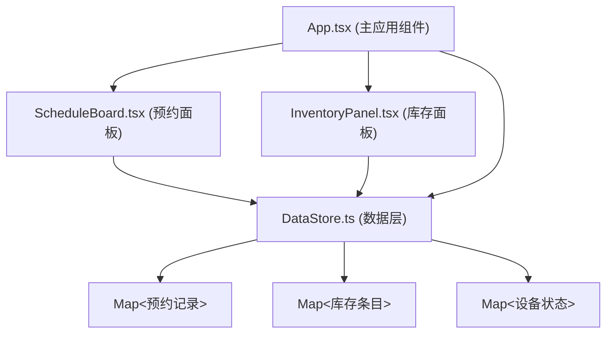
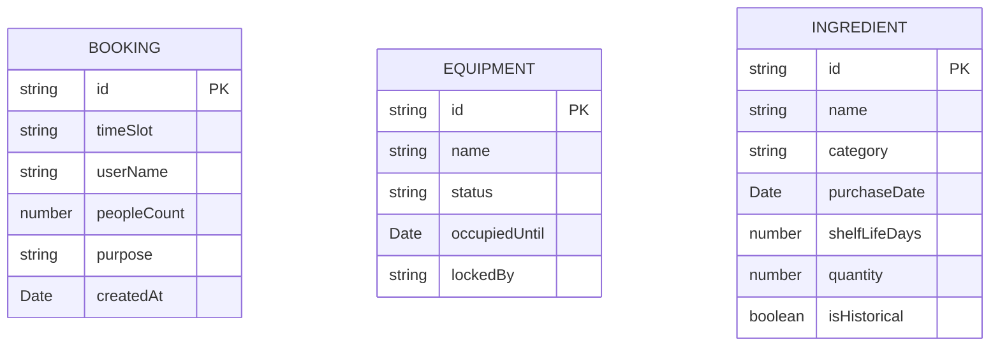

## 1. 架构设计



## 2. 技术描述

- 前端框架：React 18 + TypeScript
- 构建工具：Vite 5
- 状态管理：DataStore 单例模式（纯 TypeScript 模块）
- 样式方案：原生 CSS + CSS 变量
- 路径别名：@ 指向 src 目录
- 目标环境：ES2020

## 3. 文件结构与调用关系

```
src/
├── App.tsx              # 主应用组件，布局编排，Props 下发
├── DataStore.ts         # 纯 TS 数据层，AppDataStore 单例
├── styles.css           # 全局主题样式
└── components/
    ├── ScheduleBoard.tsx   # 预约面板组件
    └── InventoryPanel.tsx  # 食材库存面板组件
```

调用关系：
- App.tsx → 调用 ScheduleBoard 和 InventoryPanel，通过 Props 下发数据
- ScheduleBoard.tsx → 调用 DataStore.booking / releaseSlot 方法
- InventoryPanel.tsx → 调用 DataStore.addIngredient / consumeIngredient 方法
- DataStore.ts → 被 App.tsx、ScheduleBoard.tsx、InventoryPanel.tsx 直接调用

数据流：
- 用户交互 → 组件事件 → DataStore 方法调用 → 状态更新 → 组件重新渲染

## 4. 数据模型

### 4.1 数据模型定义



### 4.2 核心数据结构

```typescript
// 预约类型
interface Booking {
  id: string;
  timeSlot: string; // "HH:00" 格式
  userName: string;
  peopleCount: number;
  purpose: 'baking' | 'chinese' | 'dessert';
  createdAt: Date;
}

// 设备类型
interface Equipment {
  id: string;
  name: string;
  status: 'idle' | 'in-use' | 'maintenance';
  occupiedUntil?: Date;
  lockedBy?: string;
}

// 食材类型
interface Ingredient {
  id: string;
  name: string;
  category: 'dry' | 'refrigerated' | 'frozen';
  purchaseDate: Date;
  shelfLifeDays: number;
  quantity: number;
  isHistorical: boolean;
}

// DataStore 状态快照
interface AppState {
  bookings: Booking[];
  equipments: Equipment[];
  ingredients: Ingredient[];
}
```

## 5. DataStore 核心方法

| 方法名 | 参数 | 返回值 | 说明 |
|-------|------|--------|------|
| getBookingsBySlot | timeSlot: string | Booking[] | 获取指定时段的预约列表 |
| hasConflict | timeSlot: string | boolean | 检测时段是否已满（最多3个） |
| bookSlot | timeSlot, bookingData | Booking \| null | 创建预约，冲突返回 null |
| releaseSlot | bookingId | boolean | 取消预约 |
| findNextAvailableSlot | fromTime?: string | string \| null | 查找最近空闲时段 |
| getEquipments | - | Equipment[] | 获取所有设备状态 |
| lockEquipment | equipmentId, bookingId | boolean | 锁定设备 |
| unlockEquipment | equipmentId | boolean | 解锁设备 |
| getIngredients | includeHistorical? | Ingredient[] | 获取食材列表 |
| addIngredient | ingredientData | Ingredient | 添加食材 |
| consumeIngredient | ingredientId, amount | boolean | 消耗食材 |
| getState | - | AppState | 获取完整状态快照 |

## 6. 性能约束

- 初始化渲染时间 ≤ 800ms（含 DataStore 初始化与首次预约数据加载）
- 预约/取消操作状态更新 ≤ 50ms 内反映到 UI
- 使用 Map 数据结构保证 O(1) 查找性能
- 组件按需渲染，避免不必要的重渲染
