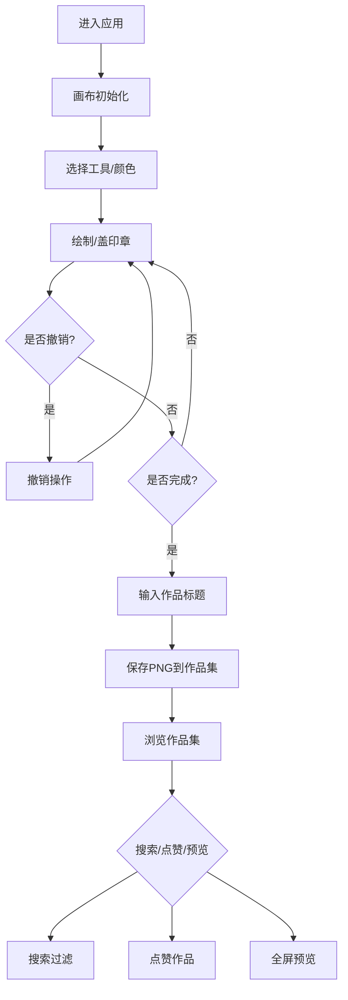

## 1. 产品概述
街头涂鸦工坊是一款数字涂鸦创作与作品集展示应用，让用户在虚拟画布上体验街头涂鸦艺术创作的乐趣。用户可使用喷漆、马克笔、印章等工具自由创作，并将作品保存至个人作品集。

- 主要用途：数字涂鸦创作、个人作品集管理、作品展示与分享
- 目标用户：涂鸦爱好者、设计师、艺术创作者
- 产品价值：提供沉浸式街头涂鸦创作体验，降低创作门槛，方便作品管理与展示

## 2. 核心功能

### 2.1 用户角色
| 角色 | 注册方式 | 核心权限 |
|------|----------|----------|
| 普通用户 | 无需注册（本地存储） | 创作涂鸦、保存作品、浏览作品集、点赞作品、搜索作品 |

### 2.2 功能模块
1. **画布创作区**：砖墙纹理背景、自由绘制、印章工具、调色板、画笔尺寸调节
2. **作品保存**：PNG导出、标题输入、时间戳命名
3. **作品集展示**：三列网格布局、作品卡片、点赞功能、搜索过滤、全屏预览
4. **撤销/重做**：20步历史记录、状态管理

### 2.3 页面详情
| 页面名称 | 模块名称 | 功能描述 |
|---------|----------|----------|
| 主页面 | 画布创作区 | 砖墙背景、鼠标绘制、印章放置、渐显动画 |
| 主页面 | 左侧工具栏 | 8色调色板、画笔尺寸滑块、印章选择 |
| 主页面 | 顶部操作栏 | 喷绘完成按钮、撤销/重做按钮 |
| 主页面 | 作品集展示区 | 三列网格、作品卡片、点赞按钮、搜索框 |
| 主页面 | 全屏预览层 | 半透明遮罩、作品大图展示、点击关闭 |

## 3. 核心流程

### 3.1 创作流程
1. 用户进入页面，看到砖墙背景画布
2. 选择颜色和画笔尺寸
3. 按住鼠标拖动绘制线条，线条带渐显效果
4. 可选择印章工具，在画布上点击放置随机风格印章
5. 点击"撤销"按钮回退操作，支持重做
6. 完成后点击"喷绘完成"按钮
7. 弹出输入框要求输入作品标题
8. 作品以PNG格式保存到本地作品集

### 3.2 作品集浏览流程
1. 作品集区域显示所有保存的作品卡片
2. 输入关键词搜索，匹配的卡片高亮显示心跳动画
3. 鼠标悬停卡片显示放大镜图标和点赞数
4. 点击卡片进入全屏预览模式
5. 点击心形按钮点赞，不可重复点赞

### 3.3 流程图

## 4. 用户界面设计

### 4.1 设计风格
- **主题色调**：深灰暗色主题（背景#1A1A24），搭配橙色系交互元素（#FF8C00到#FFA500渐变）
- **色彩搭配**：
  - 主色：#FFA500（橙色系渐变）
  - 背景：#1A1A24（深紫灰）
  - 画布背景：砖墙纹理（#8B4513/#A0522D）
  - 文字：#F5F5DC（标题）、#C0C0C0（副标题）
  - 边框高亮：#FFD700（金色）、#32CD32（搜索匹配）
- **按钮风格**：圆角设计，内阴影效果，悬停亮度提升20%
- **字体**：Roboto Mono等宽字体，12px基础字号
- **布局风格**：左右分区（左侧70%画布区，右侧30%工具与作品集区）
- **图标风格**：Emoji图标（❤️、🔍、⌛）

### 4.2 页面设计概览
| 页面名称 | 模块名称 | UI元素 |
|---------|----------|--------|
| 主页面 | 画布创作区 | 砖墙纹理、居中80%视口、深灰留白、线条渐显动画、印章弹入动画 |
| 主页面 | 左侧调色板 | 8个60x60px色块、圆角8px、悬停放大120%、颜色名称提示 |
| 主页面 | 尺寸滑块 | 1-50px范围、默认5px |
| 主页面 | 印章工具 | 5种字体印章、星星/箭头/手印基础图形、随机灰阶与旋转 |
| 主页面 | 操作按钮 | "喷绘完成"橙色按钮（圆角20px、内阴影）、撤销按钮（圆形⌛） |
| 主页面 | 作品集搜索框 | 200px宽度、圆角6px、#B0B0B0边框 |
| 主页面 | 作品卡片 | 150x150px正方形、#FFD700 2px边框、圆角12px、悬停上移8px |
| 主页面 | 点赞按钮 | ❤️ 24px、点击变红#FF0000、缩放动画0.2秒 |
| 主页面 | 全屏预览 | #000000 80%不透明遮罩、居中显示作品 |
| 主页面 | 滚动条 | 4px宽度、滑块#FFA500、轨道#2A2A3A |

### 4.3 响应式设计
- 采用桌面端优先设计
- 画布尺寸基于视口百分比自适应
- 右侧作品集区支持垂直滚动
- 暂不考虑移动端适配，专注桌面端体验

### 4.4 动效设计
- 线条绘制：0.15秒渐显效果
- 印章放置：0.3秒弹出缩放动画
- 作品悬停：上移8px + 放大镜显示
- 搜索匹配：0.3秒心跳缩放动画
- 点赞按钮：0.2秒缩放弹跳动画
- 撤销/重做：按钮状态切换动画
- 色块悬停：120%缩放过渡

### 4.5 性能指标
- 画布绘制帧率：≥45 FPS（使用requestAnimationFrame）
- 笔触采样：每帧≤200个点
- 缩略图生成：≤200ms
- 历史记录：最多20步撤销/重做
