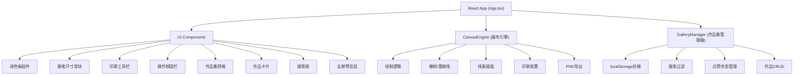
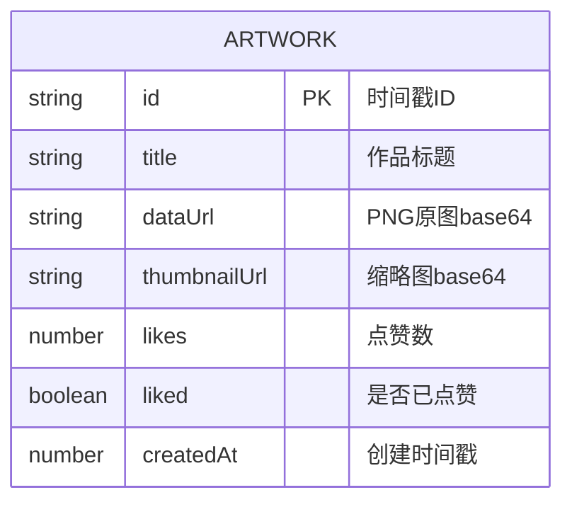

## 1. 架构设计



## 2. 技术描述

### 2.1 技术栈
- **前端框架**：React 18 + TypeScript
- **构建工具**：Vite 5
- **渲染技术**：HTML5 Canvas 2D API
- **状态管理**：React useState/useRef (本地状态)
- **数据持久化**：localStorage
- **动画方案**：CSS Transitions + requestAnimationFrame
- **字体**：Roboto Mono (Google Fonts)

### 2.2 核心依赖
| 依赖包 | 版本 | 用途 |
|--------|------|------|
| react | ^18.2.0 | UI框架 |
| react-dom | ^18.2.0 | DOM渲染 |
| typescript | ^5.3.0 | 类型系统 |
| vite | ^5.0.0 | 构建工具 |
| @vitejs/plugin-react | ^4.2.0 | React插件 |

### 2.3 项目结构
```
auto47/
├── package.json
├── index.html
├── vite.config.js
├── tsconfig.json
├── src/
│   ├── main.tsx          # React入口
│   ├── App.tsx           # 主组件
│   ├── CanvasEngine.ts   # 画布引擎
│   └── GalleryManager.ts # 作品集管理器
```

## 3. 核心模块设计

### 3.1 CanvasEngine (画布引擎)
**职责**：纯TypeScript类，不依赖React，负责所有画布绘制逻辑

**核心方法**：
- `constructor(canvas: HTMLCanvasElement)` - 初始化画布
- `startDrawing(x: number, y: number, color: string, size: number)` - 开始绘制
- `drawLine(x: number, y: number)` - 绘制线条（使用requestAnimationFrame）
- `endDrawing()` - 结束绘制
- `addStamp(x: number, y: number, stampType: string)` - 添加印章
- `undo()` - 撤销上一步
- `redo()` - 重做
- `getCanvasData()` - 导出PNG数据URL
- `clearCanvas()` - 清空画布
- `canUndo(): boolean` - 是否可撤销
- `canRedo(): boolean` - 是否可重做
- `isEmpty(): boolean` - 画布是否为空
- `loadImage(dataUrl: string)` - 加载图片到画布

**内部数据结构**：
```typescript
interface DrawAction {
  type: 'line' | 'stamp';
  data: LineData | StampData;
  timestamp: number;
}

interface LineData {
  points: Point[];
  color: string;
  size: number;
  opacity: number;
}

interface StampData {
  x: number;
  y: number;
  type: string;
  rotation: number;
  opacity: number;
  grayscale: number;
  scale: number;
}

interface Point {
  x: number;
  y: number;
}
```

**性能优化**：
- 使用requestAnimationFrame保证60fps绘制
- 每帧采样最多200个点，超出时进行降采样
- 线条插值使用二次贝塞尔曲线平滑
- 撤销/重做栈限制为20步，使用循环队列

### 3.2 GalleryManager (作品集管理器)
**职责**：管理作品的存储、搜索、点赞功能，使用localStorage持久化

**核心方法**：
- `saveArtwork(dataUrl: string, title: string)` - 保存作品
- `loadGallery(): Artwork[]` - 加载所有作品
- `searchArtworks(keyword: string): Artwork[]` - 搜索作品
- `toggleLike(artworkId: string): Artwork` - 切换点赞
- `deleteArtwork(artworkId: string)` - 删除作品
- `getArtwork(artworkId: string): Artwork | null` - 获取单个作品

**数据结构**：
```typescript
interface Artwork {
  id: string;          // 时间戳
  title: string;
  dataUrl: string;     // PNG base64
  thumbnailUrl: string; // 缩略图
  likes: number;
  liked: boolean;
  createdAt: number;
}
```

**存储方案**：
- localStorage key: `graffiti_gallery`
- 缩略图自动生成（150x150px）
- 生成时间限制在200ms内

### 3.3 App.tsx (主组件)
**职责**：React组件，组合CanvasEngine和GalleryManager，管理UI状态

**状态管理**：
- `selectedColor: string` - 当前选中颜色
- `brushSize: number` - 画笔尺寸
- `currentTool: 'brush' | 'stamp'` - 当前工具
- `selectedStamp: string` - 选中的印章类型
- `searchText: string` - 搜索关键词
- `gallery: Artwork[]` - 作品集列表
- `previewArtwork: Artwork | null` - 全屏预览作品
- `canvasSize: { width: number; height: number }` - 画布尺寸

**事件处理**：
- 画布鼠标事件（mousedown, mousemove, mouseup, mouseleave）
- 调色板颜色选择
- 印章工具选择
- 撤销/重做按钮点击
- 保存按钮点击
- 作品卡片点击（预览、点赞）
- 搜索框输入

## 4. 关键技术实现

### 4.1 砖墙纹理背景
使用CSS `repeating-linear-gradient` 实现：
```css
.brick-wall {
  background-color: #8B4513;
  background-image:
    repeating-linear-gradient(
      0deg,
      transparent,
      transparent 39px,
      #654321 39px,
      #654321 40px
    ),
    repeating-linear-gradient(
      90deg,
      #8B4513,
      #8B4513 79px,
      #654321 79px,
      #654321 80px,
      #A0522D 80px,
      #A0522D 159px,
      #654321 159px,
      #654321 160px
    );
  background-position: 0 0, 0 0;
}
```

### 4.2 线条渐显效果
使用Canvas globalAlpha + requestAnimationFrame实现：
```typescript
// 每条新线条初始opacity为0，0.15秒内渐变为目标opacity
animateLineOpacity(lineId, targetOpacity, duration = 150) {
  const startTime = performance.now();
  const animate = (now: number) => {
    const progress = Math.min((now - startTime) / duration, 1);
    const currentOpacity = targetOpacity * progress;
    // 重绘线条
    requestAnimationFrame(animate);
  };
  requestAnimationFrame(animate);
}
```

### 4.3 印章弹入动画
使用CSS transform + transition实现：
```css
.stamp-animate {
  animation: stamp-pop 0.3s cubic-bezier(0.175, 0.885, 0.32, 1.275);
}

@keyframes stamp-pop {
  0% { transform: scale(0) rotate(var(--rotation)); opacity: 0; }
  70% { transform: scale(1.1) rotate(var(--rotation)); opacity: 1; }
  100% { transform: scale(1) rotate(var(--rotation)); opacity: 1; }
}
```

### 4.4 搜索匹配心跳动画
```css
.heartbeat {
  animation: heartbeat 0.3s ease-in-out infinite;
}

@keyframes heartbeat {
  0%, 100% { transform: scale(1); }
  50% { transform: scale(1.05); }
}
```

### 4.5 性能优化策略
1. **画布绘制优化**：
   - 使用离屏Canvas预渲染砖墙背景
   - 离屏Canvas缓存静态内容
   - requestAnimationFrame批量绘制

2. **线条采样优化**：
   - 每帧最多处理200个点
   - 距离阈值过滤冗余点（< 2px忽略）
   - 二次贝塞尔曲线插值平滑

3. **缩略图生成优化**：
   - 使用canvas drawImage缩小
   - 质量参数0.8
   - 异步生成不阻塞UI

## 5. 数据模型

### 5.1 作品数据模型


### 5.2 本地存储结构
```javascript
// localStorage key: 'graffiti_gallery'
{
  version: 1,
  artworks: [
    {
      id: "1234567890000",
      title: "我的第一幅涂鸦",
      dataUrl: "data:image/png;base64,...",
      thumbnailUrl: "data:image/png;base64,...",
      likes: 5,
      liked: false,
      createdAt: 1234567890000
    }
  ]
}
```

## 6. 类型定义

```typescript
// src/types.ts
export interface Point {
  x: number;
  y: number;
}

export interface LineData {
  points: Point[];
  color: string;
  size: number;
  opacity: number;
  animationProgress: number;
}

export interface StampData {
  x: number;
  y: number;
  type: string;
  rotation: number;
  opacity: number;
  grayscale: number;
  scale: number;
  animationProgress: number;
}

export type DrawAction = 
  | { type: 'line'; data: LineData }
  | { type: 'stamp'; data: StampData };

export interface Artwork {
  id: string;
  title: string;
  dataUrl: string;
  thumbnailUrl: string;
  likes: number;
  liked: boolean;
  createdAt: number;
}

export interface StampType {
  id: string;
  name: string;
  draw: (ctx: CanvasRenderingContext2D, size: number) => void;
}

export const COLOR_PALETTE = [
  { color: '#FF4500', name: '橙红' },
  { color: '#FFD700', name: '金色' },
  { color: '#00FF7F', name: '春绿' },
  { color: '#00BFFF', name: '深天蓝' },
  { color: '#FF69B4', name: '热粉' },
  { color: '#8A2BE2', name: '蓝紫' },
  { color: '#000000', name: '黑色' },
  { color: '#FFFFFF', name: '白色' },
];

export const STAMP_TYPES: StampType[] = [
  { id: 'star', name: '星星', draw: drawStar },
  { id: 'arrow', name: '箭头', draw: drawArrow },
  { id: 'handprint', name: '手印', draw: drawHandprint },
  { id: 'tag1', name: '字体1', draw: drawTag1 },
  { id: 'tag2', name: '字体2', draw: drawTag2 },
  { id: 'tag3', name: '字体3', draw: drawTag3 },
  { id: 'tag4', name: '字体4', draw: drawTag4 },
  { id: 'tag5', name: '字体5', draw: drawTag5 },
];
```
