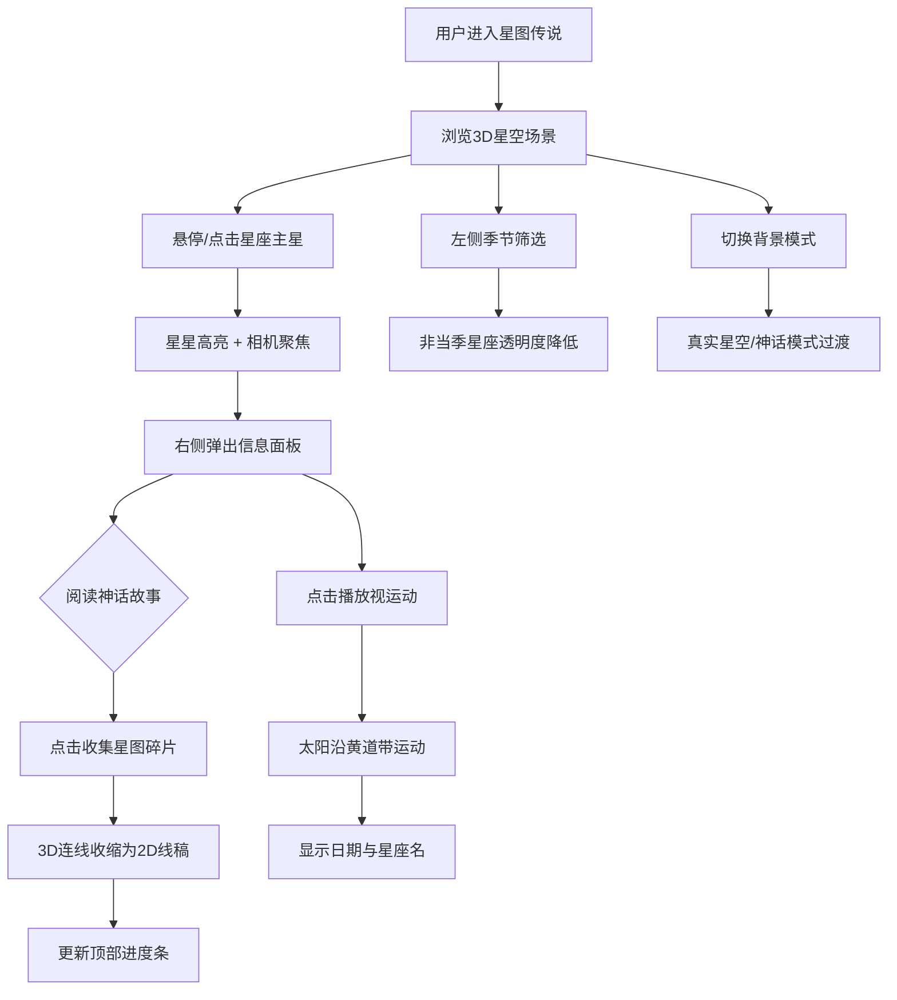

## 1. 产品概述

星图传说是一款基于3D交互的星座神话故事与星图可视化应用，让用户在浏览器中沉浸式浏览12个黄道星座的三维星图，点击星座后展示对应神话故事与线稿图形，并支持周年视运动动画模拟。

- 目标用户：天文爱好者、神话文化爱好者、教育场景使用者
- 核心价值：将天文科学与人文神话融合，提供兼具科学准确性与叙事美感的星空探索体验

## 2. 核心功能

### 2.1 功能模块

1. **3D星图主页**：5000颗背景恒星 + 12黄道星座3D连线图 + 星座标签
2. **星座交互面板**：点击星座后弹出信息面板，展示名称、主星属性、神话故事、线稿SVG
3. **周年视运动动画**：太阳标记沿黄道带匀速运动，显示日期和当前星座
4. **季节筛选工具栏**：左侧下拉筛选器，按春夏秋冬过滤星座
5. **背景模式切换**：真实星空模式 / 神话模式，颜色平滑过渡
6. **星图碎片收集**：收集星座线稿，进度条显示收集进度

### 2.2 页面详情

| 页面名称 | 模块名称 | 功能描述 |
|----------|----------|----------|
| 3D星图主页 | 星空背景 | 渲染5000颗随机位置/亮度星星粒子，带闪烁动画 |
| 3D星图主页 | 星座3D连线 | 12黄道星座在3D空间中绘制星星和连线 |
| 3D星图主页 | 星座标签 | CSS2DRenderer渲染的悬浮文字标签 |
| 3D星图主页 | 鼠标交互 | 悬停/点击高亮星星，相机平滑移动聚焦 |
| 信息面板 | 星座详情 | 中英文名称、主星属性、神话故事中英对照 |
| 信息面板 | 线稿SVG | Canvas绘制2D星座线稿 |
| 信息面板 | 视运动按钮 | 播放今日视运动动画 |
| 左侧工具栏 | 季节筛选 | 下拉框筛选春夏秋冬星座 |
| 顶部进度条 | 收集进度 | 已收集数/12，6px金色进度条 |

## 3. 核心流程

## 4. 用户界面设计

### 4.1 设计风格

- 主色调：深空主题，径向渐变 #0A0A23 → #0D0D2B
- 强调色：#81D4FA（星座连线）、#FFD54F（高亮/太阳）、#FFE082（星座主星）
- 文字色：#B0C4DE（正文淡蓝）、#E0E0E0（标签）、#FFFFFF（标题）
- 磨砂玻璃面板：backdrop-filter blur(12px)，背景 rgba(20,20,40,0.8)
- 按钮/控件：圆角8px，背景 rgba(255,255,255,0.1)，边框 rgba(255,255,255,0.2)
- 字体：标题衬线字体，正文无衬线字体，行距1.6

### 4.2 页面设计概览

| 页面名称 | 模块名称 | UI元素 |
|----------|----------|--------|
| 3D星图主页 | 星空场景 | 深空径向渐变背景，5000颗闪烁粒子，12星座3D连线 |
| 3D星图主页 | 星座标签 | #E0E0E0，14px粗体无衬线，距离动态缩放 |
| 3D星图主页 | 左侧工具栏 | 固定左侧，200px宽，rgba(10,10,30,0.7)，圆角8px |
| 信息面板 | 面板容器 | 右侧弹出，磨砂玻璃效果，0.4s淡入上滑动画 |
| 信息面板 | 星座详情 | 中英文名称、主星属性表格、故事文本 |
| 信息面板 | 线稿SVG | Canvas绘制2D星座连线图 |
| 顶部进度条 | 进度指示 | 6px高，#FFD54F颜色，半透明背景 |

### 4.3 响应式设计

- 桌面优先设计，移动端（≤768px）适配：
  - 左侧工具栏压缩为底部横向可收起抽屉
  - 信息面板改为全屏覆盖

### 4.4 3D场景指引

- 相机：透视相机，初始距离40-50单位，聚焦星座层（距离20单位）
- 光照：环境光为主，无需强方向光（星空场景）
- 星座星星：球体0.3单位，#FFE082
- 星座连线：LineBasicMaterial，#81D4FA，透明度0.7
- 黄道带：半透明椭圆环，#4FC3F7，透明度0.3
- 高亮效果：星星半径增至0.6，脉动光环1.2秒周期，最大半径1.2
- 相机动画：TWEEN，0.6秒，Cubic.InOut缓动
