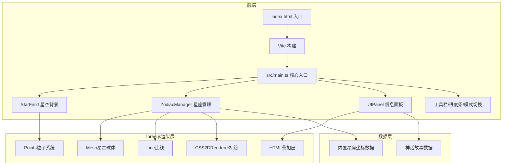

## 1. 架构设计



## 2. 技术说明

- 前端：TypeScript + Three.js + Vite（无React，纯Three.js渲染）
- 构建工具：Vite + @vitejs/plugin-react（用于CSS/资源处理）
- 3D渲染：Three.js（场景/相机/渲染器/CSS2DRenderer/TWEEN动画）
- 无后端、无数据库，所有数据内置

## 3. 文件结构

| 文件路径 | 职责 |
|----------|------|
| package.json | 依赖管理：three, typescript, vite, @vitejs/plugin-react |
| index.html | 入口页面，标题"星图传说" |
| vite.config.js | React插件配置，base: './' |
| tsconfig.json | 严格模式，target ES2020，moduleResolution bundler |
| src/main.ts | 入口：初始化场景/相机/渲染器，挂载事件总线 |
| src/starField.ts | StarField类：5000颗粒子星星，闪烁动画 |
| src/zodiacManager.ts | ZodiacManager类：星座数据解析、3D连线渲染、交互 |
| src/uiPanel.ts | UIPanel类：信息面板、神话故事、线稿SVG、视运动动画 |
| src/data/constellations.ts | 12黄道星座坐标数据与神话故事数据 |
| src/data/mythology.ts | 星座神话故事文本数据 |

## 4. 数据模型

### 4.1 星座数据结构

```typescript
interface StarData {
  name: string;
  ra: number;
  dec: number;
  magnitude: number;
  spectralType: string;
}

interface ConstellationData {
  id: string;
  nameCN: string;
  nameEN: string;
  season: 'spring' | 'summer' | 'autumn' | 'winter';
  stars: StarData[];
  lines: [number, number][];
  brightestStar: {
    nameCN: string;
    nameEN: string;
    spectralType: string;
    magnitude: number;
  };
  mythology: {
    cn: string;
    en: string;
  };
}
```

## 5. 关键技术方案

### 5.1 星空背景
- 使用 THREE.Points + THREE.BufferGeometry 渲染5000颗粒子
- 自定义着色器或属性控制颜色渐变（#FFFFFF → #B8C6DB）
- 闪烁动画通过在动画循环中修改粒子大小属性实现

### 5.2 星座渲染
- 每颗主星使用 THREE.Mesh（SphereGeometry, 0.3半径）
- 连线使用 THREE.Line + THREE.LineBasicMaterial
- 标签使用 CSS2DRenderer + CSS2DObject
- 射线检测（Raycaster）实现点击交互

### 5.3 相机动画
- 使用 @tweenjs/tween.js 实现平滑相机移动
- 时长0.6秒，Cubic.InOut缓动

### 5.4 黄道带与视运动
- 黄道带使用 THREE.TorusGeometry（扁平环）或自定义椭圆路径
- 太阳标记沿路径匀速运动15秒一圈
- 使用 THREE.Mesh + 辉光效果（自定义着色器或精灵）

### 5.5 模式切换
- 真实星空模式 → 神话模式：通过 TWEEN 动画平滑过渡所有材质颜色
- 过渡时长0.8秒

### 5.6 星座收集
- 3D → 2D收缩动画：1秒内将3D星座坐标压缩为2D平面
- 旋转至正面视角
- 收集状态存储在内存中
