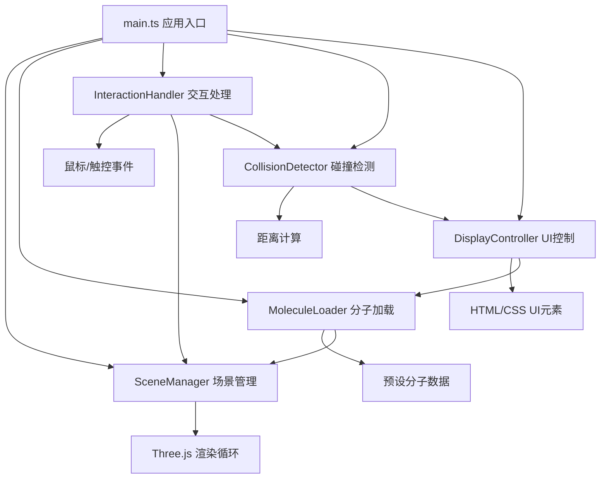

## 1. 架构设计



## 2. 技术描述

- **前端**：TypeScript + Three.js + Vite
- **构建工具**：Vite 5.x
- **3D引擎**：Three.js 0.160.x
- **工具库**：lodash 4.17.x
- **无后端**：纯前端应用
- **数据**：内置预设分子结构数据

## 3. 文件结构与职责

```
src/
├── core/
│   ├── SceneManager.ts      # 三维场景管理
│   └── MoleculeLoader.ts  # 分子模型加载与转换
├── interaction/
│   ├── InteractionHandler.ts  # 用户交互与拖拽
│   └── CollisionDetector.ts # 碰撞与对接检测
├── ui/
│   └── DisplayController.ts # UI显示控制
├── data/
│   └── molecules.ts         # 预设分子数据
├── types/
│   └── index.ts           # TypeScript类型定义
├── styles/
│   └── main.css           # 全局样式
└── main.ts                # 应用入口
```

### 调用关系与数据流向

1. **SceneManager**
   - 职责：初始化Three.js场景、相机、灯光，渲染循环
   - 被调用：InteractionHandler、DisplayController、main.ts
   - 输出：渲染帧

2. **MoleculeLoader**
   - 职责：解析分子数据，生成球棍模型Mesh，计算原子坐标
   - 输入：预设分子数据、温度参数
   - 输出：Mesh对象给SceneManager

3. **InteractionHandler**
   - 职责：监听鼠标/触控事件，实现配体拖拽、视角旋转缩放
   - 输入：用户输入事件
   - 输出：配体位置给CollisionDetector、SceneManager

4. **CollisionDetector**
   - 职责：实时检测配体与受体活性位点距离，计算结合能
   - 输入：活性位点坐标（MoleculeLoader）、配体位置（InteractionHandler）
   - 输出：对接状态给DisplayController

5. **DisplayController**
   - 职责：管理HTML面板和HUD元素
   - 输入：对接结果（CollisionDetector）
   - 输出：用户参数给MoleculeLoader

6. **main.ts**
   - 职责：初始化所有模块，启动渲染循环
   - 协调：各模块间消息传递

## 4. 核心数据结构

### 分子数据结构

```typescript
interface Atom {
  id: number;
  element: 'C' | 'O' | 'N' | 'S' | 'H';
  x: number;
  y: number;
  z: number;
  residue?: string;
  residueNumber?: number;
}

interface Bond {
  atom1: number;
  atom2: number;
  order: number;
}

interface MoleculeData {
  name: string;
  atoms: Atom[];
  bonds: Bond[];
  activeSite?: {
    center: { x: number; y: number; z: number };
    radius: number;
    keyResidues: string[];
  };
}

interface DockingResult {
  success: boolean;
  bindingEnergy: number;
  keyResidues: string[];
  distance: number;
}
```

## 5. 性能优化策略

1. **InstancedMesh**：使用实例化网格渲染大量原子球体，减少Draw Call
2. **几何体复用**：复用SphereGeometry和CylinderGeometry
3. **材质复用**：不同元素使用共享材质
4. **帧率控制**：requestAnimationFrame自动适配
5. **距离检测优化**：平方距离比较避免开方运算
6. **振动优化**：使用预计算随机向量减少运行时计算

