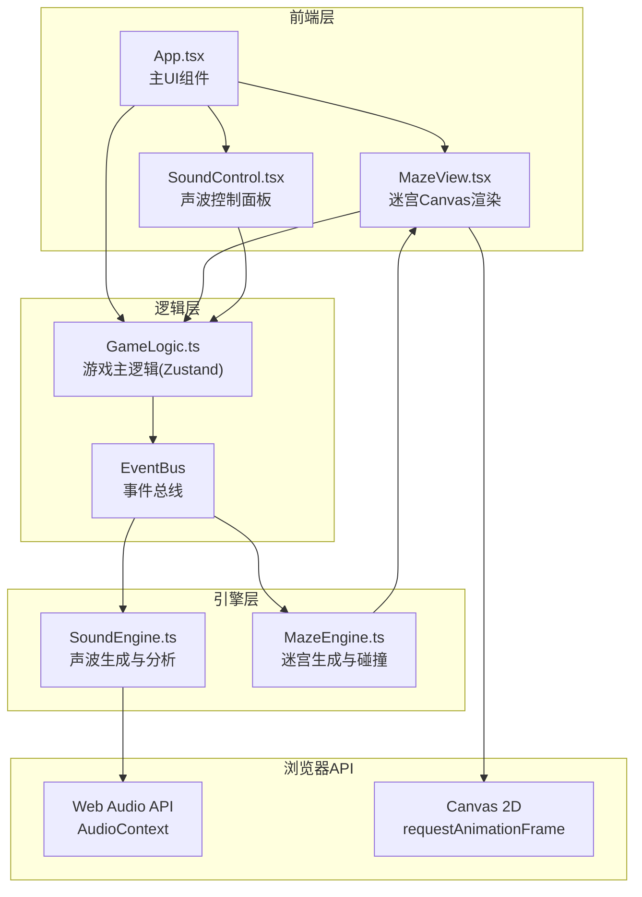

## 1. 架构设计



## 2. 技术说明

- **前端框架**：React 18 + TypeScript + Vite
- **状态管理**：Zustand
- **样式方案**：CSS Modules + 内联样式（游戏特殊视觉效果）
- **音频**：Web Audio API（AudioContext, OscillatorNode, AnalyserNode）
- **渲染**：Canvas 2D（requestAnimationFrame循环）
- **模块通信**：自定义EventBus事件总线
- **无后端**：纯前端应用

## 3. 路由定义

| 路由 | 用途 |
|------|------|
| / | 游戏主页面（单页应用，无路由切换） |

## 4. 模块接口定义

### 4.1 EventBus 事件协议

```typescript
// SoundEngine发出的事件
type SoundEvent =
  | { type: 'waveGenerated'; frequency: number; waveType: WaveType; direction: Direction }
  | { type: 'frequencyDetected'; frequency: number; amplitude: number }

// MazeEngine发出的事件
type MazeEvent =
  | { type: 'mazeGenerated'; width: number; height: number; level: number }
  | { type: 'pathUnlocked'; doorId: string; position: Position }

// 游戏事件
type GameEvent =
  | { type: 'fragmentCollected'; fragmentId: string; position: Position }
  | { type: 'levelComplete'; level: number; time: number; score: number }
  | { type: 'gamePaused' }
  | { type: 'gameResumed' }
```

### 4.2 SoundEngine 接口

```typescript
type WaveType = 'sine' | 'square' | 'triangle'

interface SoundEngine {
  start(frequency: number, waveType: WaveType): void
  stop(): void
  analyze(): Float32Array          // 频域数据
  getWaveformData(): Float32Array  // 时域数据
  destroy(): void
}
```

### 4.3 MazeEngine 接口

```typescript
type WallType = 'stone' | 'crystal' | 'metal'
type TileType = 'path' | 'wall' | 'door' | 'fragment' | 'start' | 'end'

interface Tile {
  x: number; y: number
  type: TileType
  wallType?: WallType
  doorFrequency?: number
  fragmentId?: string
}

interface MazeEngine {
  generate(width: number, height: number, level: number): void
  getTile(x: number, y: number): Tile
  checkCollision(x: number, y: number): boolean
  getNeighbors(x: number, y: number): Tile[]
  unlockDoor(doorId: string): void
  collectFragment(fragmentId: string): void
}
```

### 4.4 GameLogic Store (Zustand)

```typescript
interface GameStore {
  level: number
  playerPos: Position
  fragments: Fragment[]
  collectedFragments: number
  timeRemaining: number
  totalTime: number
  currentFrequency: number
  currentWaveType: WaveType
  isPaused: boolean
  isWaveActive: boolean
  score: number
  wrongFrequencyCount: number

  movePlayer: (dx: number, dy: number) => void
  emitWave: () => void
  stopWave: () => void
  setFrequency: (freq: number) => void
  setWaveType: (type: WaveType) => void
  togglePause: () => void
  startLevel: (level: number) => void
}
```

## 5. 核心算法

### 5.1 迷宫生成 - 递归回溯

1. 从起点(0,0)开始，标记为已访问
2. 随机选择一个未访问的相邻格子
3. 打通当前格与选中格之间的墙
4. 递归处理选中格
5. 若无未访问邻居则回溯
6. 生成后随机放置：起点、终点、碎片（死路末端）、机关门、水晶墙、金属墙

### 5.2 声波传播与交互

1. 声波从玩家位置沿指定方向直线传播
2. 每帧更新声波位置，检测与墙壁的碰撞
3. 石墙：计算反射角，声波改变方向继续传播
4. 水晶墙：计算折射角，声波偏转方向继续传播
5. 金属墙：声波被吸收，停止传播
6. 机关门：如果频率匹配，触发解锁事件

### 5.3 渲染循环

1. requestAnimationFrame驱动，目标30fps+
2. 每帧：更新声波位置 → 检测碰撞 → 更新动画状态 → 重绘Canvas
3. 声波拖尾：记录传播路径点，绘制渐变透明线条（1.5s衰减）
4. 碎片脉动：sin函数驱动#FFD54F透明度变化（2s周期）
5. 碎片环绕：已收集碎片以发光小球绕玩家旋转

## 6. 性能策略

- Canvas离屏渲染复杂静态元素（墙壁、地板）
- 声波分析数据采集间隔≤50ms
- 迷宫视口裁剪：仅渲染可视区域内的瓦片
- 粒子系统对象池复用
- 避免每帧重建AudioContext，复用单例
